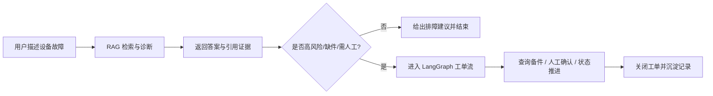

# Project A: 企业设备售后诊断与工单闭环 RAG 平台

[](https://github.com/wyjhfl/project-a-rag-platform/actions/workflows/ci.yml)


面向企业设备售后场景的 RAG 工程项目。核心目标不是只做问答，而是把“故障描述 -> 检索诊断 -> 引用证据 -> 工单推进”串成一条可演示、可验证、可部署的业务闭环。

## 项目亮点

- 不止回答问题：从设备故障描述出发，给出带引用的诊断建议，并在高风险或缺件场景中推进工单流转。
- 兼顾效果与工程：同时覆盖基础 RAG、混合检索、查询增强、安全边界、多轮对话、工单闭环和 CI/CD。
- 对外展示友好：公开仓库只保留最终实现、最小演示数据、核心测试和部署入口，不混入研发噪音。

## 适合展示的能力

- 基础 RAG：文档入库、切片、向量检索、问答、引用、SSE 流式响应
- 检索增强：BM25、RRF、rerank、查询增强、查询路由
- 安全边界：Prompt Injection 拦截、资料不足拒答、危险操作安全提示
- 多轮会话：设备型号与故障码的会话级指代消解
- 工单闭环：LangGraph 工作流、HITL、人审恢复、备件查询、工单关闭
- 工程能力：FastAPI、Vue3、Docker Compose、GitHub Actions、核心自动化测试
- 可选增强：Redis、PostgreSQL、Milvus、Neo4j、真实多模态解析与视觉 LLM

## 业务链路



## 技术架构

```text
Frontend        Vue3 + Vite + TypeScript + Element Plus
API Layer       FastAPI
RAG Layer       Chunking + Hybrid Retrieval + Rerank + Query Enhancement
Workflow        LangGraph Ticket Workflow + HITL
Default Store   SQLite + Chroma
Optional Infra  Redis + PostgreSQL + Milvus + Neo4j + MinerU + PaddleOCR
```

## 仓库结构

```text
backend/app/                  FastAPI、RAG、工单与存储实现
backend/tests/                公开版核心回归测试
backend/scripts/              评测与发布辅助脚本
frontend/                     Vue3 演示前端
data/seed_docs/               最小演示文档
data/real_manuals_sanitized/  脱敏真实资料样例
data/eval/                    回归与发布场景用例
docs/                         功能核对、发布说明、测试结果、bad cases
prompts/                      RAG prompt 文件
```

## 快速启动

### 1. 安装后端依赖

```powershell
python -m venv .venv
.venv\Scripts\activate
pip install -e .
```

### 2. 配置环境变量

复制 `.env.example` 为 `.env`。

默认情况下，即使不配置真实 LLM，也可以本地跑通主链路；系统会自动回退到抽取式答案生成，适合演示和 CI。

### 3. 启动后端

```powershell
uvicorn app.main:app --app-dir backend --host 127.0.0.1 --port 18081 --reload
```

### 4. 启动前端

```powershell
cd frontend
npm install
npm run dev
```

访问地址：

- 前端：[http://127.0.0.1:5173](http://127.0.0.1:5173)
- 后端健康检查：[http://127.0.0.1:18081/health](http://127.0.0.1:18081/health)

## Docker Compose

```powershell
docker compose up --build
```

访问地址：

- Web：[http://127.0.0.1:18080](http://127.0.0.1:18080)
- API：[http://127.0.0.1:18081](http://127.0.0.1:18081)

## API 概览

```text
GET  /health
GET  /api/v1/system/status
POST /api/v1/documents/ingest
POST /api/v1/documents/upload
POST /api/v1/chat
POST /api/v1/chat/session
POST /api/v1/chat/stream
POST /api/v1/tickets/start
GET  /api/v1/tickets
POST /api/v1/tickets/{ticket_id}/resume
POST /api/v1/tickets/{ticket_id}/close
POST /api/v1/evaluations/run
```

## 默认可跑与可选增强

默认本地可跑：

- SQLite
- Chroma
- 脱敏演示资料
- 核心 API / 检索 / 工单 / 安全 / 评测入口

可选增强，通过 `.env` 打开：

- `CACHE_ENABLED=true`：Redis 缓存
- `STORAGE_BACKEND=postgres`：PostgreSQL 结构化存储
- `VECTOR_BACKEND=milvus`：Milvus 向量库
- `GRAPH_RETRIEVAL_ENABLED=true`：Neo4j 图检索
- `MULTIMODAL_BACKEND=real`：真实 MinerU / PaddleOCR / Vision LLM 链路

这些增强能力不是 GitHub Actions 默认前提，因此公开仓库的 CI 聚焦“本地可复现主链路”。

## CI

仓库提供 GitHub Actions，默认验证：

- `ruff check backend`
- 核心 `pytest`
- `python -m compileall backend/app backend/scripts`
- `npm ci`
- `npm run build`
- `docker compose config`

## 核心验证命令

```powershell
pytest backend/tests/test_api.py `
  backend/tests/test_enterprise_api.py `
  backend/tests/test_hybrid_retrieval.py `
  backend/tests/test_rag_security.py `
  backend/tests/test_release_scenarios.py `
  backend/tests/test_ticket_workflow.py -q

python -m ruff check backend
python -m compileall backend\app backend\scripts

cd frontend
npm run build
```

## 公开版文档

- [功能核对表](docs/A-v1.0_public_feature_audit.md)
- [发布说明](docs/A-v1.0_public_release.md)
- [测试结果](docs/A-v1.0_测试结果.md)
- [Bad Cases 摘要](docs/A-v1.0_bad_cases.md)

## 为什么这个项目适合面试展示

- 有明确业务终态：不是“问完就结束”，而是把诊断结果推进到工单处理。
- 有真实工程取舍：默认可跑链路与可选企业级增强链路清晰分层。
- 有验证闭环：不仅有实现，还有测试、CI、发布说明和 bad cases 沉淀。

## 发布仓库生成

如果你在研发仓库继续迭代，可用下面的脚本重新生成干净公开版仓库：

```powershell
python backend/scripts/create_public_release_repo.py --target ..\project-a-rag-platform-public --force
```

该脚本会按白名单复制公开版文件，不会带上研发仓库的 Git 历史和本地运行产物。
