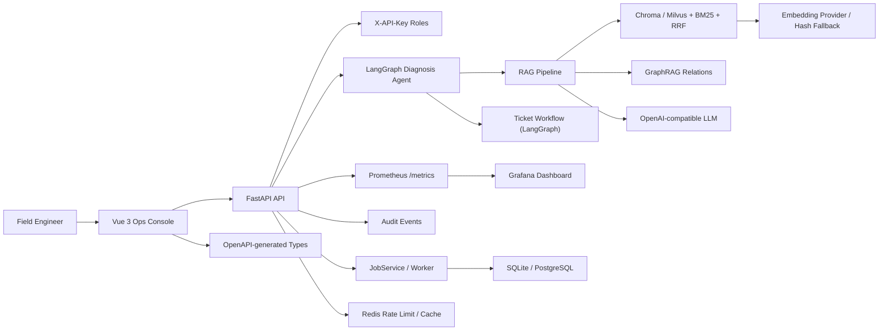

# Project A — Enterprise Agentic RAG Diagnosis Platform

> 企业设备售后诊断与工单闭环平台：把"设备型号 + 故障码 + 现场现象"转成带引用证据、可追踪、可拒答、可升级人工的诊断结论。

[](https://github.com/wyjhfl/project-a-rag-platform/actions/workflows/ci.yml)


设备售后场景对 AI 的要求和通用聊天完全不同：答案必须有出处，资料不够必须拒答，危险操作必须拦下来交给人。Project A 围绕这三条边界构建完整工程闭环：

```text
设备型号 / 故障码 / 现场现象
-> 文档入库、混合检索、LLM 查询改写、GraphRAG 关系
-> LangGraph 诊断 Agent：计划 -> 检索 -> 风险判级 -> answer / refuse / escalate
-> grounded answer + citations + trace_id
-> 资料不足拒答；高风险升级人工工单
-> Jobs / Evaluation / Audit / Prometheus + Grafana
-> Alembic + CI + Docker + Full E2E + 生产验收门禁
```

## 核心能力

| 能力 | 实现 |
|---|---|
| 诊断 Agent | LangGraph `StateGraph` + 条件边：security → plan → route → retrieve → risk → escalate/END；每步以 tool_call 落入 trace，可回放 |
| LLM in the loop | LLM 生成诊断计划、参与风险判级、低质量检索时改写查询；全部带确定性降级路径 |
| 安全下限 | 风险判级取 LLM 与关键词规则的并集——LLM 只能升级风险，永远不能降低规则判定的风险 |
| 检索 | Chroma/Milvus 向量检索 + BM25 混合 + RRF 融合 + 可选 GraphRAG 关系召回；低质量自动改写重试 |
| 模型接入 | OpenAI 兼容 LLM 与 Embedding Provider（BGE / Qwen / OpenAI 均可），环境变量即插即用 |
| 边界控制 | Prompt 注入拦截、资料不足拒答、高风险自动开工单升级人工、答案接受度校验（防幻觉兜底） |
| 可观测 | trace_id 全链路、Request ID、审计事件、Prometheus `/metrics`、Grafana 面板 |
| 工程交付 | 195 后端测试、35 Playwright E2E、OpenAPI 类型同步防 drift、secret scan、13 步生产验收门禁 |

## 一个刻意的设计决策：优雅降级

所有模型依赖（LLM、Embedding）都是**可选配置**：

- 配置了 provider：真实语义向量入库、LLM 生成答案/计划/风险判级/查询改写。
- 未配置：自动退回确定性实现（哈希向量、抽取式生成、关键词规则），**同一套代码在离线 CI 中行为完全可复现**。

这不是"没接模型"，而是把"模型可用性"当作生产故障场景来设计——provider 挂掉时系统降级而不是宕机，风险判级永远有规则兜底。测试套件同时覆盖两条路径（用注入的 fake provider 验证 LLM 路径）。

## Architecture



## 运营控制台

1. **Chat / Agentic RAG** — grounded 回答、诊断决策、tool calls、trace、GraphRAG 关系。
2. **Tickets** — 高风险升级、人工审核、备件确认、工单闭环。
3. **Quality** — regression、context precision、faithfulness、bad case 边界、trace 复盘。
4. **Jobs** — 异步任务生命周期：claim、heartbeat、cancel、retry、timeout。
5. **System Status / Audit** — release、healthz/readyz、metrics、Request ID、审计事件。
6. **Architecture / Acceptance** — 系统分层与生产验收证据。

## Tech stack

| Layer | Stack |
|---|---|
| Backend | FastAPI, Pydantic, pytest, ruff |
| Frontend | Vue 3, Vite, TypeScript, Element Plus, Playwright |
| Agent | LangGraph StateGraph（诊断 Agent + 工单流程），LLM 计划/风险判级/查询改写，确定性降级 |
| RAG | Chroma / Milvus，BM25 混合检索，RRF 融合，GraphRAG（内存版 / Neo4j），语义分块 |
| Models | OpenAI 兼容 LLM 与 Embedding Provider，未配置时哈希向量 + 抽取式生成兜底 |
| Storage | SQLite（demo）/ PostgreSQL（生产路径），Alembic 迁移 |
| Async | JobService, worker claim, heartbeat, cancel, retry, timeout |
| Security | X-API-Key 角色, Prompt 注入拦截, 上传约束, secret scan |
| Observability | Request ID, 结构化错误, 审计日志, Prometheus metrics, Grafana 面板 |
| Delivery | Docker Compose, OpenAPI drift guard, Redis/PostgreSQL smoke, Full E2E, 生产验收门禁 |

## Quick start

### One-click local E2E demo

```powershell
powershell -ExecutionPolicy Bypass -File .\scripts\run_full_e2e_demo.ps1 `
  -PythonExe "D:\path\to\Python312\python.exe" `
  -NpmCmd "D:\path\to\nodejs\npm.cmd"
```

Default local URLs:

| Service | URL |
|---|---|
| Frontend console | http://127.0.0.1:4173 |
| Backend healthz | http://127.0.0.1:8000/healthz |
| Backend readyz | http://127.0.0.1:8000/readyz |
| Metrics | http://127.0.0.1:8000/metrics |
| Prometheus | http://127.0.0.1:19090 |
| Grafana | http://127.0.0.1:13000 |

### Manual development run

```powershell
# terminal 1
$env:AUTH_ENABLED="false"
$env:STORAGE_BACKEND="sqlite"
$env:VECTOR_BACKEND="chroma"
$env:RATE_LIMIT_ENABLED="false"
cd backend
python -m uvicorn app.main:app --host 127.0.0.1 --port 8000

# terminal 2
cd frontend
$env:VITE_API_BASE="http://127.0.0.1:8000"
npm install
npm run build
npm run preview
```

### 接入真实模型（可选）

```bash
# OpenAI 兼容 chat provider（MiMo / DeepSeek / Qwen / ...）
LLM_MODEL=...
LLM_API_KEY=...
LLM_BASE_URL=...

# OpenAI 兼容 embedding provider（bge-m3 / text-embedding-v3 / ...）
EMBEDDING_MODEL=bge-m3
EMBEDDING_API_KEY=...
EMBEDDING_BASE_URL=...
EMBEDDING_DIMENSION=1024
```

不配置也能完整运行（离线降级模式），配置后 Agent 的计划、风险判级、查询改写与向量检索切换为真实模型。

## Validation

当前 `main` 分支本地验证：

```text
backend/tests: 195 passed（含 LLM 路径 fake-provider 测试与 embedding provider 测试）
ruff check backend scripts: passed
```

`v1.0.5` 发布时通过 13 步生产验收门禁：

```powershell
powershell -ExecutionPolicy Bypass -File .\scripts\final_production_acceptance.ps1 `
  -PythonExe "D:\path\to\Python312\python.exe" `
  -NpmCmd "D:\path\to\nodejs\npm.cmd" `
  -RunFullE2E
```

```text
13/13 ALL CHECKS PASSED
E2E list: 35 tests in 12 files
Secret scan: No secrets found
Docker compose config: passed
PostgreSQL smoke / Redis smoke / Worker stress: passed
Full E2E: passed
```

## Repository layout

```text
backend/app/        FastAPI APIs, LangGraph agent, RAG, Jobs, Audit, Rate Limit, Storage
backend/tests/      pytest coverage for API, auth, RAG, agent LLM paths, jobs, security
frontend/src/       Vue operations console
frontend/e2e/       Playwright E2E smoke tests
data/               sanitized demo manuals and evaluation cases
docs/               architecture, deep dives, teaching series, ops runbook, release docs
scripts/            OpenAPI export, secret scan, smoke tests, load test, acceptance gate
```

## Docs

**架构与实现**

- [Architecture Overview](docs/architecture_overview.md)
- [Agentic RAG Deep Dive](docs/agentic_rag_deep_dive.md) — 诊断 Agent 图结构与每个节点的取舍
- [Project Learning Guide](docs/learning_guide.md) / [Teaching Series（19 讲）](docs/teaching/00_course_overview.md)

**运维与质量**

- [Operation Runbook](docs/operation_runbook.md)
- [RAG Quality Report](docs/rag_quality_report.md)
- [Load Test Report](docs/load_test_report.md)
- [Production Readiness Report](docs/production_readiness_report.md)
- [Grafana Alerting Design](docs/grafana_alerting_design.md) / [OTel Trace Correlation Design](docs/otel_trace_correlation_design.md)

**交付与演示**

- [Demo Guide](docs/demo_guide.md) / [E2E Guide](docs/e2e_guide.md)
- [Deployment Guide](docs/deployment_guide.md)
- [Final Acceptance Checklist](docs/final_acceptance_checklist.md)
- [Release Notes v1.0.5](docs/release_notes_v1.0.5.md)
- Showcase 资料：[项目讲解要点](docs/resume_interview_showcase.md) · [演示脚本](docs/interview_demo_script.md) · [常见追问](docs/interview_questions.md)

## Current release

- Release tag: [`v1.0.5`](https://github.com/wyjhfl/project-a-rag-platform/releases/tag/v1.0.5)
- GitHub repository: <https://github.com/wyjhfl/project-a-rag-platform>
- CI: GitHub Actions on `main`

> Transparency note: this repository uses a reconstructed Git history after local metadata loss. The current code, tests, docs, tag, and CI state are the authoritative baseline.
