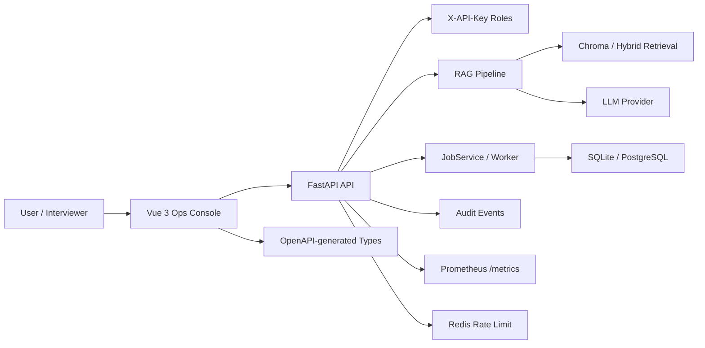

# Project A — Enterprise RAG Ops Console

> 企业设备售后诊断与工单闭环 RAG 平台｜FastAPI + Vue 3 + Chroma/SQLite + Async Jobs + Audit + Metrics + E2E

[](https://github.com/wyjhfl/project-a-rag-platform/actions/workflows/ci.yml)


Project A 是一个面向 **AI / RAG 工程岗位面试展示** 的企业设备售后诊断平台。它不是简单的 ChatGPT 套壳，而是把“故障描述 -> 知识检索 -> grounded 回答 -> 引用证据 -> 异步任务 -> 审计与指标 -> 工单闭环 -> 生产验收”做成完整工程闭环。

```text
设备型号 / 故障码 / 现场现象
-> 文档入库与检索
-> grounded answer + citations
-> 资料不足拒答 / 高风险升级人工
-> Jobs / Evaluation / Audit / Metrics
-> CI + Docker + Full E2E + Production Acceptance
```

## Why this project is worth showing

| 面试看点 | 项目里对应的工程实现 |
|---|---|
| 不是聊天套壳 | RAG 检索、引用证据、拒答边界、工单升级 |
| 可证明质量 | Quality 页展示 regression、context precision、faithfulness、context recall、bad case、trace |
| 可讲架构 | Architecture 页展示 Vue/FastAPI/RAG/Worker/Observability/Acceptance Gate |
| 可运维 | healthz、readyz、Request ID、Audit events、Prometheus `/metrics` |
| 可异步扩展 | JobService、worker claim、heartbeat、cancel、retry、timeout、PostgreSQL worker stress |
| 可交付 | 13 步 final production acceptance，覆盖测试、构建、OpenAPI、secret scan、Docker、smoke、Full E2E |

## 30-second interview pitch

> I built an enterprise equipment after-sales diagnosis RAG platform. It turns equipment models, fault codes, and field symptoms into grounded troubleshooting answers with citations. When evidence is insufficient or an operation is high risk, the system refuses or escalates to a human ticket. Engineering-wise, it includes FastAPI APIs, a Vue 3 operations console, async Jobs, audit logs, Prometheus metrics, OpenAPI-generated frontend types, Playwright E2E, Docker Compose, and a final production acceptance gate.

## Resume bullet

**中文：**

> 企业设备售后诊断 RAG 平台，基于 FastAPI、Vue 3、Chroma/SQLite、LangChain/LangGraph 实现带引用的故障诊断问答、Prompt 注入防护、异步入库/评测任务、工单闭环、审计日志、Prometheus metrics、OpenAPI 类型同步与 Playwright E2E；通过 13 步生产验收脚本覆盖 pytest、ruff、前端构建、Docker Compose、Redis 限流 smoke、PostgreSQL worker stress 与 Full E2E。

**English：**

> Built an enterprise equipment after-sales diagnosis RAG platform with FastAPI, Vue 3, Chroma/SQLite, LangChain/LangGraph, grounded answers with citations, prompt-injection guardrails, async ingestion/evaluation jobs, ticket escalation, audit logs, Prometheus metrics, OpenAPI-generated frontend types, Playwright E2E, and a 13-step production acceptance gate.

## Architecture



## Console demo route

The frontend console is designed for interviews:

1. **Acceptance** — project pitch and evidence entry point.
2. **Architecture** — system layers, RAG flow, Worker flow, observability, production gate.
3. **Quality** — RAG metrics, bad case boundaries, trace review, engineering tradeoffs.
4. **System Status** — release, healthz/readyz, metrics, Request ID.
5. **Jobs** — async lifecycle, `claim_next_job`, `heartbeat`, cancel/retry/timeout, queue evolution.
6. **Chat / Tickets / Evaluations / Audit** — grounded answer, human escalation, evaluation, traceability.

## Tech stack

| Layer | Stack |
|---|---|
| Backend | FastAPI, Pydantic, pytest, ruff |
| Frontend | Vue 3, Vite, TypeScript, Element Plus, Playwright |
| RAG | LangChain / LangGraph, Chroma, hybrid retrieval boundaries |
| Storage | SQLite for demo, PostgreSQL smoke path for production |
| Async | JobService, worker claim, heartbeat, cancel, retry, timeout |
| Security | X-API-Key roles, PromptInjectionGuard, upload constraints, secret scan |
| Observability | Request ID, structured errors, audit logs, Prometheus metrics |
| Delivery | Docker Compose, OpenAPI drift guard, Redis/PostgreSQL smoke, Full E2E |

## Quick start

### One-click local E2E demo

```powershell
powershell -ExecutionPolicy Bypass -File .\scripts\run_full_e2e_demo.ps1 `
  -PythonExe "D:\path\to\Python312\python.exe" `
  -NpmCmd "D:\path\to\nodejs\npm.cmd"
```

Default local URLs:

| Service | URL |
|---|---|
| Frontend console | http://127.0.0.1:4173 |
| Backend healthz | http://127.0.0.1:8000/healthz |
| Backend readyz | http://127.0.0.1:8000/readyz |
| Metrics | http://127.0.0.1:8000/metrics |

### Manual development run

```powershell
# terminal 1
$env:AUTH_ENABLED="false"
$env:STORAGE_BACKEND="sqlite"
$env:VECTOR_BACKEND="chroma"
$env:RATE_LIMIT_ENABLED="false"
cd backend
python -m uvicorn app.main:app --host 127.0.0.1 --port 8000

# terminal 2
cd frontend
$env:VITE_API_BASE="http://127.0.0.1:8000"
npm install
npm run build
npm run preview
```

## Validation

`v1.0.5` was cut only after the final production acceptance gate passed:

```powershell
powershell -ExecutionPolicy Bypass -File .\scripts\final_production_acceptance.ps1 `
  -PythonExe "D:\path\to\Python312\python.exe" `
  -NpmCmd "D:\path\to\nodejs\npm.cmd" `
  -RunFullE2E
```

Latest local gate:

```text
13/13 ALL CHECKS PASSED
backend/tests: 204 passed, 1 warning
E2E list: 33 tests in 11 files
Secret scan: No secrets found
Docker compose config: passed
PostgreSQL smoke / Redis smoke / Worker stress: passed
Full E2E: passed
```

## Repository layout

```text
backend/app/        FastAPI APIs, RAG, Jobs, Audit, Rate Limit, Storage
backend/tests/      pytest coverage for API, auth, RAG, jobs, security, production gates
frontend/src/       Vue operations console
frontend/e2e/       Playwright E2E smoke tests
data/               sanitized demo manuals and evaluation cases
docs/               curated showcase, architecture, demo, deployment, release docs
scripts/            OpenAPI export, secret scan, smoke tests, final production acceptance
```

## Curated docs

- [Resume / Interview Showcase](docs/resume_interview_showcase.md)
- [Interview Demo Script](docs/interview_demo_script.md)
- [Interview Questions](docs/interview_questions.md)
- [Architecture Overview](docs/architecture_overview.md)
- [Demo Guide](docs/demo_guide.md)
- [Deployment Guide](docs/deployment_guide.md)
- [E2E Guide](docs/e2e_guide.md)
- [Final Acceptance Checklist](docs/final_acceptance_checklist.md)
- [Release Notes v1.0.5](docs/release_notes_v1.0.5.md)

## Current release

- Release tag: [`v1.0.5`](https://github.com/wyjhfl/project-a-rag-platform/releases/tag/v1.0.5)
- GitHub repository: <https://github.com/wyjhfl/project-a-rag-platform>
- CI: GitHub Actions on `main`

> Transparency note: this repository uses a reconstructed Git history after local metadata loss. The current `v1.0.5` code, tests, docs, tag, and CI state are the authoritative showcase baseline.
