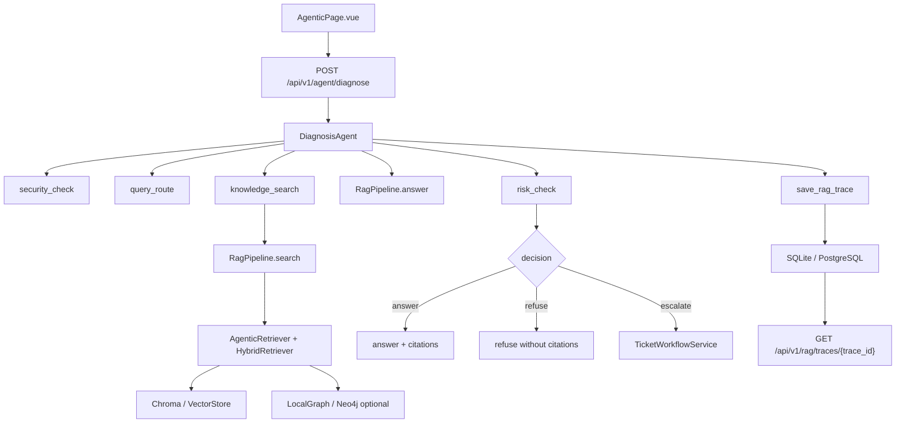

# Agentic RAG Deep Dive

> 目标：按真实代码调用顺序讲清 Project A 的 Agentic RAG 诊断链路。本文重点解释“怎么实现、为什么这样做、面试怎么讲”。

## 1. 总览：一次诊断请求发生了什么

入口 API：

```text
POST /api/v1/agent/diagnose
```

核心调用链：

```text
frontend/src/pages/AgenticPage.vue
-> frontend/src/api/endpoints.ts
-> backend/app/main.py: agent_diagnose()
-> backend/app/rag/diagnosis_agent.py: DiagnosisAgent.diagnose()
-> backend/app/rag/pipeline.py: RagPipeline.search() / answer()
-> backend/app/storage/*_store.py: save_rag_trace()
-> frontend displays decision / tool_calls / trace_id / GraphRAG relations
```

核心结果：

- `decision=answer`：证据足够且风险低，正常回答。
- `decision=refuse`：Prompt 注入、资料不足、citation 为空，拒答。
- `decision=escalate`：证据存在但风险高，升级人工工单。

## 2. API 合同

请求模型在 `backend/app/models.py`：

```text
AgentDiagnoseRequest
- question: string
- top_k: int = 4
- session_id?: string
- create_ticket_on_escalation: bool = true
```

响应模型：

```text
AgentDiagnoseResponse
- decision: answer | refuse | escalate
- answer: string
- plan: string[]
- tool_calls: AgentToolCall[]
- citations: Citation[]
- quality: AgentQuality
- trace_id: string
- ticket_id?: string
```

为什么要这样设计：

- `decision` 让 UI 和调用方不用猜系统态度。
- `tool_calls` 让 Agentic 行为可解释。
- `citations` 让回答有证据。
- `quality` 让面试官看到检索质量、引用数量、风险等级。
- `trace_id` 让一次诊断可以被追踪和复盘。

## 3. FastAPI 入口

文件：`backend/app/main.py`

核心职责：

- 在 `create_app()` 中创建 `RagPipeline`。
- 创建 `TicketWorkflowService`。
- 创建 `DiagnosisAgent` 并挂到 `app.state.diagnosis_agent`。
- 暴露 `/api/v1/agent/diagnose`。

关键流程：

```text
agent_diagnose(request)
-> app.state.diagnosis_agent.diagnose(...)
-> 返回 AgentDiagnoseResponse
```

为什么用 `app.state`：

- FastAPI 应用启动时统一装配依赖。
- API 函数不用反复创建 pipeline、store、ticket workflow。
- 测试可以通过 `create_app(database_path=..., seed_docs_dir=...)` 注入临时环境。

面试讲法：

> 我没有在接口函数里堆业务逻辑，而是让 FastAPI 负责路由和依赖装配，真正的诊断决策放在 `DiagnosisAgent`。这样 API 层薄，业务层可测试。

## 4. DiagnosisAgent：LangGraph 单诊断控制器

文件：`backend/app/rag/diagnosis_agent.py`

它不是多 Agent 协作平台，而是一个用 LangGraph `StateGraph` 编排的单诊断控制器，节点之间用条件边表达决策分支：

```text
START -> security ──(blocked)──> END
            │(passed)
            v
          plan -> route -> retrieve -> risk ──(answer/refuse)──> END
                                          │(escalate)
                                          v
                                       escalate(ticket) -> END
```

设计要点：

- 每个节点只做一件事，节点产出以 `AgentToolCall` 形式累积进状态，前端和 trace 都能回放。
- LLM 配置可用时，plan 生成和风险判级由 LLM 参与；LLM 不可用时自动降级为确定性规则，离线 demo 和 CI 行为完全可复现。
- 条件边替代了 if/else 串行代码：拒答、升级不是特殊分支，而是图上的显式出口。

### 4.1 plan

`plan` 节点优先请求 LLM 针对当前故障咨询生成 3-5 步诊断计划（提示词约束覆盖安全校验、检索策略、证据核对、风险决策），解析失败或 LLM 未配置时回退到静态计划：

```text
1. Inspect prompt-injection and authorization intent.
2. Route and enhance the retrieval query.
3. Search the grounded knowledge base.
4. Check operational risk and decide answer/refuse/escalate.
```

作用：

- 给前端展示“系统计划怎么做”，`plan_source` 区分 llm/static。
- 给 trace 和面试讲解提供结构。
- LLM 只负责规划表述，不能改变图的执行顺序，可控性由图结构保证。

### 4.2 security_check

使用：`self.pipeline.security_guard.inspect(question)`

如果命中 Prompt 注入：

```text
decision = refuse
citations = []
answer = Request refused because it looks like prompt injection...
```

优势：

- 安全检查在检索前执行，避免恶意输入污染后续流程。
- 即使拒答，也会返回结构化响应。

面试讲法：

> 我把安全检查放在最前面，因为企业 RAG 不应该先检索再判断是否危险。恶意输入应该直接拒绝。

### 4.3 query_route

使用：

```text
self.pipeline.query_router.build_enhanced_query(question, self.pipeline.query_enhancer)
```

输出：

- route
- retrieval_queries

作用：

- 把用户自然语言问题转换成更适合检索的问题。
- 支持增强检索，而不是只拿原句去搜。

面试讲法：

> 这一步是工程版 query planning，不依赖训练模型，而是用规则和增强器把检索问题变清楚。

### 4.4 knowledge_search

使用：

```text
chunks = self.pipeline.search(question, top_k=top_k)
```

它会进入 `RagPipeline.search()`：

```text
security check
-> AgenticRetriever.search()
-> _base_search()
-> query_route
-> hybrid retrieval / vector search
-> optional graph fusion
```

返回到 DiagnosisAgent 后，会把这些信息写入 tool call：

- chunks
- retrieval_score
- retrieval_attempts
- retry_reason
- context_sufficient
- rewritten_query

优势：

- 页面能展示是否触发 retry。
- 页面能展示 query rewrite 内容。
- 后续评测可以统计 retrieval_retry_rate。

### 4.5 pipeline.answer

DiagnosisAgent 调用：

```text
response = self.pipeline.answer(question, top_k=top_k)
```

为什么 search 后还要 answer：

- `search()` 负责拿候选 chunks。
- `answer()` 负责完整 RAG 回答，包括 insufficient 判断、引用筛选、生成、token usage、trace。
- 当前实现会复用同一套 pipeline 能力，保证 `/api/v1/chat` 和 `/api/v1/agent/diagnose` 的回答边界一致。

注意点：

- 这里会再次走检索链路，这是简单可靠的实现。
- 如果后续要优化性能，可以把 search 结果传入 answer，避免重复检索。
- 但当前版本优先保证 demo 清晰和逻辑复用。

### 4.6 risk_check

风险词在 `HIGH_RISK_TERMS` 中，包括：

- smoke
- odor
- burning
- high voltage
- battery swelling
- restart
- 以及中文高风险词

判断方式（LLM + 关键词双通道，取更严格结果）：

```text
keyword_level = 命中高风险词 ? high : low
llm_level     = LLM 分类器输出（未配置/出错时为空）
risk_level    = high if "high" in {keyword_level, llm_level} else low
```

为什么是“LLM 可以升级风险，但不能降低风险”：

- 关键词规则是安全下限：可测试、可解释、可被企业安全策略审计，离线也生效。
- LLM 补足规则覆盖不到的语义风险（例如没有命中词表但语境明显危险的问题）。
- 两者取并集意味着模型误判 low 不会绕过规则兜底，误判 high 只会更保守。
- `risk_check` tool call 的 `classifier` 字段标明本次判级来自 keyword 还是 llm+keyword。

### 4.7 decision policy

代码逻辑：

```text
if response.insufficient or not response.citations:
    decision = refuse
elif risk_level == high:
    decision = escalate
else:
    decision = answer
```

含义：

- 没有证据，不回答。
- 有证据但高风险，不直接指导用户操作，升级人工。
- 有证据且风险低，正常回答。

面试讲法：

> 这个决策规则故意简单，因为企业诊断场景最重要的是可解释和可验收。复杂模型判断可以后续加，但第一版必须稳。

### 4.8 ticket_escalation

如果 `decision=escalate` 且 `create_ticket_on_escalation=true`：

```text
self.ticket_workflow.start(...)
```

返回：

- ticket_id
- next_action

优势：

- 高风险不是只提示用户，而是进入人工闭环。
- RAG 和工单系统发生业务连接，更像企业系统。

## 5. RagPipeline：传统 RAG 能力如何被复用

文件：`backend/app/rag/pipeline.py`

### 5.1 ingest_directory

流程：

```text
load_documents
-> semantic_chunk_text
-> vector_store.add_chunks
-> store.add_document
-> HybridRetriever.from_chunks
-> graph_retriever.index_chunks
-> cache.bump_docs_version
```

作用：

- 把资料变成可检索 chunks。
- 同时准备 hybrid retriever 和可选图检索。

### 5.2 search

流程：

```text
PromptInjectionGuard
-> AgenticRetriever.search(question, _base_search)
-> record agentic_search trace event
```

AgenticRetriever 的价值：

- 判断是否需要 retry。
- 低质量时 query rewrite：优先调用注入的 LLM 改写器（保留设备型号与故障码、补规范术语），LLM 未配置或失败时回退启发式改写。
- 改写只发生在首轮质量低于阈值的 retry 路径上，LLM token 成本有界。
- 输出 quality_score、retrieval_attempts、context_sufficient。

### 5.3 _base_search

流程：

```text
QueryRouter.build_enhanced_query
-> HybridRetriever search or vector search
-> GraphRAG fusion if graph retriever exists
```

优势：

- 不把检索等同于单次向量搜索。
- 可以按问题类型做 query route。
- 可以把图关系结果和普通检索结果融合。

### 5.4 answer

流程：

```text
start_trace
-> security_check
-> cache check
-> search
-> insufficient 判断
-> answer chunk selection
-> LLM or extractive generator
-> safety warning
-> citations
-> chat record
-> token usage
-> end_trace
```

关键思想：

- 先检索，再回答。
- 先判断资料是否不足，再生成。
- 回答必须带 citations。
- 高风险回答追加 safety warning。
- trace 贯穿每一步。

## 6. Trace 持久化

Trace 保存入口：

```text
DiagnosisAgent._finish()
-> _build_trace()
-> store.save_rag_trace(trace)
```

Trace 内容包括：

- trace_id
- question
- decision
- route
- rewritten_query
- retrieved_chunks
- selected_chunks
- citations
- tool_calls
- latency_ms
- safety_warning
- insufficient
- raw_trace
- created_at

API：

```text
GET /api/v1/rag/traces
GET /api/v1/rag/traces/{trace_id}
```

为什么重要：

- 用户看到的不只是答案，还有证据链。
- 出错时可以查“检索到了什么、选了什么、为什么拒答或升级”。
- 面试时能证明你理解可观测性，而不只是做了 UI。

## 7. GraphRAG 展示

API：

```text
GET /api/v1/rag/graph/relations
```

实现思路：

- 如果 pipeline 有 graph_retriever，就读取其中的 relations。
- 如果没有启用图检索，则基于当前 keyword chunks 构造 LocalGraphRetriever fallback。
- 返回 source、relation、target、weight、evidence_source。

前端展示：

- `AgenticPage.vue` 在 `onMounted()` 和诊断后调用 `refreshRelations()`。
- 用 Element Plus table 展示 GraphRAG 关系。

面试讲法：

> 这里的 GraphRAG 是工程展示版，不是重训练图模型。它展示设备、故障、部件、动作之间的关系，帮助解释检索为什么相关。

## 8. 前端 AgenticPage

文件：`frontend/src/pages/AgenticPage.vue`

页面区域：

1. 诊断输入区：question、topK、是否自动建工单。
2. 结果区：decision、ticket_id、trace_id、answer、quality。
3. Adaptive Retrieval：retrieval_attempts、retry_reason、rewritten_query、context_sufficient。
4. 工具调用时间线：security_check、knowledge_search、risk_check、ticket_escalation。
5. GraphRAG 关系表：source、relation、target、evidence。

优势：

- 把后端 Agentic 行为产品化。
- 面试官不需要看日志，也能看到决策链。
- 页面和 API 一一对应，方便讲代码。

## 9. 测试如何证明功能成立

### 9.1 后端 API 测试

文件：`backend/tests/test_agentic_diagnosis_api.py`

覆盖：

- 正常问题返回 `decision=answer`。
- Prompt 注入返回 `decision=refuse`。
- 未知设备资料不足返回 `decision=refuse`。
- 高风险问题返回 `decision=escalate` 并创建 ticket。
- trace 可通过 API 查询。
- GraphRAG relations 和 metrics 可访问。

### 9.2 Agentic Evaluation 测试

文件：`backend/tests/test_agentic_evaluation.py`

覆盖指标：

- citation_accuracy
- refusal_accuracy
- escalation_accuracy
- trace_completeness
- retrieval_retry_rate

意义：

- 不只测接口能不能跑，还测 Agentic RAG 的决策质量。

### 9.3 前端 E2E 测试

文件：`frontend/e2e/agentic.spec.ts`

覆盖：

- 页面可打开。
- mock `/api/v1/agent/diagnose` 后能展示 decision。
- 能展示 trace_id。
- 能展示 tool calls。
- 能展示 Adaptive Retrieval。
- 能展示 GraphRAG relations。

## 10. 面试高频追问

### 10.1 为什么不用多 Agent？

答法：

Project A 的任务是企业设备诊断 RAG，不需要多个 Agent 互相对话。这里更重要的是检索、证据、拒答、风险升级和 trace。用单诊断控制器能把流程做得可解释、可测试，也避免和多 Agent 项目定位重叠。

### 10.2 为什么资料不足要拒答？

答法：

企业售后场景中，错误建议可能导致设备损坏或安全事故。没有 citation 或检索质量不足时，拒答比编答案更安全。

### 10.3 为什么高风险要升级人工？

答法：

冒烟、异味、高压、电池鼓包、重启等场景涉及人身和设备安全，系统应该提供边界提示并进入人工工单，而不是直接指导用户继续操作。

### 10.4 为什么需要 trace？

答法：

Trace 让一次诊断可追溯：问题是什么、检索了什么、选了哪些 chunk、有没有 retry、为什么 answer/refuse/escalate。它同时服务排障、审计、评测和面试展示。

### 10.5 这个项目还能怎么增强？

答法：

下一步可以做 OTel-style Trace Correlation，把 request_id、trace_id、tool_calls、latency_ms、metrics 串成完整可观测链路；也可以完善 Grafana 告警和 Alembic 回滚治理。

## 11. 你应该能画出的架构图



## 12. 读代码时的建议断点

如果你用调试器或打印日志学习，建议断在：

1. `backend/app/main.py` 的 `agent_diagnose()`。
2. `backend/app/rag/diagnosis_agent.py` 的 `diagnose()`。
3. `backend/app/rag/pipeline.py` 的 `search()`。
4. `backend/app/rag/pipeline.py` 的 `answer()`。
5. `backend/app/rag/diagnosis_agent.py` 的 `_build_trace()`。
6. `frontend/src/pages/AgenticPage.vue` 的 `runDiagnosis()`。

每个断点看四件事：

- 输入是什么。
- 调用了谁。
- 输出是什么。
- 状态写到了哪里。

## 13. 本模块学习完成标准

你能做到以下三点，就说明 Agentic RAG 主线已经掌握：

1. 不看代码，能讲清 `security_check -> query_route -> knowledge_search -> risk_check -> ticket_escalation`。
2. 能解释 `answer/refuse/escalate` 三个 decision 的触发条件。
3. 能从前端页面反推后端字段来源：decision、tool_calls、quality、trace_id、citations、ticket_id。
