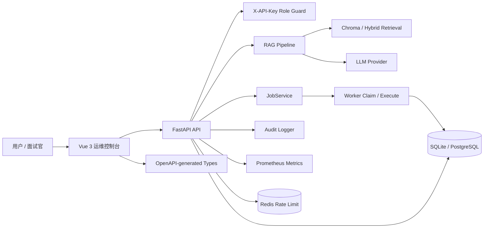

# Architecture Overview - Project A

## 总览

Project A 是一个企业设备售后诊断 RAG 平台，核心目标是把“故障描述”转成“带证据、可追踪、可升级人工”的排障建议。



## 主要模块

| 模块 | 职责 | 面试讲法 |
|---|---|---|
| Vue 控制台 | 展示状态、资料、Jobs、审计、聊天、工单、评测 | 让工程能力可演示，不只停留在 API |
| FastAPI | REST API、依赖注入、统一错误、认证 | 清晰接口边界和运维入口 |
| RAG Pipeline | 检索、上下文拼装、grounded answer | 防止只调用 LLM，强调引用和拒答 |
| Storage | SQLite demo / PostgreSQL production smoke | 轻量演示与生产增强路径兼容 |
| JobService | 异步入库和评测任务 | 展示生产任务生命周期设计 |
| Audit | 记录 job.create/succeeded/failed/cancelled 等事件 | 支撑可追踪和排障 |
| Metrics | `/metrics` 暴露 request/error/job/uptime | 支撑 SRE/运维视角 |
| OpenAPI | 导出 schema 并生成前端类型 | 降低前后端契约漂移 |

## 核心数据流

### 1. 文档入库流

```text
Documents Page -> POST /api/v1/jobs/ingest -> Job PENDING
Worker claim -> RUNNING -> ingest pipeline -> SUCCEEDED/FAILED/CANCELLED
Audit + Metrics -> Jobs Page 展示
```

### 2. RAG 问答流

```text
Chat Page -> POST /api/v1/chat
PromptInjectionGuard -> Retriever -> LLM -> citations/answer
资料不足或高风险 -> 拒答 / ticket escalation
```

### 3. 评测流

```text
Evaluations Page -> POST /api/v1/jobs/evaluations
Worker -> evaluation runner -> result summary
Audit + Jobs Page -> 可追踪结果
```

### 4. 运维排障流

```text
统一错误体 -> request_id -> ApiErrorAlert -> Audit / Logs / Metrics
```

## 设计取舍

### SQLite + Chroma vs PostgreSQL + Redis + Milvus

- Demo 默认用 SQLite + Chroma，降低面试现场启动成本。
- 生产增强 compose 提供 PostgreSQL、Redis、Milvus，展示扩展路径。

### Memory limiter vs Redis limiter

- Memory limiter 适合单实例 demo。
- Redis limiter 适合多实例共享限流，Redis 不可用时拒绝请求并让 readyz degraded。

### 内置 JobService vs 外部队列

- 内置 JobService 足够展示任务生命周期和 worker 语义。
- 多实例生产可以演进到 Celery/RQ/Redis Queue，当前文档中明确列为后续优化。

### OpenAPI generated types vs 手写 types

- 手写类型容易 drift。
- 当前前端核心 API 类型从 `docs/openapi.json` 生成，并在 CI 中检查 drift。

## 生产验证链路

最终验收脚本覆盖：

1. Full backend tests
2. Ruff check
3. Frontend build
4. OpenAPI types
5. E2E list
6. Secret scan
7. Docker Compose production config
8. Docker Compose demo config
9. PostgreSQL smoke
10. Redis rate limit tests
11. Redis rate limit smoke
12. PostgreSQL worker stress
13. Full E2E

这条链路是面试时证明“不是只在本机点通”的关键证据。
