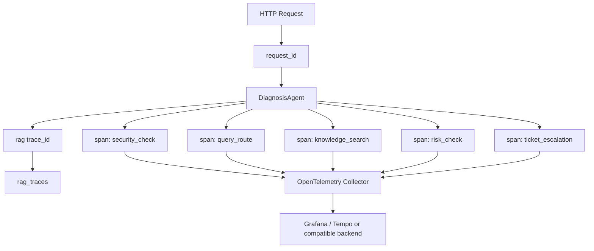

# OTel Trace Correlation Design

> 目标：设计如何把 request_id、trace_id、tool_calls、latency_ms 和 metrics 串成完整可观测链路。

## 当前状态

Project A 当前已有：

- Request ID。
- RAG Trace。
- tool_calls。
- latency_ms。
- Prometheus metrics。
- Audit events。
- Grafana demo dashboard。

当前缺口：

- Request ID 和 RAG trace_id 没有形成统一链路视图。
- tool_calls 还没有映射为标准 span。
- metrics 和具体 Trace 没有可点击关联。
- 没有 OpenTelemetry collector 和 exporter。

## 设计目标

- 每个 HTTP 请求都有 request_id。
- 每次 Agentic RAG 诊断都有 trace_id。
- request_id 和 trace_id 相互记录。
- security_check、query_route、knowledge_search、risk_check、ticket_escalation 可以映射为 span。
- latency_ms、decision、risk_level、retrieval_attempts 可以作为 span attributes 或 metrics labels。
- Grafana 可以从高错误率或高延迟指标定位到 Trace 样本。

## 建议链路

## 实施步骤

### Step 1：字段关联

先不引入新依赖，只在 Trace 中补充 request_id 字段。

验证方式：

- 调用 Agentic diagnose。
- 响应包含 trace_id。
- 后端日志和 Trace 都能看到 request_id。

### Step 2：Span 语义设计

把 tool_calls 映射为 span 名称：

- `agent.security_check`
- `agent.query_route`
- `rag.knowledge_search`
- `agent.risk_check`
- `ticket.escalation`

常用 attributes：

- `agent.decision`
- `rag.retrieval_attempts`
- `rag.context_sufficient`
- `rag.citation_count`
- `risk.level`
- `ticket.created`

### Step 3：接入 OpenTelemetry

接入后端 FastAPI instrumentation 和手动 spans。

注意：

- 不要把用户问题全文和文档内容直接写入 span attributes。
- Trace 详情仍保存在业务 RAG Trace 中。
- OTel 记录链路元数据，RAG Trace 记录业务证据链。

### Step 4：Grafana 关联

Grafana 面板增加：

- Agentic diagnosis latency。
- decision 分布。
- retrieval retry rate。
- escalation count。
- trace sample link。

## 风险和取舍

- OTel 会增加运行复杂度。
- span attributes 不能泄露敏感文档内容。
- 本地 demo 不应强依赖 OTel collector。
- 先做设计和可选配置，避免破坏本机启动体验。

## 面试表达

推荐说法：

> 当前项目已经有业务 RAG Trace 和 Prometheus metrics。下一步我会引入 OTel trace correlation，把 request_id、rag trace_id、tool_calls、latency 和 metrics 串起来。OTel 负责调用链路，RAG Trace 负责业务证据链，两者互补而不是替代。
