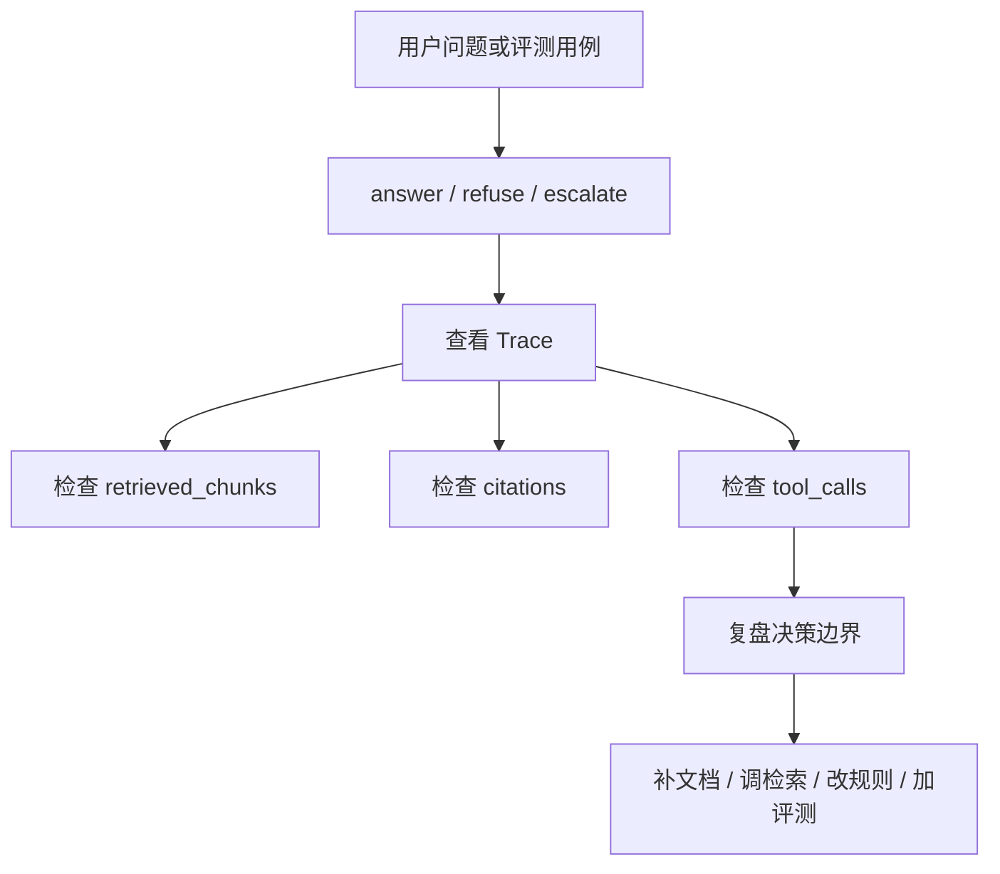

# RAG Quality Report

> 目标：明确 Project A 的 RAG 质量如何证明，以及还需要补哪些 production-like 样本。

## 结论

Project A 已完成真实模型接入（chat：agnes-2.0-flash；embedding：BAAI/bge-m3 via SiliconFlow）并完成一轮真实模型实测：regression 30/30、agentic 决策 6/6、LLM-as-judge grounded 8/10（faithfulness 均分 4.3/5）。

实测同时暴露了两个更重要的事实：当前评测集在小语料上已饱和（哈希向量对照组同样 30/30），坏案例集中在"过度保守拒答"与"系统安全话术影响 grounding 判分"。下一步质量增强的重点是造更难的评测集、扩真实样本、复盘坏案例，而不是继续堆检索组件。

## 2026-07-26 真实模型实测

**环境**：agnes-2.0-flash（temperature=0）+ BAAI/bge-m3（1024 维，SiliconFlow）；regression/chat 用 `real_manuals_sanitized`（16 篇脱敏手册），agentic 用 `seed_docs`；单轮运行，样本量见各表。

### 端到端指标

| 项目 | 结果 |
|---|---|
| regression（30 例，LLM + bge-m3） | 30/30 通过 |
| regression 对照（30 例，LLM + 哈希向量） | 30/30 通过（指标饱和，见下） |
| chat 抽样（10 例） | `llm_used` 10/10，期望关键词全命中 10/10 |
| chat 延迟 | P50 ≈ 1.8s，最大 7.0s（含检索 + LLM 生成） |
| agentic 评测（6 例） | 决策匹配 6/6；citation / refusal / escalation / trace 全部 1.0 |
| retrieval_retry_rate（agentic） | 0.5（一半用例触发低质量改写重试） |

### LLM-as-judge faithfulness 抽样（10 例，单票判分）

| 指标 | 结果 |
|---|---|
| grounded 比例 | 8/10 |
| faithfulness 均分 | 4.3 / 5 |

**坏案例复盘**（这轮实测最有价值的部分）：

1. `real-reg-010`（faithfulness=1）：资料中已给出 COM-08 通讯故障定义，模型却声称"资料未建立 COM-08 与 PLC-X200 的关联"并拒绝作答——**过度保守拒答**。方向：答案接受度校验对"部分相关资料"的边界过紧，需要针对"通用故障码 + 具体设备"的组合补检索与提示词案例。
2. `real-reg-022`(faithfulness=2)：被判"资料之外断言"的内容是系统规则自动追加的**安全边界话术**（停机/泄压/隔离）。这是"安全兜底优先于严格 grounding"的**有意设计权衡**：宁可损失判分也不省略安全提示。改进方向：将安全话术标注为系统注入段落，评测时单独核算，而不是取消注入。

### 检索后端对照的诚实结论

语义改述探针（4 条刻意不含文档原词的口语化问题）在哈希向量与 bge-m3 两种后端下命中率同为 4/4，且 top-2 引用完全一致；regression 也双双 30/30。原因：demo 语料只有 5-16 篇文档，BM25 混合检索 + 设备型号规则重排已足以覆盖，**向量后端的差异在这个语料规模上无法显现**（可参考的间接信号：哈希组端到端耗时 136s vs bge 组 80s，提示低质量首轮检索触发了更多改写重试，但该差值未控制 provider 延迟方差，不作强结论）。

这意味着：不能拿当前评测集宣称"接了 bge-m3 效果提升 X%"。真实价值在于：(1) 语义向量通道已可验证地打通（维度校验、批量 embedding、降级路径）；(2) 评测体系成熟到能识别出"评测集难度不足"这一问题本身。

## 当前质量能力

## 当前质量能力

已具备：

- 普通 RAG 问答。
- citations 引用。
- insufficient 拒答字段。
- Agentic RAG answer / refuse / escalate 决策。
- Prompt 注入拒答。
- 高风险升级工单。
- Trace 证据链。
- GraphRAG 关系展示。
- regression / adversarial / agentic evaluation 入口。
- Quality 页面和 Acceptance 证据面板。

## 关键质量指标

### citation_accuracy

含义：回答引用是否存在，且引用是否支持答案。

价值：避免模型拿无关证据包装答案。

### refusal_accuracy

含义：资料不足、未知型号、Prompt 注入等场景是否正确拒答。

价值：企业系统不能为了回答而回答。

### escalation_accuracy

含义：冒烟、异味、高压、电池鼓包等高风险问题是否正确升级工单。

价值：把安全风险交给人工闭环。

### trace_completeness

含义：Trace 是否记录 question、tool_calls、retrieved_chunks、citations、decision、quality 等字段。

价值：让每次诊断可复盘。

### retrieval_retry_rate

含义：AgenticRetriever 触发二次检索的比例。

价值：观察检索质量和 query rewrite 价值。

## Production-like 评测集建议

建议新增或扩充这些用例类型：

- 正常故障诊断。
- 未知型号拒答。
- Prompt 注入拒答。
- 高风险升级。
- 首次检索不足后 rewrite 成功。
- GraphRAG 多跳关系。
- citation 不支持答案的负例。
- 相似故障码混淆案例。
- 多部件、多动作组合问题。

## 质量复盘流程

## 当前质量边界

不能夸大为：

- 已覆盖真实企业全部设备知识。
- 已经过大规模人工标注验证。
- 已能替代维修专家。
- 已能处理所有高风险场景。

可以准确表达为：

> 当前项目具备 production-like RAG 质量治理框架，已经覆盖引用、拒答、升级、Trace、评测和 bad case 复盘能力；后续需要扩充真实设备样本和人工标注评测集。

## 下一步增强

建议优先：

1. **造更难的评测集**：改述式问题（不含文档原词）+ 更大语料（≥100 篇），让检索后端差异可测；当前集合已饱和。
2. 把本轮两个坏案例（COM-08 过度保守拒答、安全话术判分）回写为 regression 负例。
3. LLM-as-judge 从单票升级为多票/多视角（grounding、完整性、可执行性分开判）。
4. 安全边界话术标注为系统注入段落，grounding 判分时单独核算。
5. 新增 `data/eval/production_like_cases_v1.json`，标注 expected_decision、expected_citation_source、risk_level。
6. 在 Quality 页面展示真实模型实测摘要。

## 面试表达

推荐说法：

> 我不会只说 RAG 效果好，而是用 citation accuracy、refusal accuracy、escalation accuracy、trace completeness、retrieval retry rate 加上 LLM-as-judge faithfulness 抽样来描述质量。真实模型实测里我发现了两类问题：一是评测集在小语料上饱和，哈希向量对照组和 bge-m3 分数一样，说明不能拿这个集合宣称检索提升，需要造更难的改述式评测集；二是坏案例里有一条是我们自己注入的安全话术被判为资料外断言——这是安全兜底和严格 grounding 的权衡，我选择保留注入并计划在判分时单独核算。能发现评测集自身的问题，比堆一个虚高的分数更重要。
