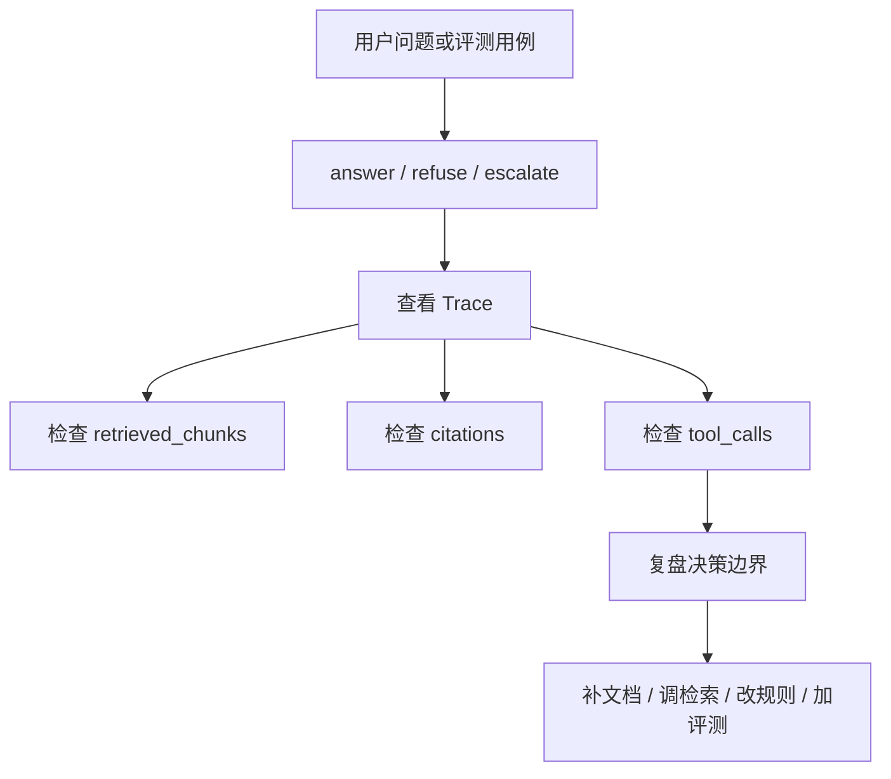

# RAG Quality Report

> 目标：明确 Project A 的 RAG 质量如何证明，以及还需要补哪些 production-like 样本。

## 结论

Project A 当前已经有 RAG、Agentic RAG、Trace、Evaluation 和 Quality 页面基础，但真实业务质量还需要更多样本支撑。

现阶段最重要的质量增强不是换模型，而是补数据、补评测、补坏案例复盘。

## 当前质量能力

已具备：

- 普通 RAG 问答。
- citations 引用。
- insufficient 拒答字段。
- Agentic RAG answer / refuse / escalate 决策。
- Prompt 注入拒答。
- 高风险升级工单。
- Trace 证据链。
- GraphRAG 关系展示。
- regression / adversarial / agentic evaluation 入口。
- Quality 页面和 Acceptance 证据面板。

## 关键质量指标

### citation_accuracy

含义：回答引用是否存在，且引用是否支持答案。

价值：避免模型拿无关证据包装答案。

### refusal_accuracy

含义：资料不足、未知型号、Prompt 注入等场景是否正确拒答。

价值：企业系统不能为了回答而回答。

### escalation_accuracy

含义：冒烟、异味、高压、电池鼓包等高风险问题是否正确升级工单。

价值：把安全风险交给人工闭环。

### trace_completeness

含义：Trace 是否记录 question、tool_calls、retrieved_chunks、citations、decision、quality 等字段。

价值：让每次诊断可复盘。

### retrieval_retry_rate

含义：AgenticRetriever 触发二次检索的比例。

价值：观察检索质量和 query rewrite 价值。

## Production-like 评测集建议

建议新增或扩充这些用例类型：

- 正常故障诊断。
- 未知型号拒答。
- Prompt 注入拒答。
- 高风险升级。
- 首次检索不足后 rewrite 成功。
- GraphRAG 多跳关系。
- citation 不支持答案的负例。
- 相似故障码混淆案例。
- 多部件、多动作组合问题。

## 质量复盘流程

## 当前质量边界

不能夸大为：

- 已覆盖真实企业全部设备知识。
- 已经过大规模人工标注验证。
- 已能替代维修专家。
- 已能处理所有高风险场景。

可以准确表达为：

> 当前项目具备 production-like RAG 质量治理框架，已经覆盖引用、拒答、升级、Trace、评测和 bad case 复盘能力；后续需要扩充真实设备样本和人工标注评测集。

## 下一步增强

建议优先：

1. 新增 `data/eval/production_like_cases_v1.json`。
2. 给每条 case 标注 expected_decision、expected_citation_source、risk_level。
3. 输出一份实测质量摘要。
4. 将坏案例回写到 regression 集合。
5. 在 Quality 页面增加 production-like case summary。

## 面试表达

推荐说法：

> 我不会只说 RAG 效果好，而是用 citation accuracy、refusal accuracy、escalation accuracy、trace completeness 和 retrieval retry rate 描述质量。当前项目已有评测和 Trace 复盘框架，下一步重点是扩充真实设备样本和人工标注数据，让质量报告更接近生产。
