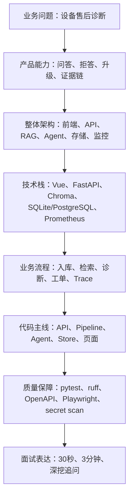

# Project A 深度教学课程总纲

> 课程定位：把 Project A 从“能跑的项目”讲成“能学习、能复述、能面试展示、能继续维护”的企业级 Agentic RAG 案例。

## 本讲目标

本讲先建立课程地基：

- 明确学习对象：准备 AI Agent、RAG、大模型工程岗位的学习者。
- 明确课程目标：不是背代码，而是掌握业务、产品、架构、流程、测试和面试表达。
- 明确学习路线：业务 -> 产品 -> 架构 -> 技术栈 -> 流程 -> 代码 -> 测试 -> 面试。
- 明确阶段边界：第一阶段只讲业务、定位、流程、架构，不进入函数级源码。

最终能力标准：

- 能用 30 秒说清 Project A 的定位。
- 能用 3 分钟讲清业务闭环和技术闭环。
- 能画出前端、API、RAG、Agent、Store、Jobs、Tickets、Evaluation、Observability 的关系。
- 能解释 answer、refuse、escalate 三类决策边界。
- 能把项目写进简历，并经得起面试官追问。

## 大白话解释

这个课程不是源码注释合集，而是一条学习路线。

直接看代码容易出现两个问题：

- 看懂了某个函数，却不知道项目整体解决什么业务问题。
- 记住了技术名词，却讲不出为什么要用这些技术。

所以课程先从业务讲起，再进入产品形态、架构拆分、技术栈、流程细节，最后才进入代码和测试。这样你在面试中不是“我写了一个 RAG”，而是“我做了一个企业设备售后诊断 Agentic RAG 平台，并能解释它的工程闭环”。

## 业务场景

Project A 面向企业设备售后诊断：

- 售后人员要根据设备型号、故障码、现场现象快速找到排障建议。
- 企业不能接受模型乱编答案，所以需要引用证据和拒答边界。
- 高风险问题不能自动指导操作，需要升级人工工单。
- 团队需要复盘系统为什么这样回答，所以需要 Trace 证据链。
- 面试展示需要可视化页面、测试、监控和文档证明工程完整性。

## 技术栈关联

课程会按“为什么需要”来讲技术：

- Vue 3：把复杂后端能力做成可演示控制台。
- FastAPI：提供清晰 API、依赖装配和 OpenAPI 契约。
- RAG Pipeline：把企业文档变成可检索知识，减少凭空回答。
- DiagnosisAgent：把安全检查、查询路由、知识检索、风险识别、工单升级串成单诊断控制器。
- Store：保存聊天、工单、Trace、审计和任务状态。
- Evaluation：用数据集验证回答、拒答、升级是否合理。
- Observability：用 metrics、Trace、audit、Request ID 支撑排障和面试展示。

## 项目实现位置

第一阶段只引用关键路径，不贴大段代码：

- 后端入口：`backend/app/main.py`
- RAG 主链路：`backend/app/rag/pipeline.py`
- Agentic 检索：`backend/app/rag/agentic.py`
- 诊断控制器：`backend/app/rag/diagnosis_agent.py`
- 图关系检索：`backend/app/rag/graph.py`
- 存储层：`backend/app/store.py`
- 工单流程：`backend/app/ticketing/workflow.py`
- 指标：`backend/app/metrics.py`
- 前端入口：`frontend/src/App.vue`
- Agentic 页面：`frontend/src/pages/AgenticPage.vue`
- 质量页面：`frontend/src/pages/QualityPage.vue`
- 现有学习总览：`docs/learning_guide.md`
- 现有深挖文档：`docs/agentic_rag_deep_dive.md`

## 流程图

## 设计优势

- 先讲边界：避免把项目讲成普通聊天机器人。
- 先讲流程：理解 answer、refuse、escalate 后再看代码更快。
- 先讲架构：知道模块职责后，读代码不会迷路。
- 面向求职：每一讲都把业务价值、技术价值和面试表达连起来。

## 局限和后续增强

当前阶段的边界：

- 不讲函数级源码。
- 不修改功能代码。
- 不替代 `docs/learning_guide.md` 和 `docs/agentic_rag_deep_dive.md`，而是补充更细的分章课程。
- 当前教学体系已落地 `00_course_overview.md` 入口和 `01` 到 `18` 共 18 章正文，后续可以继续补配套练习、图示和面试口述稿。

后续增强：

- 为每章补配套练习和口述稿。
- 进入代码阶段后增加“读码顺序”和“改动风险提示”。
- 补充真实面试追问和标准回答。

## 面试讲法

30 秒版本：

> Project A 是一个企业设备售后诊断 Agentic RAG 平台。它把设备文档检索、引用回答、拒答边界、高风险工单升级、Trace 证据链、评测和监控做成完整工程闭环，能展示我对 RAG 应用从业务到生产化落地的理解。

3 分钟版本：

> 我按业务、产品和工程三层设计 Project A。业务上，它解决售后人员查手册慢、诊断不一致、高风险问题缺少升级机制的问题。产品上，用户输入型号、故障码或现场现象，系统返回有引用的回答；资料不足时拒答；高风险时升级工单。工程上，FastAPI 负责 API 和依赖装配，RAG Pipeline 做检索与回答，DiagnosisAgent 做安全检查、query route、knowledge search、risk check 和 ticket escalation，Store 保存 Trace、工单、审计和聊天记录，Vue 3 前端展示工具调用、GraphRAG 关系、质量指标和系统状态。

简历 bullet：

- 设计企业设备售后诊断 Agentic RAG 平台，支持动态检索、引用回答、拒答边界、高风险工单升级、Trace 证据链、评测和监控。
- 基于 FastAPI、Vue 3、Chroma、SQLite/PostgreSQL、Prometheus/Grafana、Playwright 构建可演示、可测试、可追踪的 RAG 工程闭环。
- 使用单诊断控制器实现安全检查、查询路由、知识检索、风险识别和工单升级，避免与多 Agent 项目定位重叠。

## 高频追问

### 1. 为什么先讲业务和架构，不直接讲代码？

因为面试官更关心你是否知道“为什么这样设计”。代码是实现结果，业务边界和架构取舍决定项目是否可信。

### 2. 这套课程和现有学习文档有什么区别？

现有学习文档偏总览，本课程偏分章教学，会把业务、定位、流程、架构、技术栈、面试表达拆得更细。

### 3. 为什么只先写 4 篇？

前 4 篇是地基。一次性写完 18 篇容易变浅，分阶段更容易保证质量。

## 学习检查题

- Project A 的一句话定位是什么？
- 课程为什么采用“业务 -> 产品 -> 架构 -> 技术栈 -> 流程 -> 代码 -> 测试 -> 面试”？
- 为什么第一阶段不直接讲源码？
- 你能说出 5 个后续要重点学习的模块吗？
- 你能用 30 秒介绍这个项目吗？

## 下一讲衔接

下一讲进入 `docs/teaching/01_project_positioning.md`：讲清 Project A 为什么是“企业设备售后诊断 Agentic RAG 平台”，以及为什么它不是 ChatGPT 套壳，也不是多 Agent 平台。

## 18 章完整课程目录

1. `01_project_positioning.md`：项目定位与求职表达。验收标准：能用 30 秒讲清项目不是 ChatGPT 套壳。
2. `02_business_workflow.md`：业务流程与决策边界。验收标准：能讲清 answer、refuse、escalate。
3. `03_architecture_map.md`：系统架构图与模块协作。验收标准：能画出核心模块关系。
4. `04_product_pages.md`：前端页面与产品体验。验收标准：能说明每个页面服务哪个展示点。
5. `05_backend_stack.md`：FastAPI、Pydantic、OpenAPI。验收标准：能解释 API 层为什么要薄。
6. `06_frontend_stack.md`：Vue 3、Vite、TypeScript、Element Plus。验收标准：能解释前端如何产品化后端能力。
7. `07_storage_and_jobs.md`：Store、Jobs、Audit、Tickets。验收标准：能说明 RAG 项目为什么需要状态管理。
8. `08_observability_stack.md`：Metrics、Grafana、Trace、Request ID。验收标准：能讲清可观测性和排障的关系。
9. `09_rag_basics_in_project.md`：RAG 基础与项目落点。验收标准：能解释检索、chunk、引用、grounding。
10. `10_rag_pipeline_flow.md`：RagPipeline 主流程。验收标准：能讲清 search 和 answer 的职责边界。
11. `11_agentic_retrieval.md`：AgenticRetriever。验收标准：能解释 query rewrite、retry、context sufficient。
12. `12_diagnosis_agent.md`：DiagnosisAgent。验收标准：能讲清五类工具调用和决策规则。
13. `13_graphrag_and_trace.md`：GraphRAG 与 Trace。验收标准：能解释证据链如何支撑可信回答。
14. `14_evaluation_system.md`：Evaluation 系统。验收标准：能说明指标如何发现坏案例。
15. `15_test_strategy.md`：测试策略。验收标准：能讲清 pytest、ruff、OpenAPI、E2E、secret scan 分别防什么风险。
16. `16_deployment_and_runtime.md`：部署与运行。验收标准：能说明 demo 与生产部署差异。
17. `17_interview_playbook.md`：面试手册。验收标准：能完成 30 秒、3 分钟、深挖三层表达。
18. `18_next_stage_roadmap.md`：下一阶段路线。验收标准：能提出 OTel、告警、迁移治理、样本扩充等可信计划。
