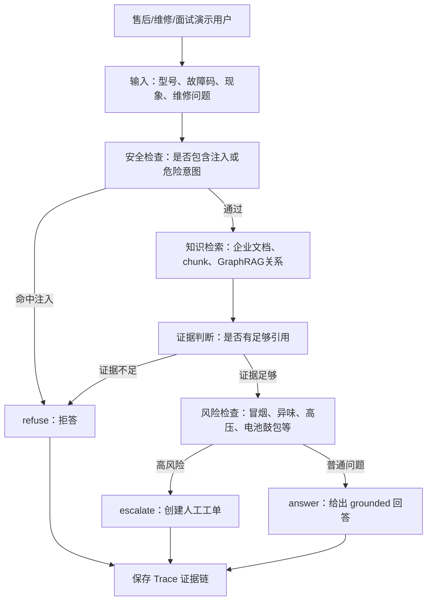

# 01｜项目定位：企业设备售后诊断 Agentic RAG 平台

## 本讲目标

本讲解决一个核心问题：Project A 到底是什么。

学完后你要能做到：

- 用一句话定义项目：企业设备售后诊断 Agentic RAG 平台。
- 解释它为什么不是 ChatGPT 套壳。
- 解释它为什么不是多 Agent 平台。
- 说清业务用户、输入、输出和核心价值。
- 准备 30 秒、3 分钟、简历 bullet 三套表达。

## 大白话解释

Project A 不是“做一个聊天框接大模型”。

它更像一个售后工程师助手：

- 用户问的是设备故障，不是闲聊。
- 系统回答必须尽量来自企业知识库，不能自由发挥。
- 资料不足时要拒答，而不是硬编。
- 有安全风险时要升级工单，而不是继续给危险建议。
- 每次诊断要留下 Trace，方便复盘为什么这样判断。

所以它的关键词不是“聊天”，而是“诊断、证据、边界、升级、可追溯”。

## 业务场景

典型用户：

- 售后客服：快速回答客户常见设备问题。
- 现场维修工程师：根据型号、故障码、现象查排障步骤。
- 技术支持主管：查看系统是否经常答错、拒答或升级。
- AI 工程面试官：观察项目是否具备真实企业场景和工程闭环。

典型输入：

- 设备型号。
- 故障码。
- 现场现象，例如无法启动、有异味、冒烟、温度异常。
- 维修问题，例如是否可以重启、是否需要更换部件。

典型输出：

- `answer`：有证据引用的诊断回答。
- `refuse`：资料不足或安全检查不通过时拒绝回答。
- `escalate`：高风险问题升级工单，交给人工处理。
- `trace_id`：一次诊断的证据链编号。
- `ticket_id`：升级人工工单后的工单编号。

## 技术栈关联

项目定位会直接决定技术选择：

- 需要回答基于企业资料，所以使用 RAG，而不是只调用通用模型。
- 需要安全边界，所以引入 Prompt Injection Guard 和风险检查。
- 需要诊断流程控制，所以使用单个 DiagnosisAgent，而不是多个角色 Agent 随机协作。
- 需要证据链，所以保存 RAG Trace，而不是只返回一段文本。
- 需要企业级展示，所以用 Vue 3 做运维控制台，而不是只提供命令行 demo。
- 需要质量证明，所以加入 Evaluation、E2E、metrics、secret scan、CI。

## 项目实现位置

定位相关文件路径：

- 项目介绍：`README.md`
- 学习总览：`docs/learning_guide.md`
- Agentic 深挖：`docs/agentic_rag_deep_dive.md`
- 简历展示：`docs/resume_interview_showcase.md`
- 面试问题：`docs/interview_questions.md`
- 后端诊断控制器：`backend/app/rag/diagnosis_agent.py`
- RAG 管道：`backend/app/rag/pipeline.py`
- 前端 Agentic 展示页：`frontend/src/pages/AgenticPage.vue`

## 流程图

## 设计优势

- 业务清晰：围绕企业设备售后诊断，不是泛泛的问答机器人。
- 边界明确：正常回答、资料不足拒答、高风险升级工单。
- 工程闭环完整：前端、后端、RAG、Agent、工单、评测、监控都有落点。
- 面试可讲：每个模块都能对应一个工程能力点，而不是只有模型调用。

## 局限和后续增强

当前定位边界：

- 它不是覆盖所有设备行业的生产知识库，演示数据规模有限。
- GraphRAG 主要是工程展示版，重点在关系展示和解释检索。
- Grafana、Alembic、Neo4j 等能力偏可用骨架和演示增强。
- 多 Agent 协作不放在本项目主线，避免和 `project-b-multi-agent` 定位重叠。

后续增强：

- 扩充多型号、多故障、多部件文档样本。
- 增加更细的风险分级和人工审核策略。
- 加入更完整的 OTel 链路追踪和告警策略。

## 面试讲法

30 秒版本：

> Project A 是一个企业设备售后诊断 Agentic RAG 平台。用户输入设备型号、故障码或现场现象后，系统会基于企业文档检索证据，给出有引用的回答；资料不足时拒答；遇到冒烟、异味、高压、电池鼓包等高风险场景会升级工单，并保存 Trace 证据链。

3 分钟版本：

> 我设计这个项目时没有把它做成普通聊天机器人，而是聚焦企业设备售后诊断。业务上，售后和维修人员需要快速从设备手册里找到可靠排障建议，同时不能在资料不足或高风险场景下乱答。产品上，我把输出分成 answer、refuse、escalate 三类：能找到证据就回答；证据不足或 Prompt 注入就拒答；涉及安全风险就创建工单。工程上，FastAPI 负责 API 和依赖装配，RAG Pipeline 负责检索与回答，DiagnosisAgent 负责安全检查、query route、knowledge search、risk check、ticket escalation，Store 保存 Trace、工单、审计和聊天记录，Vue 3 前端展示工具调用、决策、引用、GraphRAG 关系和系统状态。

简历 bullet：

- 构建企业设备售后诊断 Agentic RAG 平台，支持型号/故障码/现象输入、文档检索、引用回答、拒答边界、高风险工单升级与 Trace 证据链。
- 设计单诊断控制器完成 security check、query route、knowledge search、risk check、ticket escalation，避免将项目泛化为多 Agent 协作系统。
- 使用 FastAPI、Vue 3、Chroma、SQLite/PostgreSQL、Prometheus/Grafana、Playwright 和 OpenAPI 类型同步形成可演示、可测试、可观测的工程闭环。

## 高频追问

### 1. 为什么说它不是 ChatGPT 套壳？

因为它不是把问题直接发给模型，而是先做安全检查、知识检索、证据判断、风险检查、决策分流，并保存 Trace。核心能力是企业知识增强和诊断闭环。

### 2. 为什么说它不是多 Agent 平台？

因为它没有设计多个自治 Agent 互相协作，而是一个诊断控制器按固定工具链执行。这样边界更清晰，结果更可控。

### 3. 为什么要强调 answer、refuse、escalate？

企业场景不能只追求“能回答”。真正重要的是知道什么时候该答、什么时候不该答、什么时候交给人工。

## 学习检查题

- 用一句话说出 Project A 的定位。
- 举出 3 个业务用户和 3 类输入。
- 解释 `answer`、`refuse`、`escalate` 的区别。
- 说出它不是 ChatGPT 套壳的 3 个理由。
- 说出它不是多 Agent 平台的 2 个理由。

## 下一讲衔接

下一讲进入 `docs/teaching/02_business_workflow.md`：把项目拆成 5 条业务流程，重点讲清文档入库、普通 RAG 问答、Agentic RAG 诊断、高风险工单升级和 Trace 证据链如何串起来。
