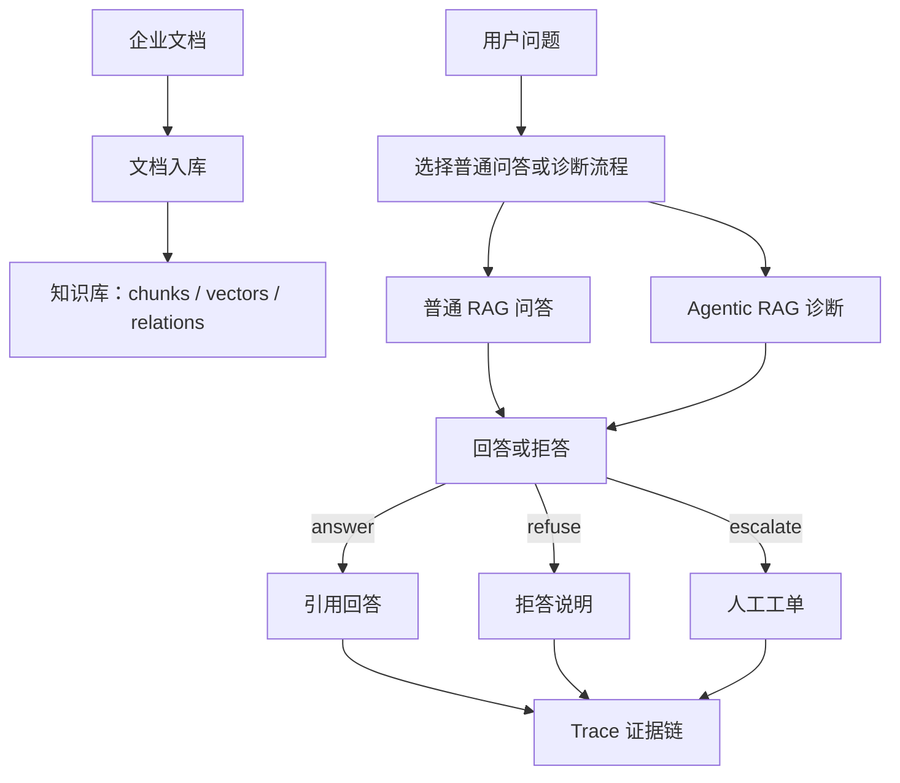

# 02｜业务流程：从文档入库到 Trace 证据链

## 本讲目标

本讲拆解 5 条业务流程：

- 文档入库。
- 普通 RAG 问答。
- Agentic RAG 诊断。
- 高风险工单升级。
- Trace 证据链。

学完后你要能讲清：每条流程解决什么业务问题，系统内部做了哪些动作，用户在前端看到什么，以及面试中如何把流程讲成工程闭环。

## 大白话解释

企业 RAG 项目不能只看“问一句答一句”。

完整流程是：

- 先把企业文档整理进系统。
- 用户提问时，系统先找相关资料。
- 普通问题给出带证据的回答。
- 诊断问题进入更严格的 Agentic RAG 流程。
- 安全风险问题升级人工工单。
- 无论答、拒答、升级，都留下 Trace，方便复盘。

## 业务场景

- 售后主管上传设备手册，希望系统检索到最新知识。
- 客服问“E21 故障怎么处理”，希望快速拿到引用答案。
- 维修工程师问“设备有异味还能重启吗”，系统需要识别高风险。
- 系统找不到可靠资料时，不能编造答案。
- 出现争议时，需要通过 Trace 回看当时检索了哪些 chunk、为什么做出这个决策。

## 技术栈关联

- 文档入库：FastAPI 文件上传、后台 Job、文档切分、向量索引、Store 状态记录。
- 普通 RAG 问答：RagPipeline、HybridRetriever、Chroma、引用生成。
- Agentic RAG 诊断：DiagnosisAgent、PromptInjectionGuard、QueryRouter、AgenticRetriever。
- 高风险工单升级：risk_check、TicketWorkflowService、ticket store。
- Trace 证据链：RagTraceRecord、Store、Trace API、前端时间线展示。

## 项目实现位置

- API 装配和路由：`backend/app/main.py`
- RAG 管道：`backend/app/rag/pipeline.py`
- Agentic 检索：`backend/app/rag/agentic.py`
- Prompt 注入防护：`backend/app/rag/security.py`
- 查询增强和路由：`backend/app/rag/query.py`
- 诊断控制器：`backend/app/rag/diagnosis_agent.py`
- 工单服务：`backend/app/ticketing/workflow.py`
- 数据模型：`backend/app/models.py`
- 存储层：`backend/app/store.py`
- 前端 Agentic 页面：`frontend/src/pages/AgenticPage.vue`
- 前端 Jobs 页面：`frontend/src/pages/JobsPage.vue`
- 前端 Tickets 页面：`frontend/src/pages/TicketsPage.vue`
- 前端 Quality 页面：`frontend/src/pages/QualityPage.vue`

## 流程图

### 全局流程

### 流程一：文档入库

业务背景：企业设备知识分散在手册、排障指南、维修记录里。RAG 要能回答，第一步必须让系统先“读过”这些资料。

系统动作：

- 接收文档或读取 demo 文档目录。
- 把长文档切成适合检索的 chunk。
- 把 chunk 写入检索索引。
- 用 Job 记录入库进度和错误摘要。
- 必要时写入审计事件和指标。

用户看到：Jobs 页面能看到任务状态，失败时能看到错误摘要，入库后问答和诊断流程能检索到新知识。

面试讲法：

> RAG 的第一步不是模型，而是知识治理。我把文档入库做成异步 Job，让长任务不会阻塞请求，同时记录状态、错误和审计信息，方便演示和排障。

### 流程二：普通 RAG 问答

业务背景：客服或维修人员问常规问题，例如故障码含义、保养步骤、部件说明。系统应该快速检索知识并给出有引用的回答。

系统动作：

- 接收用户问题。
- 调用 RAG Pipeline 检索相关 chunk。
- 根据检索结果组织上下文。
- 生成回答并附带引用。
- 资料不足时进入拒答边界。

用户看到：Chat 或相关页面展示回答文本、引用来源，Quality 页面可复盘低分案例。

面试讲法：

> 普通 RAG 问答解决的是“从企业文档中找依据再回答”。核心不是让模型自由发挥，而是把回答限制在检索到的证据上，并通过 citations 提升可信度。

### 流程三：Agentic RAG 诊断

业务背景：诊断类问题比普通问答更复杂。系统不仅要检索，还要判断问题是否安全、是否需要改写查询、是否有足够上下文、是否触发风险升级。

系统动作：

- `security_check`：检查 Prompt 注入或越权诱导。
- `query_route`：判断问题类型并增强查询。
- `knowledge_search`：复用 RAG Pipeline 检索知识。
- 质量不足时触发 query rewrite 和 retry。
- `risk_check`：识别冒烟、异味、高压、电池鼓包等风险词。
- 根据规则输出 answer、refuse 或 escalate。

用户看到：Agentic RAG 页面展示决策结果、tool calls 时间线、rewrite、retry、context sufficient、quality、trace id 和 GraphRAG 关系。

面试讲法：

> 我没有把 Agentic RAG 做成多个 Agent 互相聊天，而是用单诊断控制器串起固定工具链。这样每一步可解释、可测试、可追踪，更适合企业诊断场景。

### 流程四：高风险工单升级

业务背景：涉及安全风险的问题不能让 AI 继续给操作建议。例如冒烟、异味、高压、电池鼓包、禁止重启等场景，企业更需要人工介入。

系统动作：

- 风险检查识别高风险关键词。
- 诊断控制器把决策设为 `escalate`。
- 根据配置创建工单。
- 返回 `ticket_id` 和下一步建议。
- Trace 保存风险命中和工具调用信息。

用户看到：Agentic RAG 页面显示 escalation，Tickets 页面能看到工单状态，后续可人工恢复或关闭工单。

面试讲法：

> 企业 AI 不能只追求自动化。对高风险设备问题，我把系统设计成自动升级工单，把风险交给人工闭环处理，这比让模型继续输出危险建议更符合企业安全要求。

### 流程五：Trace 证据链

业务背景：当系统回答错了、拒答了或升级了，团队需要知道当时发生了什么。Trace 就是一次诊断的黑匣子记录。

系统动作：

- 保存问题、决策、检索结果、引用、工具调用、延迟、token usage 等信息。
- 提供 Trace 列表和详情 API。
- 前端展示 Trace 明细和工具时间线。
- 评测系统可以用 Trace 分析坏案例。

用户看到：诊断结果里有 `trace_id`，Trace 明细能看到 chunks、citations、quality、decision，Quality 页面能从 Trace 角度复盘低分案例。

面试讲法：

> Trace 的作用是把 AI 的一次回答变成可审计事件。它能说明系统检索了什么、选了什么证据、为什么拒答或升级，这对排障、评测、合规和面试展示都很关键。

## 设计优势

- 流程闭环完整：从知识入库到诊断结果再到复盘证据。
- 风险边界明确：不是所有问题都回答，安全风险优先升级。
- 可解释性强：tool calls、citations、Trace 都能解释系统行为。
- 工程演示友好：每条流程都有前端页面、API、测试和文档承接。

## 局限和后续增强

- 文档样本规模仍偏 demo，需要更多真实设备资料验证泛化性。
- 风险识别主要依赖规则词和工程判断，后续可以增加更细的安全分类器。
- Trace 已可查询，但还可以与 Request ID、Grafana、OTel 做更强关联。
- 工单流程已能演示闭环，后续可接入真实客服系统或企业 IM。

## 面试讲法

推荐主讲顺序：文档入库 -> 普通 RAG -> Agentic RAG -> 高风险升级 -> Trace 复盘。

完整表达：

> Project A 的业务流程不是简单问答，而是从文档入库开始，把设备手册切分并索引；用户提问时先走 RAG 检索和引用回答；诊断类问题进入 Agentic RAG，由单诊断控制器执行安全检查、query route、knowledge search、risk check；资料不足或注入命中时拒答，高风险时创建工单；每次结果都会保存 Trace，方便后续评测、审计和排障。

## 高频追问

### 1. answer、refuse、escalate 的边界是什么？

- `answer`：安全检查通过，检索证据足够，没有命中高风险。
- `refuse`：Prompt 注入命中，或检索不足，或没有可用 citations。
- `escalate`：问题涉及高风险设备操作，需要人工介入。

### 2. 为什么资料不足要拒答？

因为企业设备场景里错误建议可能造成损失。拒答不是失败，而是可信系统的安全边界。

### 3. 为什么 Trace 对 RAG 项目重要？

RAG 的质量问题往往发生在检索、证据选择和生成之间。Trace 能把这些步骤记录下来，便于定位根因。

## 学习检查题

- 说出 5 条业务流程的顺序。
- 解释文档入库为什么要做成 Job。
- 解释普通 RAG 和 Agentic RAG 的区别。
- 举出 3 个应该 escalate 的风险场景。
- 说出 Trace 至少记录的 5 类信息。

## 下一讲衔接

下一讲进入 `docs/teaching/03_architecture_map.md`：把这些业务流程映射到系统架构，讲清 Vue 前端、FastAPI API、RAG Pipeline、DiagnosisAgent、Store、Jobs、Tickets、Evaluation、Observability 如何协作。
