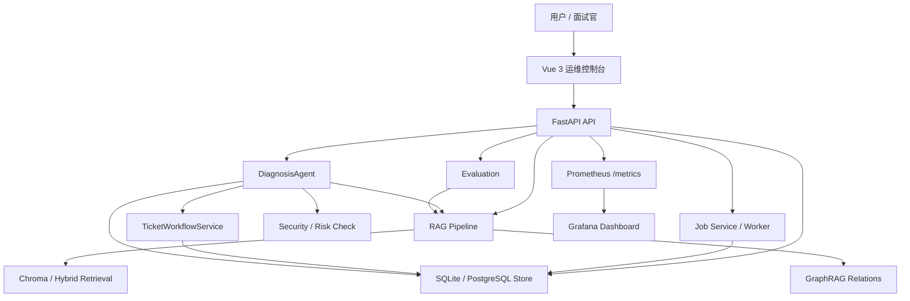
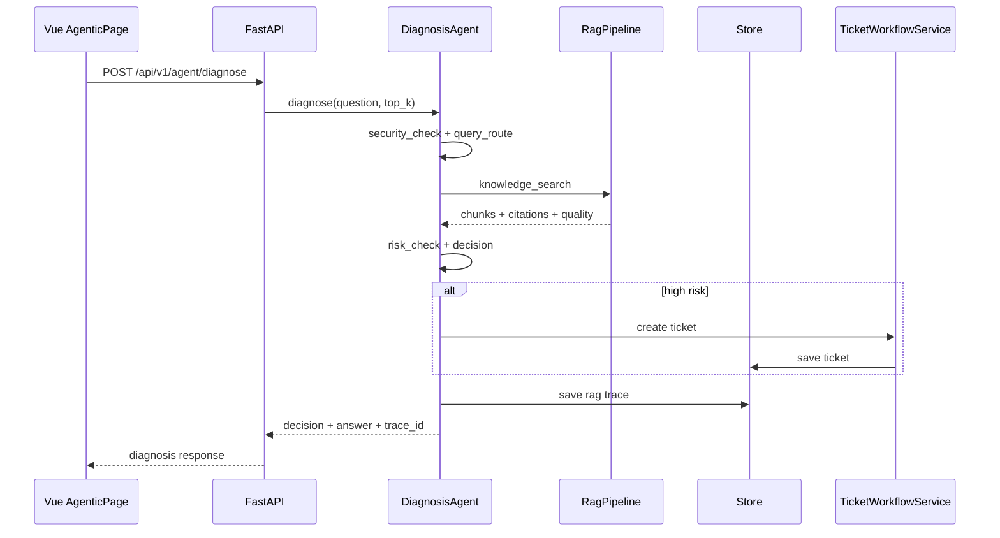

# 03｜架构地图：Project A 的模块如何协作

## 本讲目标

本讲从架构角度回答：Project A 为什么能支撑企业级 Agentic RAG 诊断闭环。

学完后你要能做到：

- 画出全局架构图。
- 解释 Vue 前端、FastAPI API、RAG Pipeline、DiagnosisAgent、Store、Jobs、Tickets、Evaluation、Observability 的职责。
- 说清每个模块使用什么技术栈、解决什么问题、和其他模块如何协作。
- 用面试语言讲出这个项目的工程完整性。

## 大白话解释

架构不是文件夹列表，而是职责分工。

Project A 可以理解成 9 个角色协作：

- Vue 前端负责让人看得见、点得动、演示得出来。
- FastAPI API 负责把外部请求接进系统。
- RAG Pipeline 负责找资料、组织证据、生成回答。
- DiagnosisAgent 负责诊断流程控制和决策。
- Store 负责保存状态和证据。
- Jobs 负责处理耗时任务。
- Tickets 负责人工升级闭环。
- Evaluation 负责验证质量。
- Observability 负责让系统可排障、可监控。

如果只做 RAG Pipeline，它只是一个算法 demo；把这些模块串起来，才像企业级工程项目。

## 业务场景

架构要支撑这些业务需求：

- 售后人员通过网页提交问题，而不是调用脚本。
- 系统要同时支持问答、诊断、工单、评测、状态查看。
- 长任务不能阻塞用户请求。
- 诊断结果要能追溯证据。
- 面试演示时要能展示质量、可观测性和工程边界。

## 技术栈关联

- Vue 3 + Vite + TypeScript + Element Plus：快速构建可演示运维控制台，TypeScript 降低接口误用风险。
- FastAPI + Pydantic：声明式 API、响应模型、自动 OpenAPI，适合 AI 应用后端。
- Chroma + RAG Pipeline：把企业文档切成可检索知识，用引用控制生成边界。
- SQLite/PostgreSQL：SQLite 方便本机 demo，PostgreSQL 代表生产化迁移方向。
- Prometheus/Grafana：用指标表达系统状态，不只靠日志。
- Playwright + pytest + ruff：覆盖前端可达性、后端行为和代码质量。

## 项目实现位置

- 前端应用入口：`frontend/src/App.vue`
- 前端壳层导航：`frontend/src/components/AppShell.vue`
- Agentic 页面：`frontend/src/pages/AgenticPage.vue`
- 架构页面：`frontend/src/pages/ArchitecturePage.vue`
- 系统状态页面：`frontend/src/pages/SystemStatusPage.vue`
- 后端 API 入口：`backend/app/main.py`
- RAG Pipeline：`backend/app/rag/pipeline.py`
- 诊断控制器：`backend/app/rag/diagnosis_agent.py`
- Agentic 检索：`backend/app/rag/agentic.py`
- Store：`backend/app/store.py`
- Jobs：`backend/app/jobs.py`、`backend/app/job_worker.py`
- Tickets：`backend/app/ticketing/workflow.py`
- Evaluation：`backend/app/evaluation.py`
- Metrics：`backend/app/metrics.py`
- 测试：`backend/tests`、`frontend/e2e`

## 流程图

### 全局架构图

### Agentic 诊断协作图

## 设计优势

### Vue 前端

职责：把后端能力产品化展示。

- 技术栈：Vue 3、Vite、TypeScript、Element Plus、Playwright。
- 解决的问题：让面试官和用户能直接看到 Agentic RAG、Trace、GraphRAG、Jobs、Tickets、Quality、System Status。
- 模块关系：调用 FastAPI API，展示后端返回的状态、结果和证据。
- 面试讲法：前端不是装饰页，而是把 RAG 工程能力变成可操作的运维控制台。

### FastAPI API

职责：系统入口和依赖装配层。

- 技术栈：FastAPI、Pydantic、OpenAPI、middleware。
- 解决的问题：统一暴露聊天、诊断、Trace、GraphRAG、Jobs、Tickets、Evaluation、metrics 等接口。
- 模块关系：向下连接 RAG、Agent、Store、Jobs、Tickets、Metrics，向上服务 Vue 前端。
- 面试讲法：API 层保持薄，把业务逻辑放到服务层，便于测试和维护。

### RAG Pipeline

职责：检索知识、组织上下文、生成有引用的回答。

- 技术栈：RAG Pipeline、Chroma、Hybrid Retrieval、citations、GraphRAG relations。
- 解决的问题：避免模型凭空回答，让答案尽量基于企业文档。
- 模块关系：被普通 Chat、DiagnosisAgent、Evaluation 调用。
- 面试讲法：RAG Pipeline 是知识增强核心，Agentic 能力是在它上面做流程控制，而不是替代它。

### DiagnosisAgent

职责：单诊断控制器。

- 技术栈：Python 服务类、PromptInjectionGuard、QueryRouter、AgenticRetriever、TicketWorkflowService。
- 解决的问题：把诊断流程拆成可解释工具调用，并输出 answer、refuse、escalate。
- 模块关系：调用 RAG Pipeline、Store、Metrics、Ticket 服务。
- 面试讲法：这里的 Agent 不是多个角色聊天，而是面向 RAG 诊断的流程控制器，强调可控、可测、可追踪。

### Store

职责：保存系统状态。

- 技术栈：SQLite、PostgreSQL 兼容路径、Pydantic 模型、Alembic 迁移骨架。
- 解决的问题：保存工单、聊天、审计、Trace、token usage 等数据。
- 模块关系：被 API、Jobs、Tickets、Agent、Evaluation 共享。
- 面试讲法：企业 RAG 不只是一次性回答，状态持久化让系统可追踪、可恢复、可治理。

### Jobs

职责：处理耗时任务。

- 技术栈：JobService、worker、heartbeat、状态枚举。
- 解决的问题：文档入库、评测等长任务不应该阻塞 HTTP 请求。
- 模块关系：API 创建任务，worker 执行任务，Store 保存状态，前端展示进度。
- 面试讲法：异步 Jobs 体现工程化，不把所有耗时工作塞进一次请求。

### Tickets

职责：人工升级闭环。

- 技术栈：TicketWorkflowService、状态流、Store。
- 解决的问题：高风险诊断不能只靠 AI 自动处理，需要人工接管。
- 模块关系：DiagnosisAgent 命中高风险后调用 Tickets，前端 Tickets 页面展示和处理。
- 面试讲法：工单模块体现 AI 系统的人机协作边界。

### Evaluation

职责：质量验证。

- 技术栈：评测数据集、回归评测、对抗评测、Agentic diagnosis cases。
- 解决的问题：判断系统是否真的回答正确、拒答合理、升级准确。
- 模块关系：调用 RAG 和 Agentic 逻辑，结果进入 Quality 页面和测试体系。
- 面试讲法：我没有只靠主观体验判断效果，而是用评测维度验证 RAG 与 Agentic 决策质量。

### Observability

职责：可观测性和排障。

- 技术栈：Request ID、audit logs、Prometheus metrics、Grafana demo dashboard、Trace。
- 解决的问题：线上系统出问题时要知道请求量、错误量、任务状态、Agent 决策分布。
- 模块关系：API middleware、Jobs、Agent、Store 都会写指标或记录。
- 面试讲法：可观测性让项目从 demo 更接近生产系统，能支撑排障和持续优化。

## 局限和后续增强

- 当前架构适合本机 demo 和面试展示，真实生产还需要更完整的权限、租户、告警、容量治理。
- SQLite 适合轻量运行，生产应优先 PostgreSQL，并完善迁移回滚策略。
- Prometheus/Grafana 已有演示栈，后续可加 OTel trace correlation。
- Jobs 当前适合项目演示，生产可替换为更强的队列和 worker 编排。
- GraphRAG 当前偏关系展示，后续可接入更强的图谱构建和实体消歧。

## 面试讲法

推荐架构表达：

> Project A 的架构按企业 RAG 应用闭环设计。前端用 Vue 3 做运维控制台，负责把诊断、Trace、GraphRAG、Jobs、Tickets、Quality、System Status 展示出来；后端用 FastAPI 作为 API 和依赖装配层；RAG Pipeline 负责文档检索、上下文组织和引用回答；DiagnosisAgent 在 RAG 之上做安全检查、query route、knowledge search、risk check 和 ticket escalation；Store 保存聊天、工单、Trace、审计等状态；Jobs 解耦入库和评测长任务；Evaluation 验证回答、拒答和升级质量；Observability 用 metrics、audit、Request ID 和 Grafana 支撑排障。整体设计重点是可信、可追溯、可评测、可运维。

核心模块追问回答：

> 核心是 RAG Pipeline 和 DiagnosisAgent 的关系。RAG Pipeline 负责知识增强，DiagnosisAgent 负责诊断控制和决策。这样既复用传统 RAG 能力，又补上企业诊断需要的安全、拒答、升级和 Trace。

## 高频追问

### 1. API 层为什么要薄？

因为 API 层主要负责协议和依赖装配。如果把业务逻辑都写在接口函数里，测试、复用和维护都会变困难。

### 2. 为什么前端也算架构重点？

面试展示项目不是只看后端。前端把 Trace、工具调用、GraphRAG、任务、指标可视化，能证明系统能力可达、可演示、可复盘。

### 3. RAG Pipeline 和 DiagnosisAgent 谁更重要？

二者职责不同。RAG Pipeline 是知识检索和回答核心，DiagnosisAgent 是诊断流程和决策核心。企业级 Agentic RAG 需要两者配合。

## 学习检查题

- 画出 Project A 的全局架构图。
- 说出 9 个核心模块及职责。
- 解释 RAG Pipeline 和 DiagnosisAgent 的关系。
- 解释 Jobs 为什么要独立出来。
- 解释 Observability 对面试展示有什么价值。

## 下一讲衔接

下一讲进入 `docs/teaching/04_product_pages.md`：从用户界面角度讲 Architecture、Agentic RAG、Quality、Jobs、Tickets、System Status 等页面分别展示什么能力，以及面试演示时应该按什么顺序点击。
