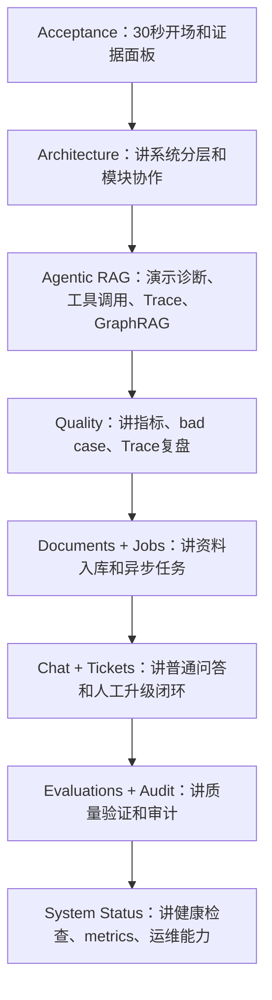
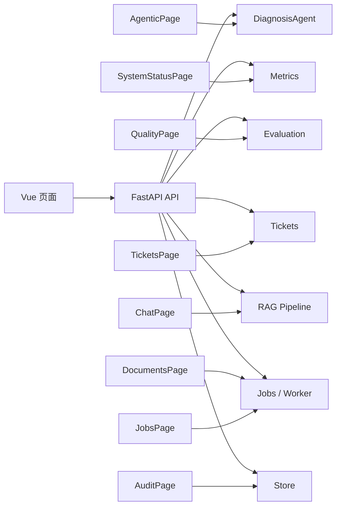

# 04｜产品页面：把工程能力讲成可演示路线

## 本讲目标

本讲从前端产品视角学习 Project A。

学完后你要能做到：

- 说清 11 个前端页面分别展示什么能力。
- 解释为什么 AI 工程项目需要产品化页面，而不是只保留 API。
- 设计一条面试演示路线：先讲项目定位，再讲架构、诊断、质量、任务、工单和系统状态。
- 把每个页面和后端能力对应起来，避免演示时只停留在“点页面”。
- 知道哪些页面适合 30 秒展示，哪些页面适合面试官深挖。

## 大白话解释

前端页面不是“给项目套个壳”。

对求职项目来说，页面有三个作用：

- 让面试官不用读源码，也能看到系统能力。
- 把复杂后端链路拆成可点击、可复盘、可解释的展示点。
- 证明项目不是单接口 demo，而是可运营、可观测、可验收的工程系统。

Project A 的前端页面可以理解成一条演示剧本：

- 验收中心负责开场。
- 架构总览负责讲设计。
- Agentic RAG 负责讲核心亮点。
- Quality、Evaluations、Audit 负责讲质量治理。
- Documents、Jobs、Tickets 负责讲业务闭环。
- System Status 负责讲运维能力。
- Chat 负责讲普通 RAG 问答基线。

## 业务场景

真实企业里，不同角色关注不同页面：

- 面试官：更关注 Acceptance、Architecture、Agentic RAG、Quality。
- 售后客服：更关注 Chat、Tickets、Documents。
- 维修主管：更关注 Agentic RAG、Trace、Tickets、Quality。
- 运维人员：更关注 System Status、Jobs、Audit、metrics。
- 项目维护者：更关注页面和后端 API 的对应关系。

所以页面不是平均重要。面试展示时要有主次：先展示能证明项目定位和技术深度的页面，再展示辅助闭环页面。

## 技术栈关联

前端主要使用 Vue 3 生态：

- Vue 3：用组件化方式组织页面，每个页面对应一个业务能力区块。
- Vite：提供快速本地开发和构建体验。
- TypeScript：减少 API 字段误用，配合 OpenAPI 类型生成增强前后端契约。
- Element Plus：提供表单、卡片、表格、标签、弹窗等后台管理常见组件。
- Playwright：做 E2E 验收，证明页面可打开、按钮可点、关键结果可显示。

为什么这样选：

- AI 项目需要快速展示复杂流程，Vue 3 + Element Plus 能高效搭建控制台。
- RAG 结果字段多，TypeScript 能让前端更早发现字段不匹配。
- 面试项目需要可验证，Playwright 能证明页面不是静态截图。

## 项目实现位置

页面入口和路由：

- 应用入口：`frontend/src/App.vue`
- 页面导航：`frontend/src/components/AppShell.vue`

核心页面：

- 验收中心：`frontend/src/pages/AcceptancePage.vue`
- 架构总览：`frontend/src/pages/ArchitecturePage.vue`
- 质量洞察：`frontend/src/pages/QualityPage.vue`
- Agentic RAG：`frontend/src/pages/AgenticPage.vue`
- 系统状态：`frontend/src/pages/SystemStatusPage.vue`
- 资料管理：`frontend/src/pages/DocumentsPage.vue`
- 异步任务：`frontend/src/pages/JobsPage.vue`
- 审计日志：`frontend/src/pages/AuditPage.vue`
- 诊断问答：`frontend/src/pages/ChatPage.vue`
- 工单闭环：`frontend/src/pages/TicketsPage.vue`
- 评测中心：`frontend/src/pages/EvaluationsPage.vue`

前端 API 对接位置：

- API 请求封装：`frontend/src/api/endpoints.ts`
- API 类型：`frontend/src/api/types.ts`
- 认证状态：`frontend/src/stores/auth.ts`

## 流程图

### 页面演示主线

### 页面和后端能力映射

## 设计优势

### 1. Acceptance：验收中心

职责：项目开场页，帮助快速建立“这不是小 demo”的第一印象。

- 技术栈关联：Vue 组件、展示卡片、Release 链接、验收指标。
- 解决的问题：面试一开始不用直接讲源码，先展示项目整体证据。
- 和其他模块关系：聚合架构、质量、测试、演示路线、生产门禁等信息。
- 面试讲法：这是项目的展示首页，用来把业务定位、工程能力和验收证据一次讲清。

适合展示：30 秒开场、项目亮点、验收证据。

### 2. Architecture：架构总览

职责：解释系统分层、RAG 数据流、Worker、可观测性和生产门禁。

- 技术栈关联：Vue 页面展示 Mermaid 架构图和模块卡片。
- 解决的问题：让面试官快速理解系统不是单接口，而是多个模块协作。
- 和其他模块关系：连接前端、API、RAG、Jobs、Store、Metrics、Acceptance Gate。
- 面试讲法：我用这个页面讲整体设计，先讲边界，再讲模块协作，最后讲为什么这样设计。

适合展示：架构追问、系统边界、模块职责。

### 3. Quality：质量洞察

职责：展示 RAG 指标、bad case、Trace 复盘和工程取舍。

- 技术栈关联：Vue 卡片、指标展示、评测结果读取。
- 解决的问题：避免只说“效果不错”，而是用指标和坏案例讲质量治理。
- 和其他模块关系：连接 Evaluation、Trace、Acceptance report。
- 面试讲法：质量页面说明我知道 RAG 系统需要评测、复盘和持续改进，不是只看一次回答。

适合展示：RAG 质量、坏案例分析、取舍边界。

### 4. Agentic RAG：核心诊断页

职责：展示诊断输入、answer/refuse/escalate 决策、工具调用、Adaptive Retrieval、Trace 和 GraphRAG 关系。

- 技术栈关联：Vue 表单、API 调用、Element Plus 表格、状态展示。
- 解决的问题：把后端 DiagnosisAgent 的行为产品化，让每一步决策可见。
- 和其他模块关系：调用 `POST /api/v1/agent/diagnose`，关联 RAG、Ticket、Trace、GraphRAG。
- 面试讲法：这是项目核心页，能展示单诊断控制器如何做安全检查、检索、风险识别、升级和证据链保存。

适合展示：项目核心亮点、Agentic RAG、Trace、GraphRAG。

### 5. System Status：系统状态

职责：展示 healthz、readyz、release、metrics summary。

- 技术栈关联：Vue 请求后端状态 API，解析 Prometheus 文本指标。
- 解决的问题：说明项目具备运维视角，不是本地跑通就结束。
- 和其他模块关系：连接后端健康检查、metrics、release 信息。
- 面试讲法：这个页面证明我考虑了系统运行状态和排障入口。

适合展示：生产化意识、监控、健康检查。

### 6. Documents：资料管理

职责：上传资料、切换 docs source、触发入库任务。

- 技术栈关联：Vue 文件上传、表单、异步 API。
- 解决的问题：RAG 的知识来源需要可管理，不能只写死在代码里。
- 和其他模块关系：触发入库 Job，最终影响 RAG 检索结果。
- 面试讲法：RAG 的第一步是知识治理，资料管理页面展示知识如何进入系统。

适合展示：知识库维护、文档入库入口。

### 7. Jobs：异步任务

职责：查看入库和评测任务，展示任务状态、失败、取消、查询和 worker 架构说明。

- 技术栈关联：Vue 表格、过滤、查询、任务操作按钮。
- 解决的问题：文档入库和评测可能耗时，不能阻塞请求。
- 和其他模块关系：连接 JobService、worker、Store、metrics、audit。
- 面试讲法：Jobs 页面展示我把耗时任务从同步请求中解耦，具备后台任务和状态治理能力。

适合展示：工程化、异步处理、长任务治理。

### 8. Audit：审计日志

职责：查看关键操作审计记录。

- 技术栈关联：Vue 表格、权限提示、API 查询。
- 解决的问题：企业系统要知道谁在什么时间触发了什么操作。
- 和其他模块关系：连接 Store 中的 audit events，覆盖 job、评测、工单等事件。
- 面试讲法：审计日志体现企业级系统的可追踪性，方便排障和合规复盘。

适合展示：企业级治理、权限和审计意识。

### 9. Chat：诊断问答

职责：展示普通 RAG 问答、引用和安全后处理。

- 技术栈关联：Vue 表单、API 调用、结果展示。
- 解决的问题：提供一个普通 RAG 基线，和 Agentic RAG 诊断形成对照。
- 和其他模块关系：调用 RAG Pipeline，不一定进入完整 DiagnosisAgent 流程。
- 面试讲法：Chat 页面说明项目保留传统 RAG 问答能力，Agentic RAG 是在其基础上的诊断增强。

适合展示：普通 RAG、引用回答、和 Agentic 的区别。

### 10. Tickets：工单闭环

职责：启动、恢复、关闭售后工单。

- 技术栈关联：Vue 表单、确认弹窗、状态表格。
- 解决的问题：高风险或复杂问题需要人工闭环，不应完全交给 AI。
- 和其他模块关系：被 DiagnosisAgent 的 escalate 决策触发，也可由页面手动管理。
- 面试讲法：Tickets 页面说明 AI 系统不是替代所有人工，而是把风险问题交给人工处理。

适合展示：人机协作、安全边界、售后闭环。

### 11. Evaluations：评测中心

职责：触发 regression、RAGAS、adversarial 等评测入口。

- 技术栈关联：Vue 操作按钮、同步/异步评测 API、结果展示。
- 解决的问题：用评测数据验证系统质量，避免只靠人工体验。
- 和其他模块关系：调用 Evaluation 服务，可能创建异步 Job，结果进入 Quality 或 Acceptance 展示。
- 面试讲法：评测中心说明项目具备质量回归意识，能在改动后检查 RAG 行为是否退化。

适合展示：质量保障、回归测试、持续优化。

## 局限和后续增强

当前页面体系已经适合面试展示，但也有边界：

- 部分页面更偏 showcase，真实生产还需要更细的权限、租户和操作确认。
- Trace、metrics、audit 还可以进一步做跨页面联动，例如从 Agentic 结果一键跳转到 Trace 详情。
- Documents 页面可以增加更完整的文档版本管理和入库差异对比。
- Tickets 页面可以接入真实客服系统、IM 或企业工单平台。
- System Status 可以补更细的告警状态和 OTel trace correlation。

## 面试讲法

推荐演示路线：

1. 先打开 Acceptance，用 30 秒说明项目定位和验收证据。
2. 打开 Architecture，用 1 分钟讲前端、API、RAG、Agent、Store、Jobs、Metrics 的关系。
3. 打开 Agentic RAG，输入一个诊断问题，展示 decision、tool calls、trace id、GraphRAG。
4. 打开 Quality 和 Evaluations，说明如何评测回答质量、拒答质量和坏案例。
5. 打开 Documents 和 Jobs，说明知识入库和异步任务。
6. 打开 Tickets，说明高风险问题如何进入人工闭环。
7. 打开 System Status 和 Audit，收束到可观测性、审计和生产化意识。

完整表达：

> 前端不是简单页面，而是 Project A 的演示控制台。Acceptance 用来建立项目整体可信度，Architecture 讲系统设计，Agentic RAG 展示核心诊断链路，Quality 和 Evaluations 展示质量治理，Documents 和 Jobs 展示知识入库和长任务治理，Tickets 展示人工升级闭环，System Status 和 Audit 展示运维与审计。通过这些页面，面试官可以直接看到 RAG 应用从业务、诊断、证据、质量到运维的完整闭环。

## 高频追问

### 1. 为什么需要这么多页面？

因为企业级 RAG 不是一个聊天框。它需要知识管理、诊断、工单、评测、监控、审计和验收证据，多页面能把这些能力拆开讲清楚。

### 2. 哪个页面最重要？

面试主线里最重要的是 Agentic RAG，其次是 Architecture 和 Quality。Agentic RAG 展示核心能力，Architecture 展示设计理解，Quality 展示工程可信度。

### 3. Chat 和 Agentic RAG 有什么区别？

Chat 是普通 RAG 问答基线，重点是检索和引用回答。Agentic RAG 是诊断增强链路，额外包含安全检查、查询路由、动态检索、风险识别、工单升级和 Trace。

### 4. 页面演示失败怎么办？

不要慌。先切到 Architecture 和 Acceptance 讲设计与证据，再用 System Status 检查健康状态，最后根据 Trace、Jobs 或 Audit 定位问题。这反而能体现排障思路。

## 学习检查题

- 说出 11 个页面各自对应的核心能力。
- 为什么 Acceptance 适合做面试开场？
- 为什么 Agentic RAG 是核心展示页？
- Chat 和 Agentic RAG 的职责差异是什么？
- 你能按 7 步说出一条完整面试演示路线吗？

## 下一讲衔接

下一讲进入 `docs/teaching/05_backend_stack.md`：开始讲后端技术栈，重点解释 FastAPI、Pydantic、OpenAPI、middleware、依赖装配为什么适合这个项目，以及 API 层为什么要保持薄。
