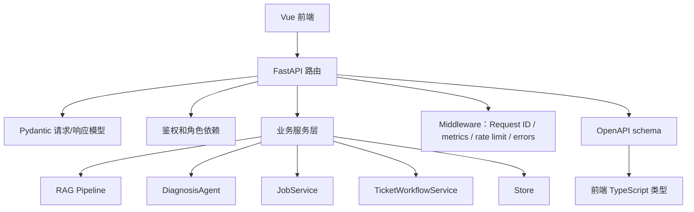

# 05｜后端技术栈：FastAPI 如何把 RAG 系统组织成工程服务

## 本讲目标

本讲开始进入技术栈阶段，但仍然不做函数级源码讲解。

你需要掌握：

- 后端为什么选择 FastAPI，而不是只写脚本或 Flask 小接口。
- Pydantic、OpenAPI、response_model、middleware 在项目里解决什么问题。
- API 层为什么要保持薄，把业务逻辑交给 RAG、Agent、Jobs、Tickets 等服务层。
- 后端如何把健康检查、认证、限流、metrics、统一错误和 Request ID 串起来。
- 面试中如何把“我会写接口”升级成“我能设计 AI 应用后端服务”。

## 大白话解释

后端不是把所有逻辑堆在一个接口里。

在 Project A 里，FastAPI 更像一个调度大厅：

- 用户从前端发请求进来。
- FastAPI 判断请求要去聊天、诊断、工单、评测、任务还是系统状态。
- 请求体和响应体用 Pydantic 模型约束。
- 业务逻辑交给专门模块处理。
- 中间件统一处理 Request ID、metrics、错误和限流。
- OpenAPI 把接口契约导出给前端生成类型。

这样做的价值是：接口清晰、模块边界清楚、测试容易写、前后端不容易漂移。

## 业务场景

企业级 RAG 平台的后端需要同时处理很多类型的请求：

- 用户问普通 RAG 问题。
- 用户发起 Agentic RAG 诊断。
- 售后主管上传资料并触发入库。
- 维修主管查看工单并关闭工单。
- 管理员运行评测或查看审计。
- 运维人员查看 healthz、readyz、metrics。

如果所有逻辑都写在一个文件里，后续很难维护。FastAPI 的作用就是给这些能力建立清晰入口。

## 技术栈关联

### FastAPI

大白话：FastAPI 是后端 HTTP 服务框架，负责定义“前端可以请求哪些地址”。

为什么用：

- 写 API 清晰，适合 RAG、Agent、工单、评测这类多接口系统。
- 自动生成 OpenAPI，方便前端同步类型。
- 支持依赖注入，可以把鉴权、角色、配置、服务实例统一装配。
- 和 pytest TestClient 配合好，便于写接口测试。

### Pydantic

大白话：Pydantic 像接口的数据合同，规定请求和响应应该长什么样。

为什么用：

- 防止前端传错字段后悄悄失败。
- 让 response_model 明确输出结构。
- 让 OpenAPI schema 更稳定。
- 让面试官看到你关注 API 契约，不是随便返回 dict。

### OpenAPI

大白话：OpenAPI 是接口说明书，前端可以根据它生成 TypeScript 类型。

为什么用：

- 降低前后端字段漂移。
- 让接口可检查、可文档化、可自动化生成类型。
- 面试里能体现工程协作意识。

### Middleware

大白话：middleware 是所有请求进出系统时都会经过的公共处理层。

为什么用：

- Request ID 不需要每个接口重复写。
- metrics 统计不需要每个接口手动记录。
- CORS、限流、统一错误都适合放在公共层。
- 公共能力集中处理，业务接口更干净。

## 项目实现位置

- FastAPI 应用入口：`backend/app/main.py`
- 请求和响应模型：`backend/app/models.py`
- 配置读取：`backend/app/config.py`
- 统一错误：`backend/app/errors.py`
- Request ID：`backend/app/observability.py`
- 限流中间件：`backend/app/rate_limit.py`
- 指标统计：`backend/app/metrics.py`
- RAG 服务：`backend/app/rag/pipeline.py`
- 诊断控制器：`backend/app/rag/diagnosis_agent.py`
- 工单服务：`backend/app/ticketing/workflow.py`
- 任务服务：`backend/app/jobs.py`
- 后端测试：`backend/tests`
- OpenAPI 文档：`docs/openapi.json`

## 流程图

## 设计优势

### 1. API 层薄

API 层主要负责协议，不负责堆业务细节。

优势：

- 接口函数更容易读。
- 业务逻辑可以单独测试。
- RAG、Agent、工单、任务模块可以复用。
- 后续改页面或改业务时，不会把所有逻辑搅在一起。

面试讲法：

> 我让 FastAPI 负责路由、模型校验和依赖装配，把真正的诊断、检索、工单、任务逻辑放到服务层。这样 API 层薄，模块更容易测试和维护。

### 2. response_model 稳定接口契约

response_model 让接口返回结构固定。

优势：

- 前端知道每个接口会返回什么字段。
- OpenAPI 可以准确描述接口。
- 测试可以检查结构，而不是只检查状态码。

面试讲法：

> AI 应用后端也需要强契约，尤其是 Agentic RAG 这种字段很多的响应。response_model 能让前后端协作更稳定。

### 3. middleware 统一请求级能力

请求级能力不应该散落在每个接口里。

优势：

- Request ID 统一生成和传递。
- metrics 自动记录请求量、错误量和延迟。
- 限流策略集中管理。
- 错误格式统一，前端能稳定展示。

面试讲法：

> 我把 Request ID、metrics、限流和错误处理放在中间件层，避免业务接口重复写横切逻辑。

### 4. OpenAPI 连接前后端

OpenAPI 不是摆设，而是前后端契约。

优势：

- 前端可以生成类型。
- CI 可以检查 API drift。
- 面试展示时能说明工程规范。

面试讲法：

> OpenAPI 让后端 schema 和前端类型形成闭环，减少字段变更造成的隐性 bug。

## 局限和后续增强

当前后端已经适合 demo 和面试展示，但还有生产增强空间：

- 鉴权可以扩展到更细的 RBAC、租户隔离和审计策略。
- 限流可以根据用户、租户、接口类型分别配置。
- 错误分类可以更细，例如区分检索失败、模型失败、存储失败、外部依赖失败。
- OpenAPI 可以加入更严格的 breaking change 检查。
- 后续可引入更完整的 OpenTelemetry trace correlation。

## 面试讲法

30 秒版本：

> 后端用 FastAPI 做 API 和依赖装配，Pydantic 定义请求响应模型，OpenAPI 同步前端类型，middleware 统一处理 Request ID、metrics、限流和错误。业务逻辑不堆在接口里，而是拆到 RAG Pipeline、DiagnosisAgent、JobService、TicketWorkflowService 和 Store，保证边界清晰、可测试、可维护。

3 分钟版本：

> Project A 的后端不是一个简单聊天接口，而是一个企业 RAG 服务层。FastAPI 负责路由、依赖注入和 OpenAPI 契约；Pydantic 定义聊天、诊断、工单、评测、Trace 等请求响应模型；middleware 统一处理 Request ID、metrics、rate limit、错误格式；具体业务由 RagPipeline、DiagnosisAgent、JobService、TicketWorkflowService、Evaluation 和 Store 承接。这样前端可以通过 OpenAPI 生成类型，测试可以按接口验证行为，运维可以通过 healthz、readyz 和 metrics 判断系统状态。

## 高频追问

### 1. 为什么不用一个 Python 脚本直接跑 RAG？

脚本适合实验，不适合企业应用。企业场景需要 API、权限、错误处理、状态保存、监控、测试和前端协作。

### 2. FastAPI 和 Pydantic 的关系是什么？

FastAPI 负责 HTTP 接口，Pydantic 负责数据模型。一个管“请求怎么进出”，一个管“数据长什么样”。

### 3. 为什么 API 层要薄？

因为 API 层越厚，业务逻辑越难测试和复用。薄 API 能把复杂度放到边界更清晰的服务层。

### 4. OpenAPI 对求职项目有什么价值？

它证明你不是只会写后端接口，还知道前后端契约、类型同步和接口漂移治理。

## 学习检查题

- FastAPI 在 Project A 中承担哪些职责？
- Pydantic 为什么适合定义 Agentic RAG 响应结构？
- middleware 适合处理哪些公共能力？
- API 层为什么不应该堆业务逻辑？
- OpenAPI 如何降低前后端协作风险？

## 下一讲衔接

下一讲进入 `docs/teaching/06_frontend_stack.md`：讲 Vue 3、Vite、TypeScript、Element Plus、OpenAPI generated types 和 Playwright 如何把后端能力变成可演示、可验证的产品界面。
