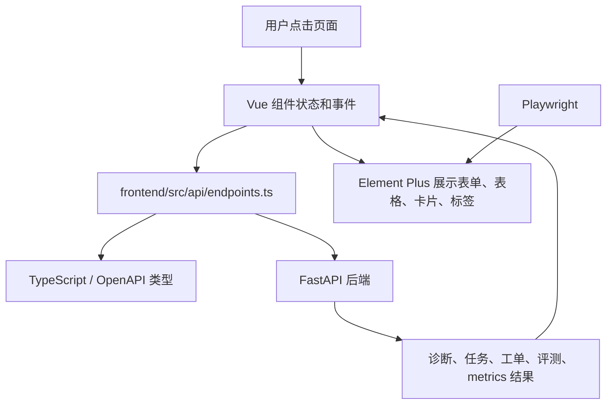

# 06｜前端技术栈：Vue 控制台如何把 RAG 能力产品化

## 本讲目标

本讲学习 Project A 的前端技术栈。

你需要掌握：

- 为什么企业级 RAG 项目需要前端控制台。
- Vue 3、Vite、TypeScript、Element Plus 分别解决什么问题。
- OpenAPI generated types 为什么能减少前后端接口漂移。
- Playwright E2E 为什么是面试项目的强证明材料。
- 如何把前端讲成“工程能力展示层”，而不是“页面装饰”。

## 大白话解释

前端不是把后端接口包一层按钮。

在 Project A 里，前端控制台负责把抽象能力变成可见证据：

- Agentic RAG 的工具调用能看到。
- Trace ID、citations、quality 能看到。
- Jobs 的状态、失败、取消能看到。
- Tickets 的人工闭环能看到。
- healthz、readyz、metrics 能看到。
- Quality 和 Evaluations 能展示系统是否可靠。

这对面试很关键。因为面试官不可能现场读完整个后端源码，前端页面就是你的项目展示窗口。

## 业务场景

不同角色会通过前端完成不同目标：

- 售后人员：通过 Chat 或 Agentic RAG 获取诊断建议。
- 管理人员：通过 Quality、Evaluations 查看系统质量。
- 运维人员：通过 System Status、Jobs、Audit 排查问题。
- 面试官：通过 Acceptance、Architecture、Agentic RAG 快速判断项目深度。
- 开发者：通过页面和 API 类型确认前后端字段是否一致。

## 技术栈关联

### Vue 3

大白话：Vue 3 是前端组件框架，用来把页面拆成可维护组件。

为什么用：

- Composition API 适合组织页面状态、请求、计算属性和事件处理。
- 单文件组件让模板、逻辑、样式集中在一个页面文件中，便于学习。
- 对后台管理型界面友好，开发效率高。

### Vite

大白话：Vite 是前端开发和构建工具。

为什么用：

- 本地启动快，适合频繁调试页面。
- 构建流程简单，适合面试项目和 CI。
- 和 Vue 3、TypeScript 配合成熟。

### TypeScript

大白话：TypeScript 是给 JavaScript 加类型。

为什么用：

- RAG 和 Agentic 响应字段多，类型能减少字段写错。
- 和 OpenAPI 生成类型结合，能让前端更早发现接口变化。
- 面试中能体现工程规范，而不是随手写页面。

### Element Plus

大白话：Element Plus 是 Vue 的后台管理组件库。

为什么用：

- 快速搭建表单、表格、卡片、标签、弹窗。
- 适合 Jobs、Tickets、Audit、System Status 这类运维控制台页面。
- 减少自造 UI 组件，把精力放在业务表达上。

### Playwright

大白话：Playwright 是端到端测试工具，可以模拟用户打开页面、点击按钮、检查结果。

为什么用：

- 证明页面不只是静态文案。
- 能覆盖关键演示路径。
- CI 里可以检查页面是否可达。

## 项目实现位置

- 前端入口：`frontend/src/App.vue`
- 壳层和导航：`frontend/src/components/AppShell.vue`
- API 请求封装：`frontend/src/api/endpoints.ts`
- API 类型：`frontend/src/api/types.ts`
- OpenAPI 生成类型：`frontend/src/api/generated.ts`
- 认证状态：`frontend/src/stores/auth.ts`
- 页面目录：`frontend/src/pages`
- E2E 测试：`frontend/e2e`
- 前端脚本：`frontend/package.json`
- OpenAPI 文件：`docs/openapi.json`

## 流程图

## 设计优势

### 1. 页面按业务能力拆分

每个页面负责一个展示主题：Agentic、Quality、Jobs、Tickets、System Status 等。

优势：

- 页面职责清晰。
- 面试演示路线清楚。
- 后端能力可以被逐个验证。

面试讲法：

> 我没有把所有能力堆在一个页面，而是按业务能力拆分控制台页面，让诊断、质量、任务、工单和运维各自可展示。

### 2. TypeScript 提升接口可靠性

Agentic RAG 的响应字段很多，例如 decision、tool_calls、citations、quality、trace_id。

优势：

- 字段拼错更容易在开发阶段暴露。
- 前端组件更清楚依赖哪些数据。
- 和 OpenAPI 类型生成形成契约闭环。

面试讲法：

> Agentic RAG 的数据结构复杂，所以我用 TypeScript 和 OpenAPI generated types 降低前后端字段漂移风险。

### 3. Element Plus 提高交付效率

后台控制台需要大量表格、卡片、状态标签和弹窗。

优势：

- 快速实现稳定界面。
- 组件语义适合运维后台。
- 少造轮子，把精力放在业务链路。

面试讲法：

> 对这个项目来说，UI 重点不是做炫酷动画，而是清晰展示工程证据，所以我选择成熟后台组件库提高交付效率。

### 4. Playwright 证明页面可达

E2E 测试能模拟真实用户操作。

优势：

- 页面改动后能发现关键入口失效。
- 面试时能说明不是只靠手工点过。
- 和 CI 配合形成验收证据。

面试讲法：

> Playwright 覆盖关键页面和按钮，证明前端展示路径是可验证的，而不是静态截图。

## 局限和后续增强

- 当前前端偏展示控制台，真实生产可增加更完整的角色权限和操作审计提示。
- 页面之间的跳转联动可以增强，例如从 Agentic Trace ID 直接跳 Trace 详情。
- 大型数据表可以增加分页、排序、导出和更细筛选。
- 错误态可以继续细分，例如模型失败、检索失败、存储失败分别提示。
- 视觉设计可以进一步统一成完整 design system，但不应优先于业务链路。

## 面试讲法

30 秒版本：

> 前端用 Vue 3、Vite、TypeScript 和 Element Plus 做成运维控制台，把后端的 RAG、Agentic 诊断、Trace、GraphRAG、Jobs、Tickets、Evaluation、metrics 可视化。OpenAPI generated types 降低前后端字段漂移，Playwright E2E 验证关键页面可达。

3 分钟版本：

> Project A 的前端不是简单聊天框，而是一个面向演示和运维的控制台。Vue 3 负责组件化页面，Vite 提供开发和构建体验，TypeScript 约束复杂 API 字段，Element Plus 快速构建表格、表单、卡片、标签等后台组件。前端通过 endpoints 调 FastAPI，通过 generated types 对齐 OpenAPI schema。页面上，Acceptance 负责开场证据，Architecture 负责架构解释，Agentic RAG 展示核心诊断链路，Quality 和 Evaluations 展示质量治理，Jobs、Tickets、Audit、System Status 展示企业级工程闭环。最后用 Playwright 做 E2E 验证，证明这些页面不是静态展示。

## 高频追问

### 1. 为什么不用纯 HTML 或简单模板？

因为项目页面多、状态多、接口多，Vue 3 更适合组件化维护和状态组织。

### 2. TypeScript 对 AI 项目有什么价值？

AI 项目的响应结构经常很复杂。TypeScript 能减少字段误用，尤其适合 Agentic RAG 这种多字段响应。

### 3. Element Plus 会不会显得普通？

不会。这个项目重点是工程能力展示，不是视觉比赛。成熟组件库能更快做出稳定后台控制台。

### 4. Playwright 和普通单元测试有什么区别？

单元测试检查局部逻辑，Playwright 从用户角度检查页面是否能打开、能点击、能显示结果。

## 学习检查题

- Vue 3 在 Project A 中主要解决什么问题？
- TypeScript 和 OpenAPI generated types 如何降低接口风险？
- Element Plus 为什么适合这个项目？
- Playwright 证明了什么？
- 前端页面如何帮助面试官理解后端能力？

## 下一讲衔接

下一讲进入 `docs/teaching/07_storage_and_jobs.md`：讲 Store、SQLite/PostgreSQL、Jobs、Audit、Tickets 如何支撑企业 RAG 的状态管理和长任务治理。
