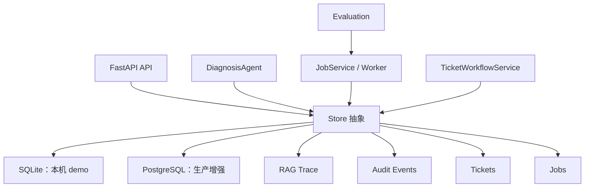
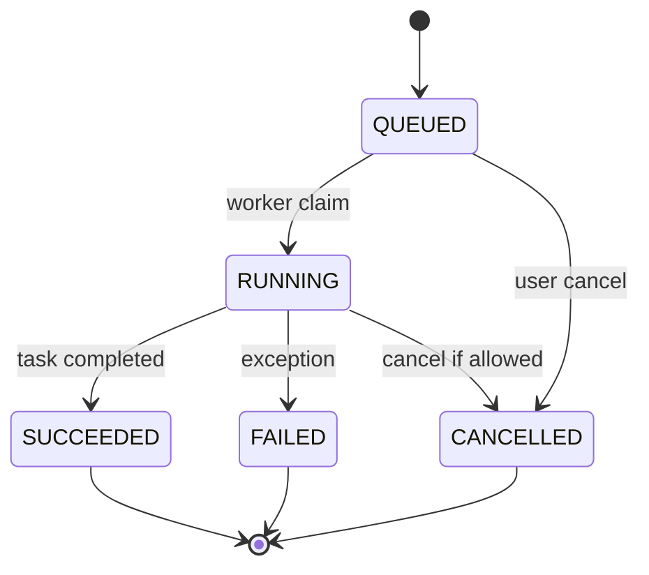
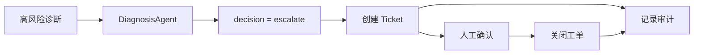

# 07｜存储与任务：RAG 项目为什么需要状态管理

## 本讲目标

本讲解释 Project A 的存储、任务、审计和工单体系。

你需要掌握：

- 为什么 RAG 项目不只是“检索后回答”，还需要保存状态。
- SQLite 和 PostgreSQL 在项目中的定位差异。
- Store 抽象为什么能隔离业务逻辑和具体数据库。
- Jobs 为什么要从同步请求中拆出来。
- Audit、Tickets、Trace 如何让系统可追踪、可恢复、可治理。

## 大白话解释

很多新手以为 RAG 项目只需要向量库。

真实企业系统还需要保存这些东西：

- 用户问过什么。
- 系统怎么回答。
- 哪些 chunk 被检索到。
- 哪次诊断升级了工单。
- 哪个入库任务失败了。
- 哪个评测任务跑过。
- 哪些操作需要审计。

这些都不是向量库能单独解决的。Project A 用 Store、Jobs、Audit、Tickets 和 Trace 把“无状态问答”升级成“有状态平台”。

## 业务场景

- 文档入库可能耗时，需要后台任务记录进度。
- 诊断结果需要 Trace，方便后续复盘。
- 高风险问题要创建工单，人工处理后还要保存状态。
- 管理员要知道评测是否跑过、是否失败。
- 运维要根据审计事件定位谁触发了什么操作。

如果没有状态管理，系统只能回答一次，答完就丢失上下文，不适合企业使用。

## 技术栈关联

### Store 抽象

大白话：Store 是项目的“数据出入口”，业务模块不直接关心底层数据库细节。

为什么用：

- 业务层只调用保存、查询方法。
- SQLite 和 PostgreSQL 可以共用相似语义。
- 测试更容易替换存储实现。
- 后续迁移数据库时影响更小。

### SQLite

大白话：SQLite 是轻量本地数据库，适合本机 demo 和快速启动。

为什么用：

- 不需要额外服务。
- 适合面试展示和本机开发。
- 能保存工单、Trace、审计、Jobs 等状态。

### PostgreSQL

大白话：PostgreSQL 是更适合生产环境的关系型数据库。

为什么用：

- 多实例共享状态更可靠。
- 事务、并发、运维工具更成熟。
- 更接近企业生产部署。

### Jobs

大白话：Jobs 是后台任务系统，用来处理耗时工作。

为什么用：

- 文档入库和评测可能很慢。
- 同步请求等待太久会影响用户体验。
- Job 状态能展示排队、运行、成功、失败、取消。

### Audit 和 Tickets

大白话：Audit 记录系统发生了什么，Tickets 记录需要人工处理的售后问题。

为什么用：

- 企业系统需要可追踪。
- 高风险诊断需要人工闭环。
- 审计事件能帮助排障和合规说明。

## 项目实现位置

- Store 抽象：`backend/app/storage/base.py`
- SQLite 实现：`backend/app/storage/sqlite_store.py`
- PostgreSQL 实现：`backend/app/storage/postgres_store.py`
- 兼容入口：`backend/app/store.py`
- 数据模型：`backend/app/models.py`
- 自动迁移骨架：`backend/app/migrations.py`
- Alembic 迁移目录：`migrations`
- Job 服务：`backend/app/jobs.py`
- Worker：`backend/app/job_worker.py`
- 工单模型：`backend/app/ticketing/models.py`
- 工单流程：`backend/app/ticketing/workflow.py`
- Trace 保存调用：`backend/app/rag/diagnosis_agent.py`
- Jobs 前端：`frontend/src/pages/JobsPage.vue`
- Tickets 前端：`frontend/src/pages/TicketsPage.vue`
- Audit 前端：`frontend/src/pages/AuditPage.vue`

## 流程图

### 状态管理总览

### Job 生命周期

### 高风险工单闭环

## 设计优势

### 1. Store 隔离数据库细节

业务模块不直接拼 SQL，而是通过 Store 方法保存和查询。

优势：

- 业务逻辑更干净。
- SQLite 和 PostgreSQL 可以切换。
- 测试时更容易验证存储行为。

面试讲法：

> 我用 Store 抽象隔离业务层和数据库实现，让 RAG、Jobs、Tickets、Trace 不直接绑定某一种数据库。

### 2. SQLite 保证 demo 低门槛

本机项目最怕启动复杂。

优势：

- 克隆后更容易跑起来。
- 面试演示不依赖外部数据库。
- 适合作为默认开发路径。

面试讲法：

> SQLite 是为了降低本机 demo 成本，PostgreSQL 则作为生产增强路径保留。

### 3. Jobs 解耦长任务

文档入库和评测不应该卡住一次 HTTP 请求。

优势：

- 用户体验更稳定。
- 任务状态可追踪。
- 失败可以记录错误摘要。
- 后续可以替换为外部队列。

面试讲法：

> 内置 JobService 先把任务生命周期语义做清楚，后续可替换 Celery、RQ 或云队列，但 UI、审计和 metrics 语义不用推倒。

### 4. Tickets 和 Audit 支撑企业闭环

AI 系统不能只输出文本。

优势：

- 高风险场景能交给人工。
- 操作过程有记录。
- 适合售后业务闭环。

面试讲法：

> 工单和审计让项目更像企业系统：AI 负责辅助诊断，风险和责任由人工闭环承接。

## 局限和后续增强

- SQLite 不适合多实例生产共享状态。
- 内置 JobService 适合演示和 MVP，生产可接外部队列。
- Alembic 迁移骨架还可以加强回滚策略和迁移验证。
- Audit 可以扩展成更完整的操作日志、用户画像和权限记录。
- Tickets 可以接入真实工单平台或企业 IM。

## 面试讲法

30 秒版本：

> Project A 不只做向量检索，还做了状态管理。Store 负责保存 Jobs、Tickets、Trace、Audit、Chat 等数据，SQLite 支撑本机 demo，PostgreSQL 作为生产增强路径。Jobs 解耦文档入库和评测长任务，Tickets 承接高风险人工闭环，Audit 和 Trace 支撑排障与复盘。

3 分钟版本：

> 企业 RAG 平台必须有状态。用户问题、诊断证据、工单状态、任务结果、审计事件都要保存。Project A 用 Store 抽象隔离业务模块和数据库实现，默认 SQLite 降低本机运行成本，同时提供 PostgreSQL 路径和 Alembic 迁移骨架。文档入库和评测通过 JobService/Worker 异步执行，避免同步请求阻塞。高风险诊断通过 TicketWorkflowService 创建工单，让人工介入。Audit events 和 RAG Trace 记录关键行为，方便质量复盘、排障和面试展示。

## 高频追问

### 1. 为什么有向量库还需要关系型数据库？

向量库负责相似度检索，关系型数据库负责保存业务状态。两者职责不同。

### 2. SQLite 会不会太弱？

SQLite 适合本机 demo 和单实例开发。项目同时保留 PostgreSQL 路径，用来说明生产演进方向。

### 3. 为什么不用一开始就接 Celery？

面试项目先把任务语义讲清楚更重要。内置 JobService 足够展示生命周期，后续可以替换执行层。

### 4. Audit 和 Trace 有什么区别？

Audit 记录系统操作事件，Trace 记录一次 RAG/Agentic 诊断的证据链。一个偏操作审计，一个偏 AI 决策复盘。

## 学习检查题

- RAG 项目为什么需要保存状态？
- Store 抽象解决什么问题？
- SQLite 和 PostgreSQL 在项目中分别适合什么场景？
- Jobs 为什么比同步请求更适合文档入库和评测？
- Audit、Trace、Tickets 三者分别记录什么？

## 下一讲衔接

下一讲进入 `docs/teaching/08_observability_stack.md`：讲 metrics、Grafana、Request ID、Audit、Trace 如何组成可观测性体系，让系统能排障、能复盘、能面试深挖。
