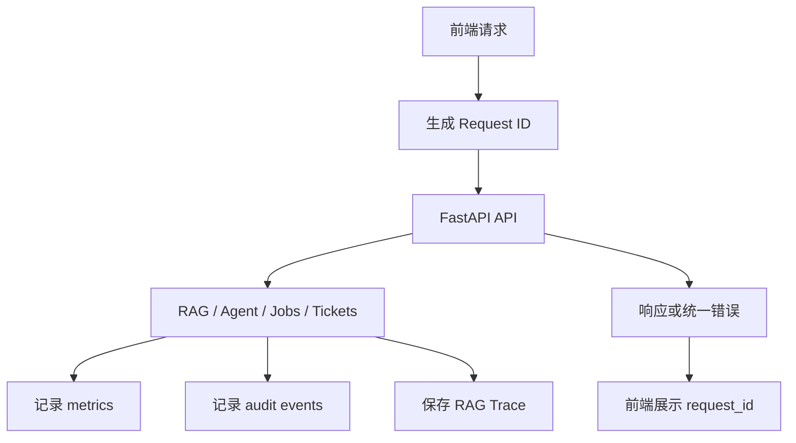
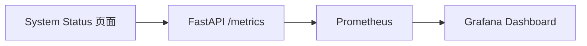
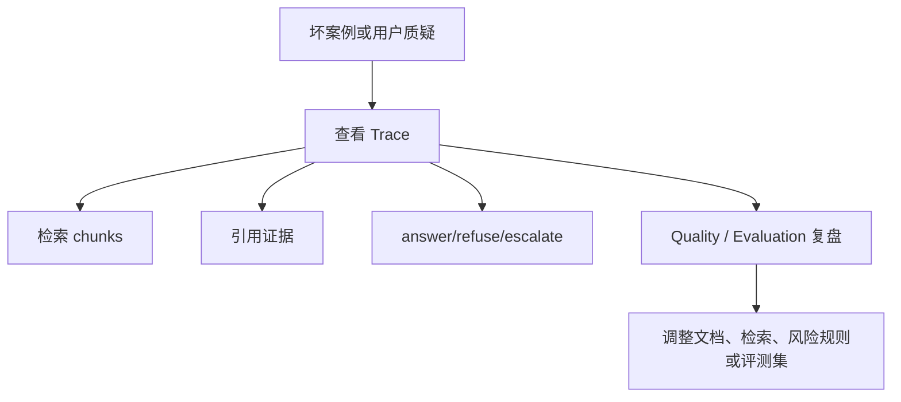

# 08｜可观测性技术栈：让 RAG 系统可排障、可复盘、可展示

## 本讲目标

本讲学习 Project A 的可观测性体系。

你需要掌握：

- 为什么企业级 RAG 项目不能只看“回答结果”。
- metrics、Request ID、Audit、Trace、healthz、readyz、Grafana 分别解决什么问题。
- 可观测性如何服务排障、质量复盘、面试展示和后续优化。
- Prometheus/Grafana 和 OpenTelemetry 的区别。
- 如何把可观测性讲成工程能力，而不是监控名词堆砌。

## 大白话解释

可观测性就是：系统出问题时，你能知道发生了什么。

对 RAG 系统来说，常见问题不是只有“接口挂了”：

- 用户说答案不对，你要知道检索到了哪些 chunks。
- 系统拒答，你要知道是注入命中还是资料不足。
- 高风险升级，你要知道风险词怎么命中。
- 页面请求失败，你要用 Request ID 定位后端日志。
- 任务失败，你要看 Jobs 状态和错误摘要。
- 请求量和错误量上升，你要通过 metrics 发现。

所以 Project A 把 metrics、Trace、Audit、Request ID、healthz、readyz、Grafana 都纳入工程闭环。

## 业务场景

- 售后主管质疑一次回答，需要查看 Trace 和 citations。
- 运维发现页面报错，需要用 Request ID 查请求链路。
- 评测通过率下降，需要结合 Quality、Evaluation、Trace 查坏案例。
- 文档入库失败，需要从 Jobs 和 Audit 查任务状态。
- 面试官追问生产化能力，需要展示 System Status、metrics 和 Grafana 配置。

## 技术栈关联

### healthz 和 readyz

大白话：healthz 看服务是否活着，readyz 看服务是否准备好对外服务。

为什么用：

- healthz 适合容器存活检查。
- readyz 适合检查配置、存储、向量库等依赖是否可用。
- 运维可以快速区分“进程还活着”和“系统真的可用”。

### Request ID

大白话：Request ID 是一次请求的追踪编号。

为什么用：

- 前端报错可以带上 request_id。
- 后端日志可以按 request_id 查同一次请求。
- 排障时不用靠猜。

### Metrics

大白话：metrics 是给机器看的数字信号。

为什么用：

- 统计请求量、错误量、任务状态、Agent 决策、Trace 数量。
- 给 Prometheus 抓取。
- 给 Grafana 做面板展示。

### Audit

大白话：Audit 是操作审计，记录关键动作发生过。

为什么用：

- 记录 job、评测、工单等关键事件。
- 支撑排障和合规说明。
- 让企业系统具备追踪能力。

### RAG Trace

大白话：Trace 是一次 RAG/Agentic 诊断的证据链。

为什么用：

- 记录问题、检索、引用、工具调用、决策、延迟等信息。
- 回答错误时能定位是检索问题、证据问题还是生成问题。
- 面试时能证明回答不是黑箱。

### Prometheus 和 Grafana

大白话：Prometheus 负责抓指标，Grafana 负责把指标画成面板。

为什么用：

- Prometheus 是常见云原生监控方案。
- Grafana 能把指标可视化。
- demo stack 能说明项目具备生产演进意识。

## 项目实现位置

- Request ID 中间件：`backend/app/observability.py`
- metrics 生成：`backend/app/metrics.py`
- metrics 路由：`backend/app/main.py`
- healthz / readyz 路由：`backend/app/main.py`
- 审计模型：`backend/app/models.py`
- 审计存储：`backend/app/storage/sqlite_store.py`、`backend/app/storage/postgres_store.py`
- Trace 模型：`backend/app/models.py`
- Trace 保存：`backend/app/rag/diagnosis_agent.py`
- Trace 存储：`backend/app/storage/sqlite_store.py`、`backend/app/storage/postgres_store.py`
- System Status 页面：`frontend/src/pages/SystemStatusPage.vue`
- Quality 页面：`frontend/src/pages/QualityPage.vue`
- Audit 页面：`frontend/src/pages/AuditPage.vue`
- Prometheus 配置：`deploy/prometheus/prometheus.yml`
- Grafana datasource：`deploy/grafana/provisioning/datasources/prometheus.yml`
- Grafana dashboard：`deploy/grafana/dashboards/project-a-rag-ops.json`
- Docker Compose：`docker-compose.yml`

## 流程图

### 请求排障链路

### 指标采集链路

### RAG 质量复盘链路

## 设计优势

### 1. Request ID 降低排障成本

没有 Request ID 时，前后端问题很难对齐。

优势：

- 用户反馈可以带编号。
- 日志和错误能关联。
- 面试中能体现生产排障意识。

面试讲法：

> 我在请求链路里加入 Request ID，让前端错误和后端日志可以对应，方便定位问题。

### 2. metrics 让系统状态数字化

只看日志很难观察趋势。

优势：

- 请求量、错误量、任务状态可以量化。
- Agent decision 分布能体现诊断行为。
- Grafana 可以做可视化面板。

面试讲法：

> metrics 让系统行为可量化，例如请求、错误、任务和 Agent 决策，不只靠人工观察页面。

### 3. Trace 让 AI 决策可复盘

RAG 错误不一定发生在生成阶段，也可能是检索或证据选择问题。

优势：

- 记录检索和引用。
- 记录工具调用和决策。
- 支撑评测、审计和坏案例修复。

面试讲法：

> Trace 把一次 Agentic RAG 诊断从黑箱变成证据链，能解释为什么回答、拒答或升级。

### 4. Audit 记录关键操作

企业系统需要知道关键事件发生过。

优势：

- 任务、评测、工单等操作可追踪。
- 管理员可以复盘操作历史。
- 和 Jobs、Tickets、Evaluation 形成治理闭环。

面试讲法：

> Audit 偏系统操作审计，Trace 偏 AI 决策复盘，两者结合让平台更接近企业系统。

### 5. healthz 和 readyz 区分存活与就绪

进程活着不代表系统能服务。

优势：

- healthz 判断服务是否存活。
- readyz 判断依赖是否可用。
- Docker 和运维系统可以据此做健康检查。

面试讲法：

> 我区分 liveness 和 readiness，避免把“进程没死”误认为“系统可用”。

## 局限和后续增强

- 当前 Grafana 是 demo dashboard，生产还需要更完整的告警规则。
- metrics 可以继续补延迟直方图、检索质量分布、模型调用成本等指标。
- Trace 和 Request ID 可以进一步关联，形成完整链路追踪。
- OpenTelemetry 还可以作为下一阶段增强，用于跨服务 trace correlation。
- Audit 可扩展用户、角色、租户和资源维度。

## 面试讲法

30 秒版本：

> Project A 做了可观测性闭环：healthz/readyz 判断服务和依赖状态，Request ID 串联前后端错误，metrics 暴露请求、错误、任务、Agent 决策等指标，Prometheus/Grafana 做监控展示，Audit 记录关键操作，RAG Trace 记录每次诊断的检索、引用、工具调用和决策。

3 分钟版本：

> 企业级 RAG 系统不能只看最终答案。Project A 的可观测性分几层：接口层有 healthz、readyz、Request ID 和统一错误，能支持运维排障；指标层通过 `/metrics` 暴露请求量、错误量、任务状态、Agent 决策、Trace 数量等信号，并接入 Prometheus/Grafana demo stack；业务层用 Audit events 记录 job、评测、工单等关键操作；AI 决策层用 RAG Trace 保存问题、检索 chunks、引用、工具调用、决策和延迟。这样系统出现答错、拒答、升级、任务失败或接口错误时，都有路径复盘。

## 高频追问

### 1. metrics、Audit、Trace 有什么区别？

metrics 是数字趋势，Audit 是操作事件，Trace 是一次 AI 诊断证据链。三者解决的问题不同。

### 2. Prometheus 和 Grafana 分别做什么？

Prometheus 抓取和存储指标，Grafana 把指标展示成面板。

### 3. OpenTelemetry 和现有 Trace 一样吗？

不一样。现有 RAG Trace 是业务证据链，OpenTelemetry 更偏跨服务调用链追踪。后续可以把两者关联起来。

### 4. 为什么 healthz 和 readyz 要分开？

healthz 表示进程活着，readyz 表示依赖也准备好了。生产环境需要区分这两种状态。

## 学习检查题

- Request ID 解决什么排障问题？
- metrics、Audit、Trace 分别记录什么？
- Prometheus 和 Grafana 的职责差异是什么？
- RAG Trace 为什么比普通日志更适合复盘回答质量？
- OpenTelemetry 可以作为哪个方向的后续增强？

## 下一讲衔接

下一讲进入 `docs/teaching/09_rag_basics_in_project.md`：开始讲 RAG 基础和 Project A 的具体落点，重点解释 chunk、embedding、检索、引用、grounding、拒答边界和质量评测。
