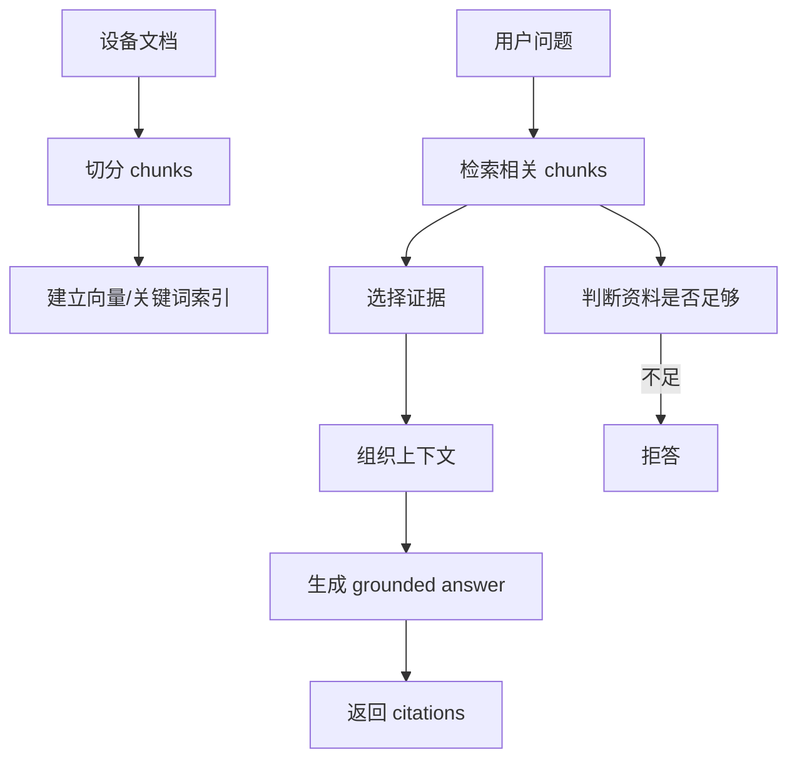

# 09｜RAG 基础：Project A 如何把企业文档变成可信回答

## 本讲目标

本讲开始进入 RAG 主线。

你需要掌握：

- RAG 是什么，以及它为什么适合企业设备售后诊断。
- chunk、embedding、向量检索、关键词检索、hybrid search、citation、grounding 分别是什么意思。
- Project A 如何用 RAG 降低模型凭空回答风险。
- 为什么资料不足时要拒答，而不是强行生成。
- 面试中如何把 RAG 讲成“可信回答系统”，而不是“向量库 demo”。

## 大白话解释

RAG 的意思是：先查资料，再回答。

普通大模型像一个记忆很强但可能乱说的人。企业售后场景不能只靠它自由发挥，因为设备维修建议可能影响安全和成本。

RAG 做的事情是：

- 先把设备文档切成小块。
- 用户提问时，先从文档块里找相关内容。
- 再把相关内容交给生成模块组织回答。
- 回答里带上引用，说明依据来自哪里。
- 找不到资料时，拒答或升级，而不是硬编。

Project A 的 RAG 价值在于“把回答绑回企业知识库”。

## 业务场景

售后人员常见问题：

- “E21 故障码是什么意思？”
- “设备无法启动应该先检查什么？”
- “某个部件是否需要更换？”
- “出现异味还能不能继续运行？”

这些问题不能只靠模型猜。系统需要从设备手册、排障文档、故障码说明中检索证据，然后再回答。

## 技术栈关联

### chunk

大白话：chunk 是文档切出来的小片段。

为什么用：

- 长文档太大，不能每次全部塞给模型。
- 小片段更容易检索和引用。
- 每个 chunk 可以保留来源、位置、元数据。

### embedding

大白话：embedding 是把文字转成数字向量，方便机器判断语义相似。

为什么用：

- 用户不一定用和手册完全一样的词。
- 语义检索能找到“意思相近”的内容。
- 对自然语言问题更友好。

### keyword search

大白话：关键词检索就是按字面词匹配。

为什么用：

- 故障码、型号、部件名通常需要精确匹配。
- 纯向量检索可能忽略短代码或专有名词。
- 和向量检索组合能提升召回。

### hybrid search

大白话：hybrid search 是向量检索和关键词检索的组合。

为什么用：

- 向量检索适合语义相似。
- 关键词检索适合故障码、型号、部件名。
- 企业设备诊断通常两者都需要。

### citation

大白话：citation 是引用证据，说明答案依据来自哪个文档片段。

为什么用：

- 让回答可验证。
- 方便用户回查原文。
- 面试中体现可信 AI 思路。

### grounding

大白话：grounding 是让模型回答被资料约束住。

为什么用：

- 减少幻觉。
- 提升企业场景可信度。
- 为拒答和 Trace 提供依据。

## 项目实现位置

- 文档结构：`backend/app/rag/documents.py`
- 文档切分：`backend/app/rag/chunker.py`
- embedding：`backend/app/rag/embedding.py`
- 向量库：`backend/app/rag/vector_store.py`
- 关键词检索：`backend/app/rag/keyword.py`
- 混合检索：`backend/app/rag/hybrid.py`
- RRF 融合：`backend/app/rag/rrf.py`
- 重排：`backend/app/rag/reranker.py`
- RAG 管道：`backend/app/rag/pipeline.py`
- 生成器：`backend/app/rag/generator.py`
- LLM 封装：`backend/app/rag/llm.py`
- 评分：`backend/app/rag/scoring.py`
- 数据模型：`backend/app/models.py`

## 流程图

## 设计优势

### 1. 先检索再生成

优势：

- 答案更贴近企业资料。
- 可以返回引用。
- 错误时能复盘检索阶段。

面试讲法：

> 我没有让模型直接回答，而是先从企业设备文档里检索证据，再生成 grounded answer。

### 2. hybrid search 适合设备场景

优势：

- 故障码、型号适合关键词匹配。
- 现象描述适合语义检索。
- 两者结合更稳。

面试讲法：

> 设备售后问题既有故障码这种精确词，也有自然语言现象描述，所以我保留 hybrid retrieval 思路。

### 3. citations 支撑可信回答

优势：

- 用户能看到依据。
- 面试官能看到不是黑箱生成。
- Trace 和评测能复盘引用质量。

面试讲法：

> citations 是 RAG 从 demo 走向可信应用的关键，因为它让回答有证据可查。

### 4. 拒答边界提升安全性

优势：

- 资料不足时不乱编。
- 设备场景更符合安全要求。
- 和 Agentic RAG 的 refuse 决策一致。

面试讲法：

> 对企业诊断来说，拒答不是能力弱，而是可信系统必须有的边界。

## 局限和后续增强

- demo 文档规模有限，真实企业需要更多型号、部件、故障样本。
- embedding 模型和 chunk 策略会影响检索质量，需要通过评测持续调优。
- hybrid search 仍可能漏召回，后续可增强 query expansion 和 rerank。
- citation 是否真正支持答案，需要更严格的 citation accuracy 评测。
- 对安全高风险问题，仅靠 RAG 不够，还需要 risk_check 和工单升级。

## 面试讲法

30 秒版本：

> Project A 的 RAG 主线是先把设备文档切成 chunks，建立向量和关键词检索，用户提问时检索相关证据，再生成带 citations 的 grounded answer。资料不足时拒答，高风险问题进入 Agentic RAG 升级工单，避免模型凭空给维修建议。

3 分钟版本：

> 我把 RAG 设计成企业知识增强链路。文档入库时先切分成 chunks，并建立向量和关键词检索能力。用户提问后，系统先做 hybrid retrieval，兼顾故障码、型号这类精确词和现场现象这类语义描述。检索到证据后，RagPipeline 组织上下文并生成回答，同时返回 citations。若检索不到足够证据，就拒答而不是强行生成。这个设计的重点是把模型回答约束在企业文档上，并通过 citations、Trace、Evaluation 形成可信闭环。

## 高频追问

### 1. RAG 能完全消除幻觉吗？

不能。RAG 只能降低幻觉风险，所以还需要引用、拒答、Trace 和评测来继续治理质量。

### 2. 为什么不用纯向量检索？

设备场景有故障码、型号、部件名，很多是短词或代码，关键词检索更可靠。hybrid search 更适合这类场景。

### 3. citation 一定代表答案正确吗？

不一定。citation 说明有证据来源，但还要看证据是否真的支持答案，所以需要 citation accuracy 和 faithfulness 评测。

### 4. 为什么资料不足要拒答？

维修建议如果错了可能造成损失。资料不足时拒答比编造答案更安全。

## 学习检查题

- 用一句话解释 RAG。
- chunk、embedding、citation 分别是什么？
- 为什么设备诊断适合 hybrid search？
- grounding 解决什么问题？
- RAG 为什么还需要拒答边界？

## 下一讲衔接

下一讲进入 `docs/teaching/10_rag_pipeline_flow.md`：讲 RagPipeline 如何把检索、证据选择、回答生成、引用、拒答和 Trace 组织成主流程。
