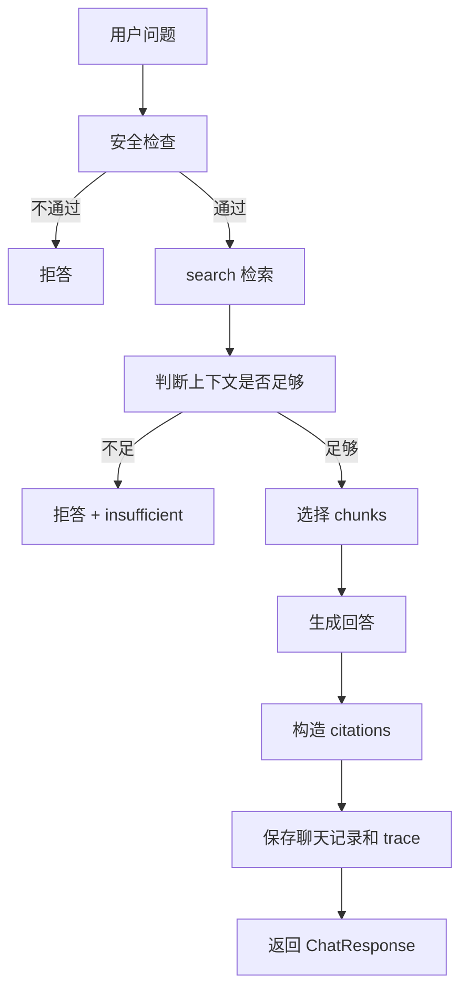
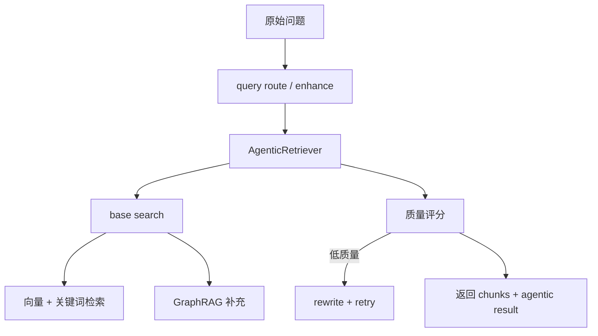

# 10｜RagPipeline 主流程：从用户问题到引用回答

## 本讲目标

本讲学习 Project A 的 RAG 主流程。

你需要掌握：

- RagPipeline 在系统中的职责。
- `search` 和 `answer` 两条能力边界。
- 安全检查、查询增强、检索、证据选择、生成、引用、拒答如何串起来。
- `last_trace` 和 `last_agentic_result` 为什么重要。
- 面试中如何把 RagPipeline 讲成“可复用 RAG 核心”，而不是普通函数。

## 大白话解释

RagPipeline 是 Project A 的知识增强发动机。

它主要做两类事情：

- `search`：负责找资料。
- `answer`：负责基于资料组织回答。

普通 Chat 会调用它，DiagnosisAgent 也会复用它。也就是说，Agentic RAG 不是另起炉灶，而是在 RagPipeline 的基础上加诊断控制、风险检查和工单升级。

## 业务场景

用户输入一个设备问题：

- 如果是普通问答，RagPipeline 检索文档并返回引用回答。
- 如果资料不足，RagPipeline 要能拒答。
- 如果是 Agentic 诊断，DiagnosisAgent 会复用 RagPipeline 的检索和回答能力。
- 如果后续要复盘，需要从 pipeline trace 中看到检索和回答过程。

## 技术栈关联

RagPipeline 连接多个 RAG 子模块：

- QueryRouter / QueryEnhancer：改写或增强用户问题，让检索更准。
- AgenticRetriever：控制检索质量、低质量 retry 和 rewrite。
- HybridRetriever：融合向量检索和关键词检索。
- Graph retriever：补充设备、故障、部件、动作关系。
- Generator / LLM generator：根据证据生成回答。
- Scoring：判断检索质量和不足边界。
- Store：保存聊天记录。
- Trace：记录一次 RAG 行为的关键步骤。

## 项目实现位置

- 主流程：`backend/app/rag/pipeline.py`
- 查询增强：`backend/app/rag/query_enhancement.py`
- Agentic 检索：`backend/app/rag/agentic.py`
- 混合检索：`backend/app/rag/hybrid.py`
- 图关系检索：`backend/app/rag/graph.py`
- 生成器：`backend/app/rag/generator.py`
- LLM 封装：`backend/app/rag/llm.py`
- 评分：`backend/app/rag/scoring.py`
- 安全检查：`backend/app/rag/security.py`
- 数据模型：`backend/app/models.py`

## 流程图

### answer 主流程

### search 主流程

## 设计优势

### 1. search 和 answer 职责分开

优势：

- 诊断 Agent 可以只复用 search。
- 普通 Chat 可以直接用 answer。
- 评测也可以单独检查检索质量。

面试讲法：

> 我把检索和回答分开，search 负责找证据，answer 负责基于证据生成回答，这样 Agentic 诊断可以复用检索能力。

### 2. Pipeline 复用传统 RAG 能力

优势：

- Agentic RAG 不重复造 RAG 逻辑。
- 普通问答和诊断保持一致知识来源。
- 维护成本更低。

面试讲法：

> DiagnosisAgent 是控制层，RagPipeline 是知识层，两者分工清晰。

### 3. last_trace 支撑复盘

优势：

- 保存最近一次 RAG 流程细节。
- DiagnosisAgent 可以读取并持久化更完整 Trace。
- Quality 页面和 Trace API 可以复盘。

面试讲法：

> Pipeline trace 记录检索和生成过程，后续被 Agentic 诊断持久化成证据链。

### 4. insufficient 让拒答有工程边界

优势：

- 资料不足不强行生成。
- 前端和评测可以识别拒答。
- Agentic 决策可以使用这个信号。

面试讲法：

> 我把资料不足做成明确字段，而不是只靠回答文本表达，这样前端、测试和评测都能识别。

## 局限和后续增强

- Pipeline 仍依赖检索质量，文档不足时无法凭空补齐知识。
- 质量阈值需要结合更多真实样本调优。
- LLM 生成结果仍需要 faithfulness 评测约束。
- Trace 可以继续和 Request ID、OpenTelemetry 关联。
- 多轮上下文和长期记忆可以作为后续增强。

## 面试讲法

30 秒版本：

> RagPipeline 是项目的 RAG 核心，search 负责查询增强、混合检索、GraphRAG 补充和质量判断，answer 负责安全检查、上下文充足性判断、生成回答、构造 citations、保存聊天记录和 trace。普通 Chat 和 DiagnosisAgent 都复用它。

3 分钟版本：

> RagPipeline 是 Project A 的知识增强核心。我把它拆成 search 和 answer 两类能力。search 先做 query route/enhance，再通过 AgenticRetriever 调用底层 hybrid search，必要时结合 GraphRAG 关系补充证据，并记录检索质量、retry 和 rewrite 信息。answer 在安全检查通过后调用 search，判断上下文是否足够；足够时生成 grounded answer 和 citations，不足时返回 insufficient 拒答。Pipeline 还会保存 last_trace 和 last_agentic_result，让 DiagnosisAgent 可以进一步持久化 Trace 并做 answer/refuse/escalate 决策。

## 高频追问

### 1. RagPipeline 和 DiagnosisAgent 有什么区别？

RagPipeline 负责知识检索和回答，DiagnosisAgent 负责诊断流程控制和最终决策。

### 2. 为什么要保留普通 Chat？

普通 Chat 是传统 RAG 基线，便于和 Agentic RAG 对比，也适合常规问答场景。

### 3. insufficient 为什么要做成字段？

字段比自然语言更可靠。前端、测试、评测都可以直接识别这个状态。

### 4. 为什么要记录 last_trace？

Trace 能让一次回答可复盘，尤其是回答错误、拒答或升级时需要定位原因。

## 学习检查题

- RagPipeline 的主要职责是什么？
- search 和 answer 的区别是什么？
- RagPipeline 如何支持 DiagnosisAgent 复用？
- insufficient 字段有什么价值？
- last_trace 和 last_agentic_result 分别服务什么场景？

## 下一讲衔接

下一讲进入 `docs/teaching/11_agentic_retrieval.md`：讲 AgenticRetriever 如何做工程版 Self-RAG，包括 query rewrite、retry、quality score、context sufficient。
