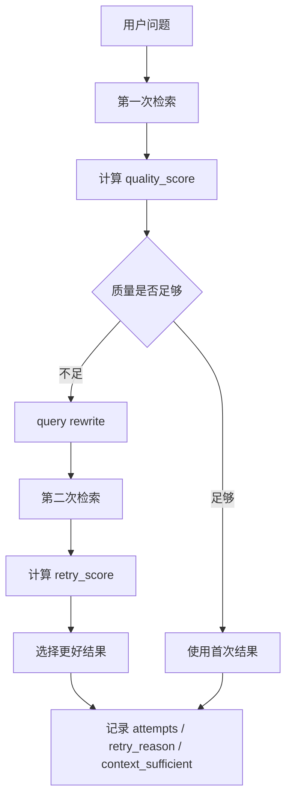

# 11｜AgenticRetriever：工程版 Self-RAG 如何做动态检索

> 版本说明（2026-07）：query rewrite 现在优先调用注入的 LLM 改写器（保留设备型号与故障码、补规范术语），LLM 未配置或调用失败时回退本讲描述的启发式改写；改写仅发生在首轮质量低于阈值的 retry 路径，token 成本有界。详见 `backend/app/rag/agentic.py`。

## 本讲目标

本讲学习 Project A 的 AgenticRetriever。

你需要掌握：

- 为什么传统“一次检索”不够稳定。
- AgenticRetriever 如何做质量评分、query rewrite 和二次检索。
- needs_retrieval、retrieval_attempts、retry_reason、context_sufficient 分别表示什么。
- 它为什么是工程版 Self-RAG，而不是训练一个新模型。
- 面试中如何解释 adaptive retrieval 的价值和边界。

## 大白话解释

传统 RAG 常见问题是：第一次检索不准，系统还是继续回答。

AgenticRetriever 做了一件务实的事：

- 先检索一次。
- 给检索结果打质量分。
- 如果质量低，就改写查询再检索一次。
- 比较两次结果，选择更好的。
- 把是否 retry、为什么 retry、上下文是否足够记录下来。

这不是复杂的“训练版 Self-RAG”，而是工程版 adaptive retrieval：用规则和评分让检索更稳。

## 业务场景

设备售后问题常常写得不标准：

- 用户说“机器有味道”，文档里写“异味”。
- 用户说“报错 E 二一”，文档里写“E21”。
- 用户描述很短，第一次检索可能找不到正确 chunk。
- 用户同时提到型号、现象、部件，检索需要抓重点。

AgenticRetriever 的价值就是在首次检索弱时，尝试通过 query rewrite 找到更好的证据。

## 技术栈关联

### quality score

大白话：检索质量分，用来判断找到的 chunks 是否像样。

为什么用：

- 不想盲目信任第一次检索。
- 低质量时触发 retry。
- Trace 和前端能展示检索质量。

### query rewrite

大白话：把用户原话改写成更适合检索的查询。

为什么用：

- 用户问题可能口语化。
- 文档表达可能更正式。
- 改写后更容易命中文档关键词。

### retry

大白话：第一次不理想就再试一次。

为什么用：

- 提高召回机会。
- 避免一次检索失败就直接拒答。
- 但也要限制次数，避免复杂度失控。

### context sufficient

大白话：当前检索结果是否足够支撑回答。

为什么用：

- 让后续 answer/refuse 决策更明确。
- 前端可以展示上下文是否充足。
- 评测可以统计检索不足案例。

## 项目实现位置

- Agentic 检索控制器：`backend/app/rag/agentic.py`
- RAG Pipeline 调用：`backend/app/rag/pipeline.py`
- 诊断控制器读取结果：`backend/app/rag/diagnosis_agent.py`
- 前端展示 adaptive 信息：`frontend/src/pages/AgenticPage.vue`
- 测试覆盖：`backend/tests`

## 流程图

## 设计优势

### 1. 比传统一次检索更稳

优势：

- 首次检索差时有补救机会。
- query rewrite 能改善口语问题。
- retry 信息可解释。

面试讲法：

> 我没有把检索当成一次性黑箱，而是加入质量判断和低质量 retry，形成工程版 adaptive retrieval。

### 2. 不引入训练成本

优势：

- 适合本机 demo 和面试项目。
- 不依赖额外训练数据。
- 实现简单，可测试、可解释。

面试讲法：

> 这是工程版 Self-RAG 思路，不训练新模型，而是通过评分、改写和重试提升检索稳定性。

### 3. 决策字段可产品化

优势：

- 前端能展示是否 retry。
- Trace 能记录 retry_reason。
- Evaluation 能统计 retrieval_retry_rate。

面试讲法：

> 我把 adaptive retrieval 的过程做成结构化字段，而不是藏在日志里，这样可展示、可测试、可评测。

### 4. 和 DiagnosisAgent 解耦

优势：

- AgenticRetriever 只负责检索控制。
- DiagnosisAgent 负责诊断决策。
- 模块边界清楚。

面试讲法：

> AgenticRetriever 解决“怎么找资料更稳”，DiagnosisAgent 解决“找到资料后怎么决策”。

## 局限和后续增强

- 评分规则是工程启发式，不等于真实相关性评估模型。
- 只做有限 retry，不能保证一定找得到资料。
- query rewrite 需要更多真实样本持续优化。
- context_sufficient 是辅助信号，最终还要结合 citations 和风险检查。
- 后续可引入 reranker、LLM judge 或学习型检索质量评估。

## 面试讲法

30 秒版本：

> AgenticRetriever 是工程版 Self-RAG：先检索一次并计算质量分，低于阈值时进行 query rewrite 和二次检索，再选择更好的结果，同时记录 retrieval_attempts、retry_reason 和 context_sufficient，供 Trace、前端和评测使用。

3 分钟版本：

> 传统 RAG 的问题是一次检索失败后仍可能继续生成。Project A 的 AgenticRetriever 在检索层加入自适应控制。它先调用底层 search_fn 做第一次检索，根据问题和 chunks 计算 quality_score；如果质量不足，就改写 query 再检索一次，比较两次结果后选择更好的。它不会直接决定 answer/refuse/escalate，而是输出 needs_retrieval、retrieval_attempts、retry_reason、context_sufficient 等结构化字段。DiagnosisAgent 和前端可以用这些字段解释为什么触发 retry，以及上下文是否足够支撑回答。

## 高频追问

### 1. 这是不是完整 Self-RAG？

不是训练版 Self-RAG，而是工程版 Self-RAG 风格增强。它用规则、评分、rewrite、retry 实现类似自适应检索思想。

### 2. 为什么不无限重试？

无限重试会增加延迟和复杂度，也可能仍然找不到资料。企业系统要在质量和成本之间取舍。

### 3. query rewrite 会不会改错？

有可能，所以系统会比较检索质量，并保留 Trace。后续可以用评测集持续优化 rewrite 策略。

### 4. context_sufficient 能完全决定是否回答吗？

不能，它是辅助信号。最终还要结合 citations、insufficient、risk_check 和诊断规则。

## 学习检查题

- AgenticRetriever 解决传统 RAG 的什么问题？
- retrieval_attempts 和 retry_reason 分别表示什么？
- query rewrite 为什么能改善检索？
- 工程版 Self-RAG 和训练版 Self-RAG 有什么区别？
- 为什么 AgenticRetriever 不直接创建工单？

## 下一讲衔接

下一讲进入 `docs/teaching/12_diagnosis_agent.md`：讲 DiagnosisAgent 如何串起 security_check、query_route、knowledge_search、risk_check、ticket_escalation，并输出 answer/refuse/escalate。
