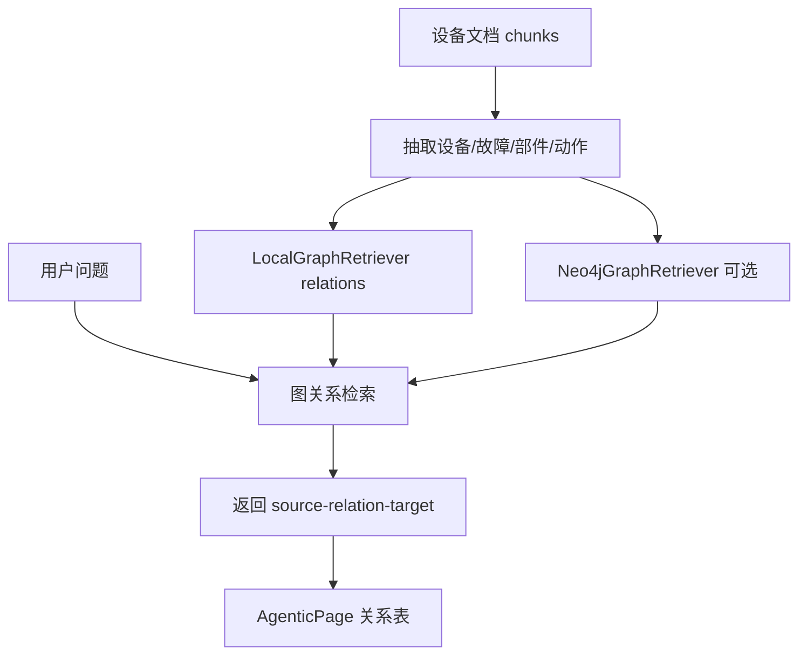
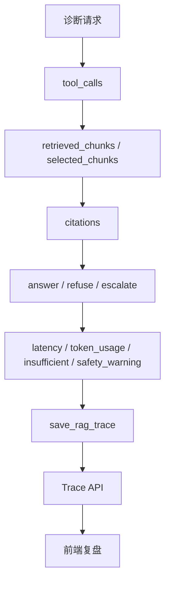
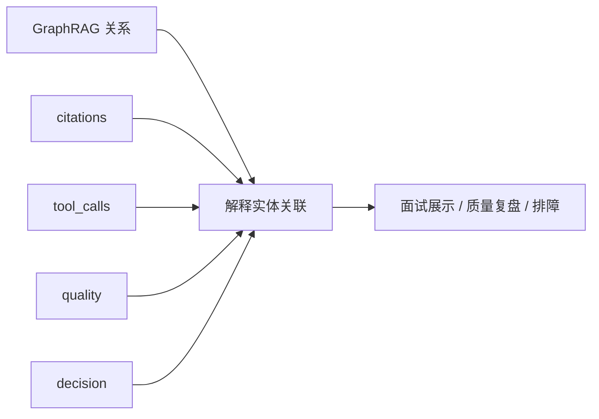

# 13｜GraphRAG 与 Trace：让诊断证据链可解释

## 本讲目标

本讲学习 Project A 的 GraphRAG 展示和 RAG Trace。

你需要掌握：

- GraphRAG 在本项目中的定位：关系解释和检索补充，不是大型图谱平台。
- LocalGraphRetriever 和 Neo4jGraphRetriever 的边界。
- Trace 为什么是 Agentic RAG 的证据链。
- GraphRAG、citations、tool_calls、quality、decision 如何一起解释一次诊断。
- 面试中如何把“可解释”和“可追溯”讲清楚。

## 大白话解释

RAG 回答要可信，光有最终答案不够。

你还要回答：

- 系统检索到了什么？
- 引用了哪些证据？
- 设备、故障、部件、动作之间有什么关系？
- 为什么选择 answer、refuse 或 escalate？
- 如果答错了，应该从哪里复盘？

GraphRAG 负责把设备关系讲清楚，Trace 负责把一次诊断全过程记录下来。

## 业务场景

一个售后问题可能涉及多跳关系：

- 设备型号有某个故障码。
- 故障码可能关联某个部件。
- 部件需要执行某个检查动作。
- 如果现象高风险，需要升级工单。

普通 citations 能说明文本来源，GraphRAG 能补充“实体关系”，Trace 能说明“系统当时怎么走到这个结论”。

## 技术栈关联

### LocalGraphRetriever

大白话：本地图关系检索器，不依赖外部图数据库。

为什么用：

- 本机 demo 更容易跑。
- 即使不开 Neo4j，也能展示设备、故障、部件、动作关系。
- 适合面试展示 GraphRAG 思路。

### Neo4jGraphRetriever

大白话：Neo4j 版本图关系检索器，用于生产增强或更真实图谱场景。

为什么用：

- Neo4j 更适合复杂图查询。
- 可以作为后续生产演进方向。
- 和本地 fallback 保持类似接口。

### RAG Trace

大白话：Trace 是一次诊断的全过程记录。

为什么用：

- 记录 question、decision、route、rewritten_query。
- 记录 retrieved_chunks、selected_chunks、citations。
- 记录 tool_calls、latency、token_usage、safety_warning、insufficient。
- 让回答、拒答、升级都可复盘。

## 项目实现位置

- 图关系检索：`backend/app/rag/graph.py`
- GraphRAG API：`backend/app/main.py`
- GraphRAG 前端展示：`frontend/src/pages/AgenticPage.vue`
- Trace 模型：`backend/app/models.py`
- Trace 保存：`backend/app/rag/diagnosis_agent.py`
- Trace 存储抽象：`backend/app/storage/base.py`
- SQLite Trace：`backend/app/storage/sqlite_store.py`
- PostgreSQL Trace：`backend/app/storage/postgres_store.py`
- RAG Pipeline trace：`backend/app/rag/pipeline.py`
- 质量复盘页面：`frontend/src/pages/QualityPage.vue`

## 流程图

### GraphRAG 关系流

### Trace 证据链

### GraphRAG + Trace 协作

## 设计优势

### 1. GraphRAG 让关系更直观

优势：

- 展示设备、故障、部件、动作之间的关系。
- 弥补纯文本 chunk 的解释不足。
- 适合面试时讲“多跳关系问题”。

面试讲法：

> 这里的 GraphRAG 重点是关系解释和检索补充，帮助说明设备、故障、部件、动作之间为什么相关。

### 2. 本地 fallback 降低运行门槛

优势：

- 不依赖 Neo4j 也能演示。
- 本机项目更容易跑。
- Neo4j 可作为生产增强路径。

面试讲法：

> 我保留 LocalGraphRetriever 作为默认演示路径，同时提供 Neo4j-backed 方向，兼顾可运行和可扩展。

### 3. Trace 让 AI 决策可追溯

优势：

- 回答、拒答、升级都有证据链。
- 质量问题可以定位到检索、引用、风险检查或生成阶段。
- 前端和评测都能使用 Trace 信息。

面试讲法：

> Trace 是 Agentic RAG 的审计证据链，记录一次诊断从问题到工具调用、证据、决策的全过程。

### 4. GraphRAG 和 Trace 互补

优势：

- GraphRAG 解释“实体之间有什么关系”。
- Trace 解释“系统这次为什么这样决策”。
- citations 解释“文本证据来自哪里”。

面试讲法：

> citations、GraphRAG 和 Trace 解决的是三个层次：文本证据、关系解释、决策过程。

## 局限和后续增强

- 当前 GraphRAG 更偏工程展示，不是完整知识图谱治理平台。
- 实体抽取规则可以继续增强，尤其是型号、部件、故障码标准化。
- Neo4j 可用于更复杂的多跳查询和图谱分析。
- Trace 可以增加和 Request ID、Grafana、OpenTelemetry 的关联。
- citation accuracy 还可以用更严格评测验证。

## 面试讲法

30 秒版本：

> Project A 用 GraphRAG 展示设备、故障、部件、动作之间的关系，用 Trace 保存一次 Agentic RAG 诊断的完整证据链，包括 question、tool_calls、retrieved_chunks、citations、decision、quality、latency 等。GraphRAG 解释关系，citations 解释文本依据，Trace 解释系统为什么这样决策。

3 分钟版本：

> 在 Project A 中，GraphRAG 不是大型图谱平台，而是面向售后诊断的关系解释能力。LocalGraphRetriever 可以从本地文档中抽取设备、故障、部件、动作关系，Neo4jGraphRetriever 作为可选生产增强。前端 AgenticPage 展示 source-relation-target 关系表，让面试官看到系统不只检索文本，也能解释实体关系。Trace 则记录一次诊断的全过程，包括 security_check、query_route、knowledge_search、risk_check、ticket_escalation、retrieved_chunks、selected_chunks、citations、quality、decision、insufficient 等字段。两者结合后，系统不仅能回答，还能解释依据、关系和决策过程。

## 高频追问

### 1. 这个 GraphRAG 是完整知识图谱吗？

不是。它是工程展示版 GraphRAG，重点在关系解释和检索补充。完整图谱治理可以作为后续增强。

### 2. LocalGraphRetriever 和 Neo4jGraphRetriever 有什么区别？

LocalGraphRetriever 适合本机 demo，无外部依赖。Neo4jGraphRetriever 适合更复杂图查询和生产增强。

### 3. Trace 和日志有什么区别？

日志偏系统运行记录，Trace 偏一次诊断的业务证据链，更适合复盘 RAG 决策。

### 4. citations、GraphRAG、Trace 三者如何分工？

citations 给文本证据，GraphRAG 给实体关系，Trace 给过程证据。

## 学习检查题

- GraphRAG 在 Project A 中解决什么问题？
- 为什么要保留本地图关系 fallback？
- Trace 至少应该记录哪些信息？
- citations、GraphRAG、Trace 分别回答什么问题？
- GraphRAG 后续如何增强到更生产化？

## 下一讲衔接

下一讲进入 `docs/teaching/14_evaluation_system.md`：学习 regression、adversarial、agentic diagnosis 等评测如何验证回答质量、拒答质量、升级质量和 Trace 完整性。
