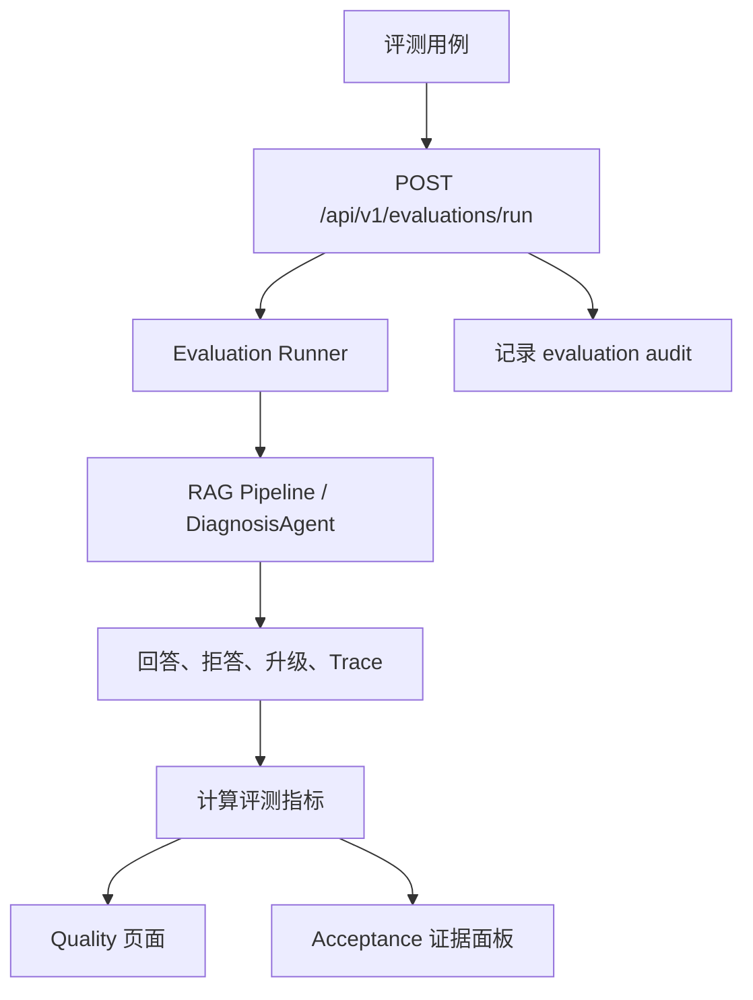

# 14｜评测系统：如何证明 RAG 和 Agentic 决策真的可靠

## 本讲目标

本讲学习 Project A 的评测体系。

你需要掌握：

- 为什么 RAG 项目必须有评测，而不能只靠手工体验。
- regression、RAGAS、adversarial、agentic evaluation 分别验证什么。
- citation_accuracy、refusal_accuracy、escalation_accuracy、trace_completeness、retrieval_retry_rate 的意义。
- Evaluation、Quality 页面、Acceptance 页面如何形成质量闭环。
- 面试中如何把评测讲成工程质量能力。

## 大白话解释

评测就是给系统出题，并检查它答得是否符合预期。

RAG 项目如果只说“我试了几个问题，感觉可以”，面试说服力很弱。企业系统需要更硬的证据：

- 正常问题能不能答对。
- 资料不足时会不会拒答。
- Prompt 注入会不会被拦住。
- 高风险问题会不会升级工单。
- 回答有没有引用。
- Trace 证据链是不是完整。

Project A 的评测体系就是把这些问题数据化。

## 业务场景

评测服务这些场景：

- 每次改 RAG 检索逻辑后，检查正常问题是否退化。
- 每次改安全规则后，检查注入问题是否被拒答。
- 每次改高风险词后，检查危险问题是否升级。
- 每次改 Trace 字段后，检查证据链是否仍然完整。
- 面试展示时，用 Quality 和 Evaluations 页面证明项目不是只靠主观演示。

## 技术栈关联

### regression evaluation

大白话：回归评测，用固定题目检查系统是否稳定。

为什么用：

- 防止改动后老问题答坏。
- 适合持续集成和质量门禁。
- 能形成通过率指标。

### RAGAS evaluation

大白话：RAG 质量维度评测，关注上下文、忠实度、召回等指标。

为什么用：

- 不只看答案文字，还看检索和证据质量。
- 帮助发现上下文不足、引用不准、回答不忠实。

### adversarial evaluation

大白话：对抗评测，专门测试系统在恶意或边界输入下是否稳。

为什么用：

- 检查 Prompt 注入、安全绕过、异常输入。
- 企业 AI 必须证明安全边界。

### agentic evaluation

大白话：诊断 Agent 专属评测，检查 answer、refuse、escalate 决策是否正确。

为什么用：

- Agentic RAG 的质量不只是答案，还包括决策。
- 能检查 citation、refusal、escalation、Trace、retry。

## 项目实现位置

- 评测请求模型：`backend/app/models.py`
- 评测 API：`backend/app/main.py`
- 异步评测 Job：`backend/app/job_worker.py`
- Agentic 评测测试：`backend/tests/test_agentic_evaluation.py`
- 企业 API 测试：`backend/tests/test_enterprise_api.py`
- 评测页面：`frontend/src/pages/EvaluationsPage.vue`
- 质量页面：`frontend/src/pages/QualityPage.vue`
- 验收中心：`frontend/src/pages/AcceptancePage.vue`
- 评测数据：`data/eval`
- 验收文档：`docs/final_acceptance_checklist.md`

## 流程图

## 设计优势

### 1. 评测覆盖正常和异常

优势：

- 正常问题验证回答能力。
- 对抗问题验证安全边界。
- 高风险问题验证升级能力。

面试讲法：

> 我没有只测 happy path，而是把正常问答、资料不足、Prompt 注入和高风险升级都纳入评测。

### 2. Agentic 评测关注决策质量

优势：

- 不只判断 answer 文本。
- 检查 refuse 和 escalate 是否合理。
- 检查 Trace 是否完整。

面试讲法：

> Agentic RAG 的质量核心是决策质量，所以我增加了 refusal、escalation、trace completeness 等指标。

### 3. 评测结果产品化展示

优势：

- Quality 页面能展示指标和坏案例。
- Acceptance 页面能做面试开场证据。
- Evaluations 页面能触发评测。

面试讲法：

> 评测结果不是藏在脚本输出里，而是进入前端页面，形成可展示的质量闭环。

### 4. 评测和 CI 互补

优势：

- pytest 检查接口和逻辑。
- Evaluation 检查业务质量。
- E2E 检查页面可达。

面试讲法：

> 测试保证系统能跑，评测保证 AI 行为质量，两者解决的问题不同。

## 局限和后续增强

- 评测集规模仍需持续扩充，尤其是真实设备故障样本。
- RAGAS 类指标需要结合人工抽检，不能完全替代专家判断。
- Agentic 决策可以增加更多风险等级，而不只是 answer/refuse/escalate。
- citation_accuracy 可以继续细化到“引用是否真正支持答案”。
- 后续可增加自动 bad case 入库和回归用例生成。

## 面试讲法

30 秒版本：

> Project A 的评测体系覆盖 regression、RAGAS、adversarial 和 agentic diagnosis。它不只看答案，还看 citation、refusal、escalation、Trace 完整性和 retrieval retry，评测结果进入 Quality、Evaluations 和 Acceptance 页面，形成质量闭环。

3 分钟版本：

> 我把评测分成四类：regression 保证常规问题不退化，RAGAS 类指标关注上下文和忠实度，adversarial 测试 Prompt 注入和边界输入，agentic evaluation 专门验证诊断控制器的 answer/refuse/escalate 决策。Agentic 评测会关注 citation_accuracy、refusal_accuracy、escalation_accuracy、trace_completeness、retrieval_retry_rate。这样系统不只是能回答，还能证明它什么时候该拒答、什么时候该升级、有没有引用、Trace 是否完整。前端 Quality 和 Evaluations 页面把这些结果产品化，适合面试展示和后续维护。

## 高频追问

### 1. 测试和评测有什么区别？

测试更关注代码行为是否符合预期，评测更关注 AI 输出和决策质量是否符合业务预期。

### 2. 为什么 Agentic RAG 要单独评测？

因为它不仅生成答案，还做拒答、升级、重试和 Trace。传统答案评测覆盖不了这些决策。

### 3. 评测指标能完全代表真实效果吗？

不能。指标是质量信号，真实效果还需要更多业务样本和人工复核。

### 4. 为什么要评估 refusal_accuracy？

企业 AI 不能乱答。资料不足或安全风险时拒答正确，本身就是质量能力。

## 学习检查题

- regression、adversarial、agentic evaluation 分别验证什么？
- citation_accuracy 和 trace_completeness 为什么重要？
- 为什么高风险升级也要评测？
- Quality 页面和 Evaluations 页面分别服务什么场景？
- 测试和评测的区别是什么？

## 下一讲衔接

下一讲进入 `docs/teaching/15_test_strategy.md`：讲 pytest、ruff、OpenAPI drift、secret scan、Docker Compose、Playwright E2E 如何组成工程验收体系。
