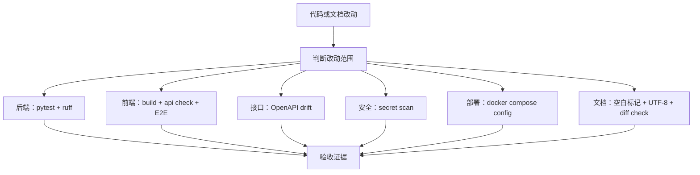

# 15｜测试策略：如何把项目从能跑变成可信

## 本讲目标

本讲学习 Project A 的测试和验收策略。

你需要掌握：

- pytest、ruff、OpenAPI drift、secret scan、Docker Compose config、Playwright E2E 分别防什么风险。
- 为什么文档项目不用跑全量测试，但功能改动必须跑相关检查。
- CI 和 final production acceptance 的区别。
- 测试策略如何服务面试可信度。
- 如何根据改动范围选择最窄验证路径。

## 大白话解释

测试不是为了“跑命令好看”，而是为了防止项目悄悄坏掉。

Project A 有很多层：

- 后端 API。
- RAG 和 Agentic 决策。
- 前端页面。
- OpenAPI 类型。
- Docker 配置。
- 密钥安全。
- 工单、Jobs、Trace、Metrics。

每一层都有对应检查。这样你在面试里可以说：这个项目不是手工点过一次，而是有系统化验收路径。

## 业务场景

常见改动和验证方式：

- 改后端 API：跑 pytest、ruff、OpenAPI drift。
- 改前端页面：跑前端 build、api check、相关 Playwright。
- 改 RAG 决策：跑后端 RAG/Agentic 测试和评测。
- 改 Docker 配置：跑 docker compose config。
- 改文档：跑空白标记、编码、secret scan、diff check。
- 准备发布：跑 final production acceptance。

## 技术栈关联

### pytest

大白话：Python 测试框架，用来验证后端行为。

为什么用：

- 检查 API 是否返回正确。
- 检查 RAG、工单、Jobs、限流等逻辑。
- 适合 CI 自动运行。

### ruff

大白话：Python 代码检查工具。

为什么用：

- 发现明显代码风格和质量问题。
- 速度快，适合 CI。
- 防止低级错误进入主分支。

### OpenAPI drift check

大白话：检查后端接口 schema 和前端类型是否偏离。

为什么用：

- 防止后端字段变了，前端类型没更新。
- 保证 API 契约稳定。

### secret scan

大白话：扫描仓库里有没有误提交密钥。

为什么用：

- 防止 API Key、token、私钥进入版本库。
- 对 AI 项目尤其重要，因为常接第三方模型和中转服务。

### Docker Compose config

大白话：检查 Compose 文件语法和服务配置是否能被 Docker 正确解析。

为什么用：

- 提前发现部署配置错误。
- 验证 demo 和生产 compose 都可解析。

### Playwright E2E

大白话：模拟用户操作浏览器，检查页面是否可达。

为什么用：

- 证明前端演示路径没有断。
- 检查关键按钮、路由、展示结果。

## 项目实现位置

- 后端测试：`backend/tests`
- 前端 E2E：`frontend/e2e`
- CI 配置：`.github/workflows/ci.yml`
- Python 配置：`pyproject.toml`
- 前端脚本：`frontend/package.json`
- OpenAPI 导出：`scripts/export_openapi.py`
- 密钥扫描：`scripts/secret_scan.py`
- 最终验收：`scripts/final_production_acceptance.ps1`
- E2E 演示脚本：`scripts/run_full_e2e_demo.ps1`
- Docker 配置：`docker-compose.yml`、`docker-compose.demo.yml`
- 验收文档：`docs/final_acceptance_checklist.md`
- E2E 文档：`docs/e2e_guide.md`

## 流程图

## 设计优势

### 1. 分层验证

优势：

- 后端、前端、接口、安全、部署分别检查。
- 一个检查失败时更容易定位问题。
- 不把所有风险压到手工演示。

面试讲法：

> 我把验收拆成后端测试、前端 E2E、OpenAPI drift、安全扫描和 Docker 配置检查，不同工具防不同风险。

### 2. 最窄验证路径

优势：

- 文档改动不用跑全量构建。
- 功能改动必须跑相关测试。
- 节省时间，同时不牺牲关键质量。

面试讲法：

> 我会按改动范围选择验证路径，文档只跑文档级检查，API 改动才跑后端、OpenAPI 和前端类型检查。

### 3. CI 提供持续保障

优势：

- push/PR 自动跑核心检查。
- 避免只在本机可用。
- GitHub Checks 能成为项目可信证据。

面试讲法：

> CI 让项目质量不是靠个人记忆，而是靠自动化门禁。

### 4. final acceptance 支撑发布演示

优势：

- 把多项检查串成最终验收脚本。
- 适合发布前或面试前跑一遍。
- 能讲清从开发到交付的闭环。

面试讲法：

> final production acceptance 是项目的交付门禁，覆盖测试、构建、OpenAPI、secret scan、Docker、smoke 和 E2E。

## 局限和后续增强

- E2E 默认不一定在每次 push 全量运行，避免 CI 成本过高。
- 评测数据规模还可以继续扩大。
- Docker smoke 更适合本机或专门 CI runner。
- 后续可增加覆盖率报告、性能基准和合约测试。
- 可以为 Agentic RAG 增加更多端到端真实场景用例。

## 面试讲法

30 秒版本：

> Project A 的测试策略是分层验收：pytest 验证后端 API 和业务逻辑，ruff 做 Python 静态检查，OpenAPI drift 防前后端契约漂移，secret scan 防密钥泄露，Docker Compose config 验证部署配置，Playwright E2E 验证前端演示路径，final production acceptance 串起发布级门禁。

3 分钟版本：

> 我把测试分成代码行为、接口契约、前端可达、安全、部署和发布门禁几层。后端用 pytest 覆盖认证、RAG、Agentic 诊断、工单、Jobs、限流等逻辑；ruff 检查代码质量；OpenAPI 导出和前端类型生成防止接口字段漂移；secret_scan 防止密钥误提交；docker compose config 检查生产和 demo 配置；Playwright 从用户角度验证 Acceptance、Agentic、System Status、Jobs、Tickets、Evaluations 等页面可达；最终用 final_production_acceptance.ps1 把这些检查串成完整交付路径。

## 高频追问

### 1. 为什么文档改动不跑全量测试？

因为文档不影响运行逻辑。只跑文档级检查更高效，但如果文档改了命令或配置说明，也应补对应验证。

### 2. OpenAPI drift 防什么？

防后端接口 schema 改了，但前端类型或文档没有同步，导致运行时字段不匹配。

### 3. secret scan 为什么重要？

AI 项目常接 API Key 和模型服务，密钥泄露风险高，必须纳入门禁。

### 4. E2E 和 pytest 谁更重要？

职责不同。pytest 检查后端逻辑，E2E 检查用户路径。两者互补。

## 学习检查题

- pytest、ruff、secret scan 分别防什么风险？
- OpenAPI drift check 的价值是什么？
- 为什么 Playwright 适合面试展示项目？
- 文档改动和 API 改动的验证路径有什么不同？
- final production acceptance 解决什么问题？

## 下一讲衔接

下一讲进入 `docs/teaching/16_deployment_and_runtime.md`：讲 Docker Compose、环境变量、healthz、readyz、PostgreSQL、Redis、Prometheus/Grafana 如何支撑本机 demo 和生产演进。

