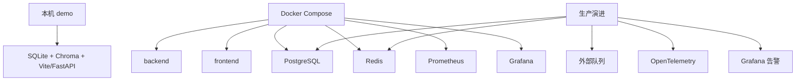
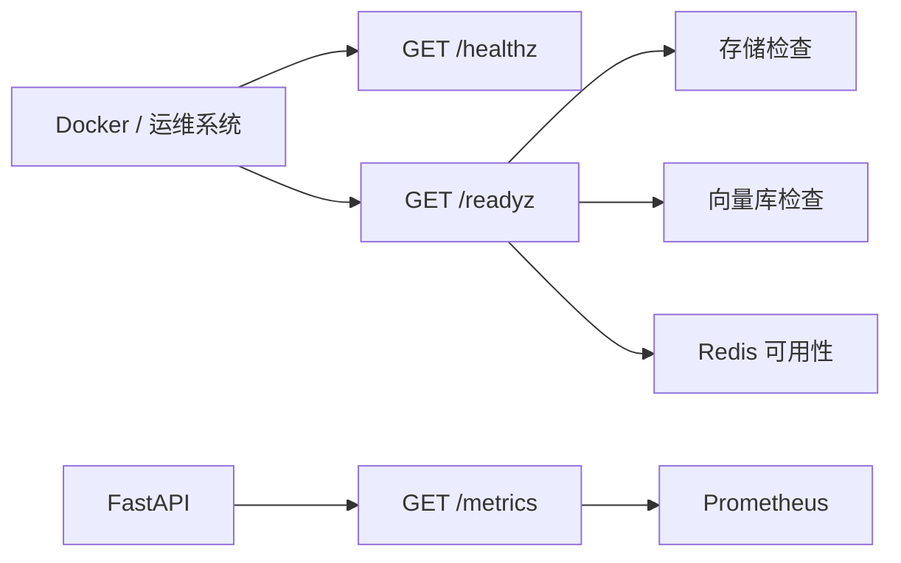

# 16｜部署与运行：本机 demo 和生产演进怎么讲

## 本讲目标

本讲学习 Project A 的运行和部署体系。

你需要掌握：

- 本机 demo、Docker Compose、生产增强三种运行层次。
- 环境变量为什么是配置边界。
- healthz、readyz、metrics 在运行时的作用。
- SQLite、PostgreSQL、Redis、Prometheus/Grafana、Milvus/Chroma 的演进关系。
- 面试中如何诚实区分“已实现 demo 能力”和“后续生产增强方向”。

## 大白话解释

部署就是让项目在不同环境里稳定跑起来。

Project A 的运行策略可以分三层：

- 本机 demo：优先低门槛，用 SQLite、Chroma、本地前后端启动。
- Docker Compose：把 backend、frontend、数据库、监控等服务编排起来。
- 生产演进：把 SQLite 换 PostgreSQL，把本地任务换外部队列，把 demo 监控升级为告警和链路追踪。

面试时最重要的是不夸大：哪些是当前可跑，哪些是生产增强骨架，哪些是下一阶段计划，要讲清楚。

## 业务场景

- 面试前：需要快速在本机启动后端和前端。
- PR 检查：需要验证 docker compose 配置能解析。
- 演示环境：需要 healthz/readyz 判断服务状态。
- 生产演进：需要 PostgreSQL 共享状态、Redis 缓存和限流、Prometheus/Grafana 监控。
- 故障排查：需要 metrics、日志、Request ID、Trace 辅助定位。

## 技术栈关联

### Docker Compose

大白话：Compose 用一个文件描述多个服务怎么一起启动。

为什么用：

- 后端、前端、数据库、监控可以统一编排。
- 本机和 CI 能检查配置。
- 面试里能说明部署意识。

### 环境变量

大白话：环境变量是运行时配置，不应该写死进代码。

为什么用：

- API Key、数据库地址、Redis 地址、功能开关不能硬编码。
- demo 和生产可以使用不同配置。
- 防止密钥进入版本库。

### healthz / readyz

大白话：healthz 看服务活着，readyz 看服务是否准备好。

为什么用：

- 容器健康检查。
- 运维排障。
- 区分进程存活和依赖可用。

### PostgreSQL / Redis

大白话：PostgreSQL 管业务状态，Redis 管缓存和限流。

为什么用：

- PostgreSQL 适合多实例共享 jobs、tickets、trace、audit。
- Redis 适合缓存、会话、限流等快速状态。

### Prometheus / Grafana

大白话：Prometheus 抓指标，Grafana 展示指标。

为什么用：

- 支撑运行时观测。
- 面试展示生产化方向。
- 后续可加告警。

## 项目实现位置

- 主 Compose：`docker-compose.yml`
- Demo Compose：`docker-compose.demo.yml`
- 部署文档：`docs/deployment_guide.md`
- Demo 文档：`docs/demo_guide.md`
- 最终验收文档：`docs/final_acceptance_checklist.md`
- 环境示例：`.env.example`
- 后端配置：`backend/app/config.py`
- 健康检查：`backend/app/main.py`
- Redis 缓存：`backend/app/cache/redis_cache.py`
- Redis 限流：`backend/app/rate_limit.py`
- PostgreSQL Store：`backend/app/storage/postgres_store.py`
- 向量库工厂：`backend/app/rag/vector_factory.py`
- Prometheus 配置：`deploy/prometheus/prometheus.yml`
- Grafana 配置：`deploy/grafana`

## 流程图

### 运行层次

### 运行时健康检查

## 设计优势

### 1. 本机 demo 低门槛

优势：

- 不依赖复杂云服务。
- 面试前容易启动。
- SQLite 和本地向量库降低环境成本。

面试讲法：

> 我保留了低门槛本机 demo 路径，确保项目可运行，而不是只停留在架构图。

### 2. Compose 展示部署意识

优势：

- 多服务关系清晰。
- CI 可验证配置。
- 面试能讲后端、前端、数据库、监控如何协作。

面试讲法：

> Docker Compose 不是生产全部答案，但能清楚展示服务编排和生产演进方向。

### 3. 环境变量隔离配置

优势：

- 避免密钥写进代码。
- demo、测试、生产配置可分离。
- 功能开关更灵活。

面试讲法：

> 我用环境变量管理数据库、Redis、模型、监控和安全开关，避免把运行配置硬编码。

### 4. readyz 比 healthz 更接近真实可用性

优势：

- healthz 只说明服务活着。
- readyz 能说明依赖是否可用。
- 适合容器和生产健康检查。

面试讲法：

> 我区分 liveness 和 readiness，避免进程活着但依赖坏了还继续接流量。

## 局限和后续增强

- Docker Compose 适合 demo 和中小部署，复杂生产可迁移到 Kubernetes 或云托管服务。
- 内置 JobService 可替换为 Celery、RQ、云队列等外部队列。
- Grafana 当前是 demo dashboard，后续应补生产告警规则。
- Alembic 迁移骨架可继续加强回滚、备份和发布流程。
- 向量库可从 Chroma 演进到 Milvus 等更适合大规模数据的方案。

## 面试讲法

30 秒版本：

> Project A 支持低门槛本机 demo，也提供 Docker Compose 和生产增强路径。本机可用 SQLite 和 Chroma 快速跑通，生产方向保留 PostgreSQL、Redis、Prometheus/Grafana、Milvus 和 Alembic 迁移骨架。运行时通过 healthz、readyz、metrics、Request ID 和 Trace 支撑排障。

3 分钟版本：

> 我把部署分成 demo、compose 和生产演进三层。demo 层优先保证面试和本机可跑，用 SQLite、本地向量库和前后端服务快速启动。Compose 层把 backend、frontend、PostgreSQL、Redis、Prometheus、Grafana 等服务组织起来，并通过 docker compose config 在 CI 中验证配置。生产演进层可以把状态存储迁移到 PostgreSQL，把缓存和限流放到 Redis，把任务执行层替换为外部队列，把监控从 demo dashboard 升级为 Grafana 告警和 OpenTelemetry 链路追踪。配置都通过环境变量控制，避免密钥和环境差异写进代码。

## 高频追问

### 1. Docker Compose 等于生产部署吗？

不完全等于。Compose 适合 demo、中小部署和本机验证，大规模生产还需要更强编排、弹性、告警和安全治理。

### 2. 为什么要保留 SQLite？

SQLite 降低本机运行门槛，适合面试 demo。生产路径则应使用 PostgreSQL。

### 3. Redis 在项目里有什么价值？

Redis 可用于缓存、会话和限流，适合多实例共享快速状态。

### 4. Milvus 和 Chroma 怎么取舍？

Chroma 适合轻量 demo，Milvus 更适合大规模向量检索和生产化扩展。

## 学习检查题

- 本机 demo、Docker Compose、生产演进三层分别解决什么问题？
- 环境变量为什么重要？
- healthz 和 readyz 的区别是什么？
- SQLite、PostgreSQL、Redis、Chroma、Milvus 分别适合什么场景？
- Grafana demo stack 后续如何增强？

## 下一讲衔接

下一讲进入 `docs/teaching/17_interview_playbook.md`：把前面 16 讲压缩成简历、30 秒介绍、3 分钟项目讲解和高频追问回答。
