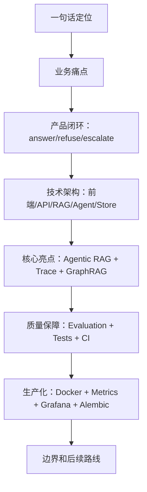

# 17｜面试手册：如何把 Project A 讲成强项目

## 本讲目标

本讲把前面 16 讲压缩成可直接用于简历和面试的表达。

你需要掌握：

- 简历 bullet 怎么写。
- 30 秒项目介绍怎么讲。
- 3 分钟项目深讲怎么讲。
- 面试官深挖 RAG、Agentic、评测、部署、可观测性时怎么回答。
- 如何诚实讲项目边界和后续优化，不夸大能力。

## 大白话解释

面试不是把所有技术都背一遍。

强项目表达要做到三点：

- 先讲业务：这个项目解决什么真实问题。
- 再讲闭环：输入、处理、输出、拒答、升级、Trace、评测、监控如何串起来。
- 最后讲取舍：哪些已经实现，哪些是后续生产增强。

Project A 的核心面试定位是：企业设备售后诊断 Agentic RAG 平台。

不要讲成：

- “我做了一个聊天机器人。”
- “我做了很多 Agent。”
- “我接了一个向量库。”

要讲成：

- “我做了一个有业务边界、证据链、评测、工单、可观测性的 RAG 工程平台。”

## 业务场景

面试官通常会从这些角度追问：

- 业务：为什么选设备售后诊断？
- RAG：怎么检索、怎么引用、怎么拒答？
- Agentic：为什么叫 Agentic RAG，不是多 Agent？
- 安全：Prompt 注入和高风险问题怎么处理？
- 评测：怎么证明系统可靠？
- 工程：前后端、任务、存储、部署、监控怎么做？
- 边界：这个项目还有哪些不足？

你的回答要围绕 Project A 的真实模块，不要泛泛讲概念。

## 技术栈关联

面试表达可以按技术栈分层：

- 前端：Vue 3、TypeScript、Element Plus、Playwright，把后端能力产品化。
- 后端：FastAPI、Pydantic、OpenAPI、middleware，提供稳定 API 和契约。
- RAG：chunk、hybrid retrieval、citations、grounding、refusal。
- Agentic：DiagnosisAgent、AgenticRetriever、tool calls、answer/refuse/escalate。
- 状态：SQLite/PostgreSQL、Jobs、Tickets、Audit、Trace。
- 质量：Evaluation、Quality、pytest、ruff、E2E、secret scan。
- 运维：healthz、readyz、metrics、Prometheus/Grafana、Docker Compose。

## 项目实现位置

面试前建议熟悉这些文件：

- 项目介绍：`README.md`
- 简历文档：`docs/resume_interview_showcase.md`
- 面试脚本：`docs/interview_demo_script.md`
- 面试问题：`docs/interview_questions.md`
- 学习总览：`docs/learning_guide.md`
- Agentic 深挖：`docs/agentic_rag_deep_dive.md`
- 后端入口：`backend/app/main.py`
- RAG 主线：`backend/app/rag/pipeline.py`
- 诊断控制器：`backend/app/rag/diagnosis_agent.py`
- 前端核心页：`frontend/src/pages/AgenticPage.vue`
- CI：`.github/workflows/ci.yml`

## 流程图

### 面试讲解顺序

## 设计优势

### 1. 简历 bullet

推荐写法：

- 构建企业设备售后诊断 Agentic RAG 平台，支持文档入库、动态检索、引用回答、拒答边界、高风险工单升级、Trace 证据链、评测和监控。
- 设计单诊断控制器串联 security check、query route、knowledge search、risk check、ticket escalation，实现 answer/refuse/escalate 三类可解释决策。
- 基于 FastAPI、Vue 3、Chroma、SQLite/PostgreSQL、Prometheus/Grafana、OpenAPI、Playwright 构建可演示、可测试、可观测的 RAG 工程闭环。

为什么这样写：

- 有业务场景。
- 有技术栈。
- 有工程闭环。
- 有可追问亮点。

### 2. 30 秒介绍

推荐表达：

> Project A 是一个企业设备售后诊断 Agentic RAG 平台。用户输入设备型号、故障码或现场现象后，系统会基于企业文档检索证据，给出带引用的回答；资料不足或 Prompt 注入时拒答；冒烟、异味、高压、电池鼓包等高风险问题会升级工单。工程上我做了 FastAPI API、Vue 3 控制台、RAG Pipeline、单诊断控制器、Trace 证据链、GraphRAG 关系展示、评测、Jobs、Audit、Prometheus/Grafana 和 CI/E2E。

### 3. 3 分钟深讲

推荐结构：

1. 业务：设备售后诊断需要可靠、可追溯、可升级。
2. 产品：输入型号/故障码/现象，输出 answer/refuse/escalate。
3. 架构：Vue 前端、FastAPI API、RAG Pipeline、DiagnosisAgent、Store、Jobs、Tickets、Evaluation、Observability。
4. 核心：Agentic RAG 做安全检查、查询路由、动态检索、风险识别和工单升级。
5. 质量：citations、Trace、Evaluation、pytest、Playwright、OpenAPI drift、secret scan。
6. 生产化：Docker Compose、healthz、readyz、metrics、Grafana、PostgreSQL/Redis 演进。
7. 取舍：本项目不是多 Agent 平台，GraphRAG 和 Grafana 是可用演示与后续增强方向。

### 4. 深挖追问回答框架

当面试官追问时，按这个模板答：

- 先给结论。
- 再讲项目里的实现位置。
- 再讲为什么这样设计。
- 最后讲局限和后续增强。

示例：

> 为什么不是多 Agent？结论是本项目定位不是多 Agent 协作，而是 RAG 场景下的单诊断控制器。实现上在 `backend/app/rag/diagnosis_agent.py`，它固定调用 security_check、query_route、knowledge_search、risk_check、ticket_escalation。这样比多 Agent 更可控、可测、可追踪。后续如果要做多 Agent，我会放在另一个项目里，而不是破坏 Project A 的定位。

## 局限和后续增强

面试中不要回避不足，要把不足讲成路线：

- 数据规模：demo 数据有限，后续扩充真实设备样本。
- GraphRAG：当前偏关系展示，后续做实体消歧、多跳查询和 Neo4j 图谱治理。
- 监控：已有 metrics 和 Grafana demo，后续补告警和 OpenTelemetry。
- 迁移：已有 Alembic 骨架，后续加强回滚、备份和发布流程。
- 任务：内置 JobService 足够展示语义，生产可换 Celery/RQ/云队列。

## 面试讲法

### 高频问题 1：这个项目和普通 RAG 有什么区别？

> 普通 RAG 重点是检索后回答，Project A 在此基础上补了 Agentic 诊断控制、拒答边界、高风险工单升级、Trace 证据链、GraphRAG 关系展示、评测和可观测性，更接近企业落地系统。

### 高频问题 2：为什么要做拒答？

> 企业设备诊断不能为了回答而回答。资料不足、Prompt 注入或无 citations 时拒答，是为了避免错误维修建议造成风险。

### 高频问题 3：项目最强亮点是什么？

> 最强亮点是把 Agentic RAG 做成可解释闭环：DiagnosisAgent 负责决策，RagPipeline 负责知识检索，Trace 记录证据链，Tickets 承接高风险，Evaluation 验证质量，前端把整个过程产品化展示。

### 高频问题 4：你最想继续优化什么？

> 我会优先补真实业务样本、OTel 链路追踪、Grafana 告警、生产级 Alembic 迁移治理和外部队列，让 demo 平台进一步接近生产系统。

## 高频追问

### 1. 面试官说“这是不是套壳”怎么办？

直接讲边界：安全检查、检索、引用、拒答、风险升级、Trace、评测和监控都不是简单套壳。

### 2. 面试官问“你写了多少代码”怎么办？

不要纠结行数，讲你能解释的模块边界、主链路、取舍和验证证据。

### 3. 面试官问“真实生产能用吗”怎么办？

诚实回答：当前适合面试展示和工程样板，生产还需要真实数据、权限、告警、扩容、迁移、运维治理增强。

### 4. 面试官深挖某个模块不会怎么办？

先承认边界，再回到你掌握的主链路，最后说后续会从哪个文件和测试继续补齐。

## 学习检查题

- 用 30 秒介绍 Project A。
- 用 3 分钟讲清业务、架构、核心亮点和质量保障。
- 如何回答“为什么不是多 Agent”？
- 如何回答“真实生产能用吗”？
- 简历 bullet 中必须包含哪些关键词？

## 下一讲衔接

最后一讲进入 `docs/teaching/18_next_stage_roadmap.md`：把项目后续优化路线讲成清晰、可信、可执行的工程计划。
