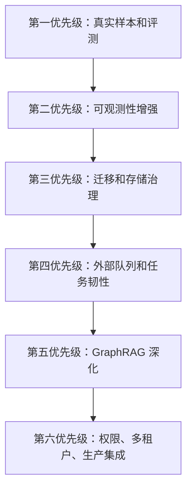

# 18｜下一阶段路线：如何把 Project A 继续做强

## 本讲目标

本讲作为 18 章课程收尾，讲 Project A 的后续增强路线。

你需要掌握：

- 如何判断一个项目下一步该优化什么。
- 哪些增强能提升求职竞争力。
- 哪些增强属于生产化路线。
- 如何避免为了堆技术而过度设计。
- 如何把后续计划讲成可执行 roadmap。

## 大白话解释

项目做完第一版后，不是继续乱加功能。

下一阶段要围绕一个目标：让 Project A 更像真实企业级 RAG 平台。

优先级应该按价值排序：

- 先补真实样本和评测，让质量更可信。
- 再补可观测性和告警，让排障更完整。
- 再补迁移、队列、权限、图谱治理，让生产化更扎实。
- 最后再考虑更复杂的多模型、多租户、多 Agent 扩展。

不要为了简历堆名词。每个增强都要能回答：解决什么问题、改哪里、怎么验证、面试怎么讲。

## 业务场景

后续增强可以服务这些场景：

- 更多设备型号和故障码进入知识库。
- 售后主管希望看到更稳定的质量指标。
- 运维希望请求、Trace、metrics 能串起来。
- 开发者希望数据库迁移和回滚更可靠。
- 企业希望接入真实工单系统和权限体系。
- 面试官希望看到你对生产化演进有清晰判断。

## 技术栈关联

### 数据和评测增强

方向：扩充文档、评测集、bad case、citation accuracy。

价值：这是最直接提升 RAG 可信度的路线。

### 可观测性增强

方向：OpenTelemetry、Grafana 告警、trace_id/request_id/metrics 关联。

价值：从 demo metrics 走向生产排障体系。

### 迁移和存储治理

方向：Alembic 回滚策略、迁移 smoke、备份恢复、PostgreSQL 优先路径。

价值：让状态管理更接近生产要求。

### 任务系统增强

方向：外部队列、并发 worker、重试策略、死信队列。

价值：让文档入库和评测任务更稳定。

### GraphRAG 增强

方向：实体消歧、多跳查询、Neo4j 图谱治理、关系置信度。

价值：让设备、故障、部件、动作关系更可信。

## 项目实现位置

后续路线可能涉及：

- 数据集：`data/eval`
- RAG 主链路：`backend/app/rag/pipeline.py`
- Agentic 检索：`backend/app/rag/agentic.py`
- 诊断控制器：`backend/app/rag/diagnosis_agent.py`
- GraphRAG：`backend/app/rag/graph.py`
- 评测 API：`backend/app/main.py`
- Store：`backend/app/storage`
- Jobs：`backend/app/jobs.py`、`backend/app/job_worker.py`
- Metrics：`backend/app/metrics.py`
- Grafana：`deploy/grafana`
- Prometheus：`deploy/prometheus/prometheus.yml`
- Alembic：`migrations`
- CI：`.github/workflows/ci.yml`
- 前端展示：`frontend/src/pages`

## 流程图

### 下一阶段路线图

### 每个增强的判断模板

## 设计优势

### 1. 先补数据和评测

原因：RAG 系统质量首先由数据和评测决定。

建议动作：

- 扩充真实设备文档样本。
- 增加未知型号、故障码、风险操作、Prompt 注入案例。
- 加强 citation accuracy 和 trace completeness。

面试讲法：

> 我下一步优先扩充真实样本和评测集，因为 RAG 质量不能只靠架构，需要数据闭环支撑。

### 2. 补 OTel 和告警

原因：当前已有 metrics 和 Grafana demo，但生产排障还需要链路关联和告警。

建议动作：

- 关联 request_id、trace_id、tool_calls、latency。
- 增加 Grafana 告警规则。
- 增加检索失败率、拒答率、升级率、延迟分布指标。

面试讲法：

> 当前 metrics 已能展示系统状态，下一步会补 OpenTelemetry 和告警，把 demo 监控升级成生产可观测性。

### 3. 强化 Alembic 和 PostgreSQL

原因：企业系统状态迁移必须可靠。

建议动作：

- 为核心表补完整迁移和回滚策略。
- 增加迁移 smoke。
- 建立备份恢复说明。

面试讲法：

> 生产化不只是功能上线，还要保证数据库结构能安全演进，所以我会加强 Alembic 迁移治理。

### 4. 外部队列替换内置 Jobs

原因：内置 JobService 适合展示语义，生产并发和可靠性需要更强执行层。

建议动作：

- 保留 Job API 和前端语义。
- 执行层替换为 Celery、RQ 或云队列。
- 增加重试、超时、死信队列。

面试讲法：

> 我不会推翻现有 Jobs 语义，而是替换底层执行层，让 API、UI、Audit、metrics 保持稳定。

### 5. GraphRAG 深化

原因：设备诊断天然有实体关系。

建议动作：

- 标准化型号、故障码、部件名。
- 增加实体消歧和关系置信度。
- 接入 Neo4j 多跳查询。

面试讲法：

> 当前 GraphRAG 偏展示和检索补充，下一步可以做实体治理和多跳查询，让关系推理更可信。

## 局限和后续增强

本项目后续要避免三个误区：

- 不要为了名词堆叠而引入复杂技术。
- 不要把 Project A 改成多 Agent 平台，避免和多 Agent 项目定位重叠。
- 不要只加 UI，不补数据、评测和验证。

更合理的增强顺序：

1. 数据和评测。
2. 可观测性和告警。
3. 迁移和存储治理。
4. 外部队列和任务韧性。
5. GraphRAG 深化。
6. 权限、多租户和企业系统集成。

## 面试讲法

30 秒版本：

> Project A 下一阶段我会优先扩充真实设备样本和评测集，再补 OpenTelemetry、Grafana 告警、Alembic 迁移治理、外部队列和 GraphRAG 实体治理。核心原则是不堆技术名词，而是围绕可信回答、可追溯、可评测、可运维、可生产化逐步增强。

3 分钟版本：

> 后续路线我会按工程价值排序。第一是数据和评测，扩充真实设备手册、未知型号、风险操作、Prompt 注入和多跳关系问题，让 RAG 质量有更强证据。第二是可观测性，把 request_id、trace_id、tool_calls、latency、metrics 串起来，并补 Grafana 告警和 OpenTelemetry。第三是迁移治理，完善 Alembic 回滚、备份恢复和 PostgreSQL smoke。第四是任务系统，把内置 JobService 的执行层演进到外部队列，但保留现有 API、UI、Audit 和 metrics 语义。第五是 GraphRAG 深化，做实体标准化、关系置信度、Neo4j 多跳查询。这样项目会从面试展示平台逐步接近真实企业 RAG 平台。

## 高频追问

### 1. 下一步最该做什么？

优先扩充真实样本和评测。没有数据和评测，RAG 质量很难证明。

### 2. 为什么不先加更多 Agent？

Project A 的定位是 Agentic RAG 诊断平台，不是多 Agent 协作平台。多 Agent 可以放在独立项目，避免定位混乱。

### 3. 生产化最薄弱的点是什么？

真实数据规模、告警体系、迁移治理、外部队列和权限租户仍需加强。

### 4. 后续路线如何避免过度设计？

每个增强都必须回答业务问题、影响模块、验证方式和面试价值；答不清就先不做。

## 学习检查题

- Project A 下一阶段最优先增强什么？
- OTel 和当前 RAG Trace 如何互补？
- 为什么内置 JobService 可以先保留语义，再替换执行层？
- GraphRAG 生产化需要补哪些能力？
- 如何判断一个增强是不是过度设计？

## 下一讲衔接

18 讲课程到这里形成完整闭环。下一步可以进入两条路线：

- 学习路线：按 `docs/teaching/00_course_overview.md` 回到第 01 讲开始逐章学习和复述。
- 工程路线：选择一个增强方向，例如“真实评测集扩充”或“OTel + Grafana 告警”，先写设计，再实现。
